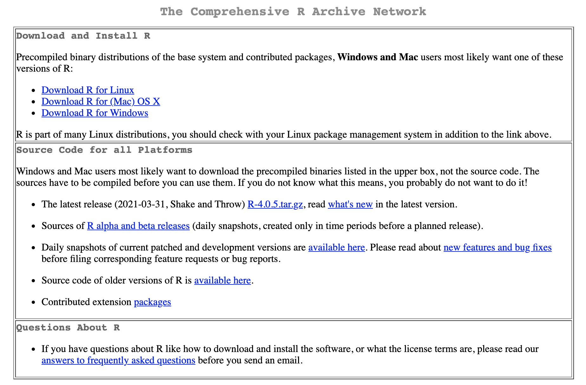
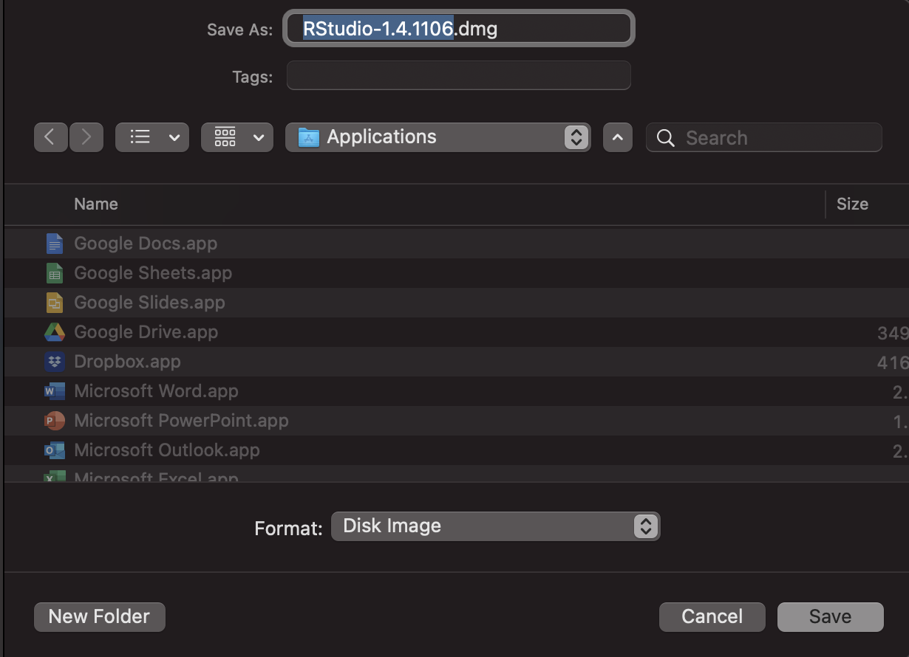
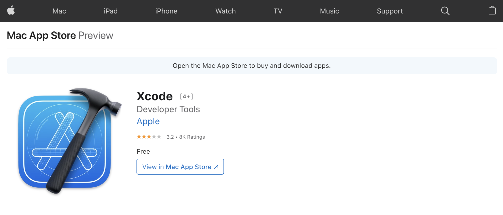

```{r, echo = FALSE}
# don't name this setup!
knitr::opts_chunk$set(collapse = TRUE,
                      comment = "#>",
                      message = FALSE,
                      warning = FALSE)
```

# Objectives

- download, install, and set up R and RStudio on your local machine
- compare differences between the R programming language and the R application
- explain what the differences between the command line, script files, and an [Integrated Development Environment](https://en.wikipedia.org/wiki/Integrated_development_environment)
- compare [open-source software](https://en.wikipedia.org/wiki/Open-source_software) and [proprietary software](https://en.wikipedia.org/wiki/Proprietary_software)

# Materials

The slides for this section are available [here]().

# Installation

Depending on what kind of computer you have, these instructions will be a little different. The two sections below describe how to install R and RStudio on Mac and Windows machines. An alternative to downloading and installing R and RStudio is using [RStudio.Cloud](https://rstudio.cloud/), which operates entirely in your browser. You'll need to sign up for a free RStudio.cloud account using your Google account or email address, but we recommend using a [Github](https://github.com/) account (also free!).

## Installing R on Mac {.tabset}

These steps cover how to install R and RStudio on a Windows machine. The technical details on the operating system and machine are listed below,

```
MacBook Pro (13-inch, 2017, Four Thunderbolt 3 Ports)
macOS Big Sur
  Version: 11.2.3 (20D91)
Model Name:	MacBook Pro
  Model Identifier:	MacBookPro14,2
  Graphics: Intel Iris Plus Graphics 650 1536 MB
  Processor Name:	Dual-Core Intel Core i5
  Processor Speed:	3.1 GHz
  Number of Processors:	1
  Total Number of Cores:	2
  L2 Cache (per Core):	256 KB
  L3 Cache:	4 MB
  Hyper-Threading Technology:	Enabled
  Memory:	16 GB
  System Firmware Version:	429.80.1.0.0
  SMC Version (system):	2.44f6
```

### Download R

Navigate to [CRAN](https://cran.r-project.org/), the The Comprehensive R Archive Network.

```{r bk00-01-cran.png, echo=FALSE}

```


Click on the [Download R for (Mac) OS X](https://cran.r-project.org/).

```{r bk00-02-mac-download, echo=FALSE}

```

Download the R package:

```{r bk00-03-mac-r-pkg, echo=FALSE}
knitr::include_graphics("img/bk00-03-mac-r-pkg.png")
```

Download the R installer package into your Applications folder.

```{r bk00-05-mac-r-app-folder, echo=FALSE}
knitr::include_graphics("img/bk00-05-mac-r-app-folder.png")
```

### Download RStudio

Navigate to [RStudio downloads](https://www.rstudio.com/products/rstudio/download/#download) for Macs

```{r bk00-04-mac-rstudio-download, echo=FALSE}
knitr::include_graphics("img/bk00-04-mac-rstudio-download.png")
```

Download the RStudio .dmg into your Applications folder.

```{r bk00-06-mac-rstudio-app-folder, echo=FALSE}

```


### Install Xcode

You'll need to install Xcode to compile R packages, which you can find in the [Mac App Store](https://apps.apple.com/us/app/xcode/id497799835?mt=12).

```{r bk00-07-mac-xcode-app-store, echo=FALSE}

```

Open the App Store on your local machine and click on the 'Develop' tab. Click on the 'Get' icon (*mine says 'open' because I already Xcode installed*).

Follow the instructions to install Xcode just like you would any other application on your Mac.

```{r bk00-08-mac-xcode-app-get, echo=FALSE}
knitr::include_graphics("img/bk00-08-mac-xcode-app-get.png")
```


### Install R

Open your Applications folder and click on the R package installer.

```{r bk00-09-r-install-01, echo=FALSE}
knitr::include_graphics("img/bk00-09-r-install-01.png")
```

This will open the installer package, click on 'Continue' until you're asked to 'Agree'

```{r bk00-09-r-install-02, echo=FALSE}
knitr::include_graphics("img/bk00-09-r-install-02.png")
```

Click 'Agree'

```{r bk00-09-r-install-03, echo=FALSE}
knitr::include_graphics("img/bk00-09-r-install-03.png")
```

All the package installer to install R on your machine. 

```{r bk00-09-r-install-04, echo=FALSE}
knitr::include_graphics("img/bk00-09-r-install-04.png")
```

Wait for R to finishing installing...

```{r bk00-09-r-install-05, echo=FALSE}
knitr::include_graphics("img/bk00-09-r-install-05.png")
```

Click 'Close' when the application is installed. 

```{r bk00-09-r-install-06, echo=FALSE}
knitr::include_graphics("img/bk00-09-r-install-06.png")
```

### Install RStudio

Open your Applications folder and click on the RStudio .dmg installer.

```{r bk00-09-rstudio-install-01, echo=FALSE}

```

Drag and drop the 'RStudio.app' icon into the 'Applications' folder. 

```{r bk00-09-rstudio-install-02, echo=FALSE}
knitr::include_graphics("img/bk00-09-rstudio-install-02.png")
```

Wait for the application to finishing copying...

```{r bk00-09-rstudio-install-03, echo=FALSE}

```

Double-click on the new 'RStudio.App' icon.

```{r bk00-09-rstudio-install-04, echo=FALSE}
knitr::include_graphics("img/bk00-09-rstudio-install-04.png")
```

We're sure--click 'Open'

```{r bk00-09-rstudio-install-05, echo=FALSE}
knitr::include_graphics("img/bk00-09-rstudio-install-05.png")
```

Take a look at the RStudio IDE!

```{r bk00-09-rstudio-install-06, echo=FALSE}
knitr::include_graphics("img/bk00-09-rstudio-install-06.png")
```

## Installing R on Windows {.tabset}

These steps cover how to install R and RStudio on a Windows machine. The technical details on the operating system and machine are listed below,

### Download R

```{r bk00-10-cran, echo=FALSE}
# knitr::include_graphics("img/bk00-10-cran.png")
```

```{r bk00-10-win-download, echo=FALSE}
# knitr::include_graphics("img/bk00-10-win-download.png")
```


### Download RStudio

### Download Rtools

### Install R

### Install RStudio

### Install Rtools

## RStudio.Cloud {.tabset}

### Create a Github account

### Create a RStudio.Cloud account
