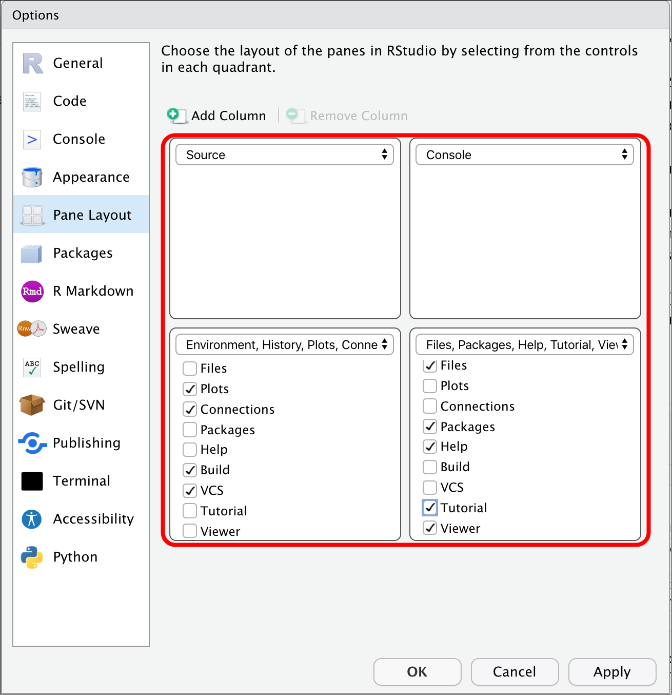
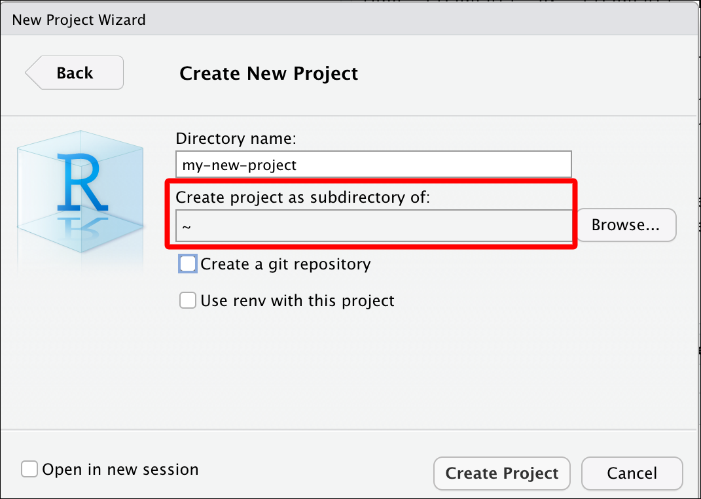

```{r, echo = FALSE}
knitr::opts_chunk$set(collapse = TRUE, 
                      comment = "#>", 
                      error = TRUE)
```

# Objectives 

This lesson covers some tips on managing your code, datasets, and other files with RStudio. The sections below give a tour of the IDE, and some of the customizations that you can do to increase your productivity. 

I've included some comments in *italics*--these are just my personal observations, feel free to set up the IDE in a way that works best for you!

# Materials 

Check out the slides for this section [here](https://mjfrigaard.github.io/r-workflow-best-practices/Index.html#1).

# Global Settings 

These can be found under **Tools > Global Options...** 

## General {.tabset}

Click on **Tools > Global Options...**, in the **General** section, you will see settings for **Workspace** 


### Workspace

Un-check the option for "*Restore .RData into workspace at startup*"

### `.RData`

We also don't want the workspace to `.RData` on exit, so we will set this to **Never**

### General settings

How your **General** settings should look:

```{r img-settings, echo=FALSE, out.width='89%', out.height='80%', fig.align='center'}
knitr::include_graphics(path = "img/settings.png")
```

## Code {.tabset}

Under **Tools > Global Options...** click on **Code** 

### Code editing

- Auto indent? *not recommended if you regularly paste lots of text*
- Continue comment lines? *very handy if you write a lot of comments*
- Save R scripts before sourcing? *can't see how this is a bad thing...*

```{r code-settings, echo=FALSE, out.width='40%', out.height='40%', fig.align='center'}
knitr::include_graphics(path = "img/code-settings.png")
```

### Code display

- Margins? *this is handy for knowing when to wrap code*
- Scrolling? *not sure why this is even an option?*
- Rainbow parentheses? *add some color to your life!*

```{r code-display, echo=FALSE, out.width='40%', out.height='40%', fig.align='center'}
knitr::include_graphics(path = "img/code-display.png")
```

### Code saving

- Cursor position? *this is nice when you want to remember where you left off*
- Line endings? *'platform native' seems the safest*
- Text encoding? *I use UTF-8, but ASCII works for special characters*

```{r code-savings, echo=FALSE, out.width='40%', out.height='40%', fig.align='center'}
knitr::include_graphics(path = "img/code-savings.png")
```

### Code completion

- Insert parentheses? *one less things to think about/type*
- Insert spaces? *reduces the keystroke/neuron load*
- Completion delay setting? *how quickly do you want help? :)*

```{r code-completion, echo=FALSE, out.width='40%', out.height='40%', fig.align='center'}
knitr::include_graphics(path = "img/code-completion.png")
```


### Code diagnostics 

- Check your R Code? *just about all of these help me write better code*
- Check other languages? *I write other languages, so this is a great feature*
- How long? *as quickly as possible :)*


```{r code-diagnostics, echo=FALSE, out.width='40%', out.height='40%', fig.align='center'}
knitr::include_graphics(path = "img/code-diagnostics.png")
```


## Console {.tabset}

Under **Tools > Global Options...** click on **Console** 

The console is where we can enter code directly, and where we'll see output. We should consider the following settings:

- Display? *IMO, syntax highlighting makes sense pretty much everywhere*

- Debugging? *this makes sense*

- Other? *this is a personal preference* 

```{r console, echo=FALSE, out.width='40%', out.height='40%', fig.align='center'}
knitr::include_graphics(path = "img/console.png")
```

## Appearance {.tabset}

Under **Tools > Global Options...** click on **Appearance** 

- RStudio theme? *varies from lighter >> darker*
- Zoom? *controls the entire IDE*
  - Also hold `⌘` and press `+` on macOS
  - Also hold `ctrl` and press `+` on Windows
- Font? *also can adjust with Zoom*
- Editor theme? *check out [`rsthemes` package](https://www.garrickadenbuie.com/project/rsthemes/)*

```{r appearance, echo=FALSE, out.width='40%', out.height='40%', fig.align='center'}
knitr::include_graphics(path = "img/appearance.png")
```

## Pane layout {.tabset}

Under **Tools > Global Options...** click on **Pane Layout** 

### Default panes

- Source? *this is where I do most of my work*
- Console? *position so I can see output* 
- Combining? *I prefer:*
  - Plots, Connections, Build, VCS, Presentation 
  - Files, Packages, Help, Tutorial, Viewer

```{r default-layout, echo=FALSE, out.width="40%", out.height="40%", fig.align='center'}

```

### Adding columns

- Two screens?
  - add a Source column and rearrange the panes

```{r add-column-switch-panes, echo=FALSE, out.width="40%", out.height="40%", fig.align='center'}

```

### Three column view

Now you see **Source**, **Tutorial**, and **Console** panes on a single screen!

```{r three-column-layout, echo=FALSE, out.width="65%", out.height="65%", fig.align='center'}
knitr::include_graphics("img/three-column-layout.png")
```

# RStudio projects

Keep track of all your files with RStudio project files (`.Rproj`).

## Why RStudio Projects? {.tabset}

- Self contained
*Using R projects keeps track or your current working directory!*

- Project orientated 
*`.Rproj` files make bundling and shipping files and folders easier!*

- Avoid removing all the files  

*see [tweets below](https://twitter.com/hadleywickham/status/940021008764846080) and [tidyverse article](https://www.tidyverse.org/blog/2017/12/workflow-vs-script/)*

> If the first line of your R script is   
> `setwd("C:\Users\jenny\path\that\only\I\have")`  
> I will come into your office and SET YOUR COMPUTER ON FIRE 🔥   
> If the first line of your R script is
> `rm(list = ls())`  
> I will come into your office and SET YOUR COMPUTER ON FIRE 🔥  

### RStudio project (existing folder) 

Click on '***Project: (New)***' > '***New Project***'

```{r proj-existing-dir, echo=FALSE, out.width="60%", out.height="60%", fig.align='left'}
knitr::include_graphics("img/proj-existing-dir.png")
```

Click on '***Browse***' > '***Create Project***'

```{r proj-existing-dir-create, echo=FALSE, out.width="60%", out.height="60%", fig.align='center'}
knitr::include_graphics("img/proj-existing-dir-create.png")
```


### RStudio project (new folder)

Click on '***Project: (New)***' > '***New Project***'

```{r proj-new-dir, echo=FALSE, out.width="60%", out.height="60%", fig.align='left'}
knitr::include_graphics("img/proj-new-dir.png")
```

Select project type

```{r proj-new-project, echo=FALSE, out.width="60%", out.height="60%", fig.align='left'}
knitr::include_graphics("img/proj-new-project.png")
```

Create new folder name

```{r proj-new-dir-name, echo=FALSE, out.width="60%", out.height="60%", fig.align='left'}
knitr::include_graphics("img/proj-new-dir-name.png")
```

Choose parent folder

```{r proj-new-parent-dir-name, echo=FALSE, out.width="60%", out.height="60%", fig.align='left'}

```

Use Git (if installed)

```{r proj-new-dir-version-crtl, echo=FALSE, out.width="60%", out.height="60%"}
knitr::include_graphics("img/proj-new-dir-version-crtl.png")
```

# Folders and files

Good folder and file organization saves time and headaches. 

## Folder structure {.tabset}

See the tabs below for some basic guidelines on folder structure and file naming.

### General advice 

- separate raw and cleaned data  

- keep documents and code separate  

- keep figures separate  

- name files appropriately (preferably 2 digit prefix)

- structure is reusable and easy to understand

### Example folder structure

Adapted from from '[Good enough practices in scientific computing](https://journals.plos.org/ploscompbiol/article?id=10.1371/journal.pcbi.1005510)' 


```bash
project-name/
            |-- CITATION
            |-- project-name.Rproj
            |-- README.md
            |-- LICENSE
            |-- requirements.txt
            |--data/
                   |--raw/
                         |--raw-birds-data.csv
                   |--processed/
                               |--processed-birds-data.csv
            |--doc/
                  |-- notebook.Rmd
                  |-- manuscript.Rmd
                  |-- changelog.txt
            |-- results/
                  |-- summarized-results.csv
            |-- code/
                  |-- 01-sightings-import.R
                  |-- 02-sightings-wrangle.R
                  |-- 03-sightings-model.R
                  |-- runall.R
```

## Naming files {.tabset}

Basic rules to follow: 

1. human readable -> (makes sense)

2. machine readable -> (regex)

3. sort/order well -> (ISO 8601 date)

### Example file names

*These are handy names:*

2020-10-12-270-301-***central-lab-metrics***.csv  
2020-10-12-***270-301***-central-lab-metrics.csv  
***2020-10-12***-270-301-central-lab-metrics.csv 

*So are these:*

***01.0***-import_270-301_central-lab-metrics.R  
02.0-***wrangle***_270-301_central-lab-metrics.R  
03.0-eda_***270-301***_central-lab-metrics.R  
04.0-model_270-301_***central-lab-metrics***.R  

> *Adapted from [Jenny Byran's slides](https://speakerdeck.com/jennybc/how-to-name-files)

### Locating files

*We can use regular expressions to find '270-301' files!!*

```{r grepl}
grepl(pattern = "270-301", 
      x = "2020-10-12-270-301-central-lab-metrics.csv")
```

> *Adapted from [Jenny Byran's slides](https://speakerdeck.com/jennybc/how-to-name-files)

### Other examples 

*Logical order and underscores `_` also make it easier to sort files*

```{r create-files, echo=FALSE}
files <- c("01.0-import_270-301_central-lab-metrics.R",
"02.0-wrangle_270-301_central-lab-metrics.R",
"03.0-eda_270-301_central-lab-metrics.R",
"04.0-model_270-301_central-lab-metrics.R")
```

```{r files}
# writeLines(files)
files
```

```{r files-str_split_fixed, str_split_fixed}
stringr::str_split_fixed(string = files, pattern = "_", 3)
```

> *Adapted from [Jenny Byran's slides](https://speakerdeck.com/jennybc/how-to-name-files)


## File paths {.tabset}  

Use relative rather than absolute file paths

### Absolute paths

These are specific to a *system* 

`/project-name/data` -> absolute path in macOS

`\\project-name\\data` -> absolute path in Windows

### Relative paths

These are specific to a *folder*

`project-name/data` -> relative path in macOS

`project-name\\data` -> relative path in Windows

# Useful packages 

This section covers some packages to help manage files and folders. 

## The `here` package {.tabset}  

The `here::set_here()` function solves a lot of file path problems (*especially if you're not using R projects*)

### Using `here()`

```{r using-here, eval=FALSE}
library(here)
#> here() starts at /Users/mjfrigaard/Documents/@BioMarin/r-meetup-tutorials
```

### `set_here(".")`

This creates a `.here` file (similar to `.Rproj` files)


```{r here-list.files, eval=FALSE}
here::set_here(".")
#> Created file .here in /Users/mjfrigaard/Documents/@BioMarin/r-meetup-tutorials . Please start a new R session in the new project directory.
list.files(all.files = TRUE, pattern = "here")
#> [1] ".here"
```

## The `fs` package {.tabset} 

The `fs` package stands for **file system** and is great for locating and accessing files. 

### Folder trees 

View a tree layout of your files with `fs::dir_tree()`.

```{r dir_tree}
fs::dir_tree("data")
```

### List files 

Get the complete path to files using `fs::dir_ls()`.

```{r dir_ls}
fs::dir_ls("data")
```

## Reproducible examples {.tabset}

The [`reprex` package](https://github.com/tidyverse/reprex) was designed to help you create a reproducible example

### Reprex addin 1

1. Copy code
2. Select *Addin* > *Render selection*  

```{r copy-render-reprex, echo=FALSE, out.width="60%", out.height="60%", fig.align='center'}

```

### Reprex addin 2

1. Copy code
2. Select *Addin* > *Render selection*  
3. Wait for console  
4. Paste reprex

```{r paste-reprex.png, echo=FALSE, out.width="60%", out.height="60%", fig.align='center'}
knitr::include_graphics("img/paste-reprex.png")
```

### Reprex + datapasta

To copy + paste actual data in a reproducible example, try [`datapasta`](https://reprex.tidyverse.org/articles/articles/datapasta-reprex.html)!

```{r datapasta_w_reprex_sheet_to_tribble, echo=FALSE, out.width="60%", out.height="60%", fig.align='center'}
knitr::include_graphics("https://raw.githubusercontent.com/tidyverse/reprex/master/img/datapasta_w_reprex_sheet_to_tribble.gif")
```

# More RStudio panes

RStudio also comes with access to a **Terminal** and **Help** pane.

## Terminal pane {.tabset}  

Learn a handful of command-line tools to make life easier

### Command line basics 

Know how to use `cd`, `pwd`, `mkdir`, `rm`, `ls`, etc.

### Terminal in RStudio

RStudio comes with a Terminal pane for quick access to the command-line

```{r terminal-pane.png, echo=FALSE, out.width="60%", out.height="60%", fig.align='center'}
knitr::include_graphics("img/terminal-pane.png")
```


## Getting help {.tabset}

R comes with a *ton* of accessible help files 

### Accessing help files 

```{r help-files, eval=FALSE}
?read.csv
```

### The ***Help*** pane

```{r help-pane, echo=FALSE, out.width="60%", out.height="60%", fig.align='center'}
knitr::include_graphics("img/help-pane.png")
```


# Learn more about R best practices

1. [R for Data Science](https://r4ds.had.co.nz/) 

2. [Tidyverse](https://www.tidyverse.org/)  

3. [RViews Community Blog](https://rviews.rstudio.com/)

# Feedback

@mjfrigaard on Twitter and Github

mjfrigaard@gmail.com 
