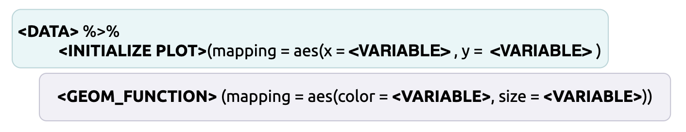

```{r setup, include=FALSE}
# uncomment the line below to install the packages for these exercises!
# source("00-inst.R")
library(knitr)
library(tidyverse)
opts_chunk$set(warning = FALSE, message = FALSE)
```

# Why have a grammar of graphics?

The `ggplot2` package is one of most commonly used tools for data visualizations. For more on the grammar, see the online text titled, [ggplot2: Elegant Graphics for Data Analysis](https://ggplot2-book.org/). If you're looking for a cookbook (graphs and code to build them), see the [R Graphics Cookbook, 2nd edition](https://r-graphics.org/). 


[Wilhelm von Humboldt](https://en.wikipedia.org/wiki/Wilhelm_von_Humboldt) has described a language as a system for "*making infinite use of finite means.*" Grammar is the way we convert the thoughts in our heads into discrete concepts (i.e. words), and then we apply a set of rules (or syntax) to create and display comprehensible statements (for humans or computers). 

In this sense, `ggplot2` gives us an ability to communicate the complexities of any data visualization in the same way that any specialized vocabulary allows us to precisely and unambiguously define ideas.

## Import the data 

We will begin by importing the data from the wrangling section. These data come from a wikipedia table on [the deployment of COVID-19 vaccinations](https://en.wikipedia.org/wiki/Deployment_of_COVID-19_vaccines#Distribution). The code below will scrape the html table and store the results in `COVID19VaxRaw`.

### Scrape wikipedia 

1. We load the `tidyverse`, `rvest`, and `xml2` packages with `library()`

```{r packages, message=FALSE, warning=FALSE}
library(tidyverse)
library(rvest)
library(xml2)
library(skimr)
```

2. The url for the wikipedia page is read into R with `xml2::read_html()` and stored in `wiki_html` as a list containing `xml_document` and `xml_node` 

```{r wiki_html}
# Read html from url
wiki_html <- xml2::read_html("https://en.wikipedia.org/wiki/COVID-19_vaccine")
str(wiki_html)
```


3. The `rvest::html_nodes()` function looks for a CSS `"table"` in `wiki_html` and stores these in `wiki_html_tables`  

```{r wiki_html_tables}
# extract html nodes
wiki_html_tables <- wiki_html %>% rvest::html_nodes(css = "table")
str(wiki_html_tables)
```


4. We use the bracket subsetting (`[]`) and `base::grep()` to find tables with the word `"distribution"` in them and store these in `relevant_tables` 

```{r relevant_tables}
# identify relevant html table with 'distribution' in the title
relevant_tables <- wiki_html_tables[grep("distribution", wiki_html_tables)]
str(relevant_tables)
```


5. Now we can use the `rvest::html_table()` function to 'harvest' the tables stored in the first position of `relevant_tables` and set the `fill` argument to `TRUE` (`[[1]]`), and store the output in `COVID19VaxRaw`. 

```{r create-COVID19VaxRaw}
# convert table to data.frame
COVID19VaxRaw <- rvest::html_table(relevant_tables[[1]],
                                         fill = TRUE)
str(COVID19VaxRaw)
```


6. The `COVID19VaxRaw` is a rectangular `data.frame` object:

```{r head-COVID19VaxRaw, message=FALSE, warning=FALSE}
head(COVID19VaxRaw)
```

7. We only want three columns (`[ , 2:4]`), and we want to rename these `"location"`, `"n_vaccinated"`, and `"perc_of_pop"`.

```{r COVID19VaxRaw}
# assign names to first three columns
COVID19VaxRaw <- COVID19VaxRaw[ , 2:4]
COVID19VaxRaw <- magrittr::set_names(x = COVID19VaxRaw, 
                    value = c("location", "n_vaccinated",
                                       "perc_of_pop"))
head(COVID19VaxRaw)
```

### Date-stamp and export raw data

This is a good time to export these data into the `data/raw` folder (in case the numbers change the next time we scrape the table). 

```{r write_csv-raw-data}
# create the raw data folder
fs::dir_create("data/raw/")
# export the COVID19VaxRaw
readr::write_csv(x = COVID19VaxRaw, 
                 file = paste0("data/raw/", 
                               base::noquote(lubridate::today()),
                 "-COVID19VaxRaw.csv"))
# verify
fs::dir_tree("data/raw/", regexp = "COVID19")
```

We can see these data have been downloaded on multiple days (starting on `2021-09-19`)

## Look at the data {.tabset}

> “A problem well-defined is a problem half solved.” ― [John Dewey](https://www.goodreads.com/quotes/7702317-a-problem-well-defined-is-a-problem-half-solved#)


Before we start any data wrangling, we need to look at the data in it's 'natural state.' Viewing the data gives us an opportunity to quantify the catastrophe we're dealing with, and let's us plan a path forward. 

There are multiple functions for looking at your data in R. I like to start with the `utils::head()` and `utils::tail()` functions see the 'top' and 'bottom' a dataset. 

`utils::head()` shows us the top six rows of `COVID19VaxRaw`:

```{r head-COVID19VaxRaw-02}
utils::head(COVID19VaxRaw)
```

We can change the number of rows `head()` or `tail()` returns by supplying a number to the `n` argument. 

```{r head-n-COVID19VaxRaw}
utils::tail(COVID19VaxRaw, n = 10)
```

### solution 

Use the `utils::tail()` function below to view the bottom 10 rows of `COVID19VaxRaw`. 

```{r tail-COVID19VaxRaw-sol}
utils::tail(COVID19VaxRaw, n = 10)
```

We've covered other functions for viewing your data (`dplyr::glimpse()`, `utils::str()`, and `View()`), and I recommend using any combination of them to get a good understanding of what you're dealing with. We can already see a few of the columns need to be addressed before we can start visualizing, so let's write up a plan for wrangling these variables:

1. The last row in `COVID19VaxRaw` has some metadata (data about data) that needs to be extracted before we can visualize. 

2. We need to remove the alphabetic identifier for each country `location` (i.e., `World[d]` and `China[e]`).   

3. The number vaccinated variable (`n_vaccinated`) has commas (`,`) and needs to be converted to a number.    

4. The percent of population variable (`perc_of_pop`) has symbols (percent symbols (`%`), which is making R treat it as a character, so these will have to be removed.  

## Wrangling step 1: Remove metadata {.tabset}

We can use the `dplyr::filter` function to remove the last row with the `Sources`. We're going to combine `filter()` with the `stringr::str_detect()` function so we can identify the row with the word 'Sources'. The [`stringr` package](https://stringr.tidyverse.org/index.html) is part of the `tidyverse` and comes with some excellent functions for manipulating strings (characters). 

`stringr::str_detect()` takes a `string` argument, which will be our `location` variable in `COVID19VaxRaw`, and a `pattern` argument, which we will specify as `".mw-parser-output"`.

```{r str_detect}
stringr::str_detect(string = COVID19VaxRaw$location, 
                    pattern = ".mw-parser-output")
```

As we can see, only the last row is identified as having the `".mw-parser-output"` pattern. But what if we want the *opposite* logical values designated? Fortunately, `str_detect()` has a `negate` argument we can set to `TRUE`. 

```{r str_detect-negate}
stringr::str_detect(string = COVID19VaxRaw$location, 
                    pattern = ".mw-parser-output", negate = TRUE)
```


### solution 

Use `str_detect()` and `filter()` to remove the metadata row, and assign the output to `WikiCovid`. Change the `negate` argument to `TRUE` for these data.

```{r WikiCovid-sol}
WikiCovid <- dplyr::filter(COVID19VaxRaw, 
                str_detect(string = COVID19VaxRaw$location, 
                    pattern = ".mw-parser-output", negate = TRUE))
glimpse(WikiCovid)
```


### solution 

Now use `str_detect()` with `filter()` to extract the metadata row with the `".mw-parser-output"` pattern, and assign the output to `WikiCovidSource`. Don't change the `negate` argument this time. 


```{r WikiCovidSource-sol}
WikiCovidSource <- dplyr::filter(COVID19VaxRaw, 
                str_detect(string = COVID19VaxRaw$location, 
                    pattern = ".mw-parser-output"))
glimpse(WikiCovidSource)
```

We changed the name of the `COVID19VaxRaw` dataset to `WikiCovid` so we can differentiate the changed data from the raw data. This is a good practice because you might need to revert back to the original dataset along the way (or view it for comparison).

## Wrangling step 2: Remove string characters {.tabset}

For the next step in wrangling the `location` variable, we will want to identify all the letters in brackets using  [`stringr::str_view_all()`](https://stringr.tidyverse.org/reference/str_view.html). Below is an example of how it works:

```{r remedy02, message=FALSE, warning=FALSE}
str_view_all(string = WikiCovid$location, pattern = "\\[[^\\[\\]]+\\]", match = TRUE)
```

`str_view_all()` shows us all the `locations` with a bracket `[]` + letter/number indicator. Don't worry if you don't know what the regular expression pattern (`"\\[[^\\[\\]]+\\]"`) is doing. We will cover regular expressions in a later section (if you can't wait, check out the [Strings chapter of R for Data Science](https://r4ds.had.co.nz/strings.html)). The main takeaway here is that we need to provide a `string` (i.e. the variable name), and a pattern we wish to view. 

### solution

Now that we've successfully identified the regular expression pattern for matching all the strings we want to remove, we can use `dplyr::mutate()` and `stringr::str_remove_all()` to remove these numbers and letters from the `location` column: 

- copy and paste the `pattern` from the `stringr::str_view_all()` function above into the `pattern` argument for `stringr::str_remove_all()` below:

```{r str_remove_all-location-sol}
WikiCovid <- mutate(.data = WikiCovid,
    # remove bracket indicators ([])
    location = stringr::str_remove_all(string = location, 
                                       pattern = "\\[[^\\[\\]]+\\]"))
head(WikiCovid)
```

## Wrangling step 3: Removing commas {.tabset}

The next variable we want to address is the number vaccinated, or `n_vaccinated`. These numbers were formatted with commas in the Wikipedia table (which is common), so R treated them like a character variable. We will use the `readr::parse_number()` to convert `n_vaccinated` to a numerical variable.  

### solution 

Enter the `n_vaccinated` variable into the `readr::parse_number()` function below:
 
```{r parse_number-sol}
WikiCovid <- mutate(.data = WikiCovid,
    # remove bracket indicators ([])
    location = stringr::str_remove_all(string = location, 
                                       pattern = "\\[[^\\[\\]]+\\]"), 
    n_vaccinated = readr::parse_number(n_vaccinated))
head(WikiCovid)
```

Now the data are beginning to look wrangled! We only have one more variable to go! 

## Wrangling step 4: Remove % symbols {.tabset}

The `perc_of_pop` variable poses a few challenges, starting with the `%` symbol. We can remove this with `stringr::str_remove_all()` *or* the `readr::parse_number()` function. 

We should see how many locations *DON'T* have a `%` symbol using `dplyr::filter()` and `!stringr::str_detect()`.

```{r check-percentages}
filter(WikiCovid, !str_detect(string = perc_of_pop, pattern = "%"))
```

We can see there is a missing percentage for `Guernsey`. We will have to make sure this also gets formatted correctly. 

Now we need to decide how to deal with these percentage symbols. We will test both `stringr::str_remove_all()` and `readr::parse_number()` below to see which one is best:

```{r perc_of_pop-str_remove_all}
stringr::str_remove_all(string = head(WikiCovid$perc_of_pop), pattern = "%")
```

`stringr::str_remove_all` gives us no problems, what about `readr::parse_number()`?

```{r perc_of_pop-parse_number}
readr::parse_number(x = head(WikiCovid$perc_of_pop))
```

`readr::parse_number()` converts the percentages to a number. This is preferred because 1) it requires fewer steps, and 2) it will handle other missing values.

### solution 

Add the code for removing the percentage symbols from `perc_of_pop` with `readr::parse_number()` to the `mutate()` function below:

```{r perc_of_pop-sol}
WikiCovid <- mutate(.data = WikiCovid,
    # remove % and convert to number
    perc_of_pop = readr::parse_number(perc_of_pop))
head(WikiCovid)
```

Let's check the `"Guernsey"` value for `perc_of_pop`. 

```{r check-Guernsey}
filter(WikiCovid, location == "Guernsey")
```

This has been formatted correctly--let's start visaulizing!

# Exploring your data {.tabset} 

R has thousands of custom built packages for visualizing data. One of the packages we'll be using a lot in this course is [`skimr`](https://docs.ropensci.org/skimr/), which provides a "*A frictionless, pipeable approach to dealing with summary statistics.*" 

> *What is 'pipeable'?*

The pipe (`%>%`) from the [`magrittr` package](https://magrittr.tidyverse.org/) is what's referred to as syntactic sugar (yes, that's [really a term](https://en.wikipedia.org/wiki/Syntactic_sugar)) because it's,

"*syntax within a programming language that is designed to make things easier to read or to express*" 

### How pipes work

R is a [functional programming language](https://adv-r.hadley.nz/fp.html). In standard math notation, the common way to write a function is `f(x)` or `y = f(x)`, which is read as "*f of x*" or "*y equals f of x*". 

Pipes restructure the function syntax, so this:

```{r pipe-args.png, echo=FALSE, fig.align='center'}

```

Becomes this: 

```{r pipe-args-02.png, echo=FALSE, fig.align='center'}
knitr::include_graphics("img/pipe-args-02.png")
```

### Pipelines

As you can imagine, writing code like this can get complicated if we wanted to use multiple functions (as we typically do), Without the pipe, we have to write these as nested functions (i.e. `h(f(x))`). 

```{r pipe-args-03.png, echo=FALSE, fig.align='center'}

```

With the pipe, we can rewrite this code to the following:

```{r pipe-args-04.png, echo=FALSE, fig.align='center'}
knitr::include_graphics("img/pipe-args-04.png")
```

Using the pipe makes code easier to 1) think about, 2) write, and 3) read. 

**Character variables**

If we want to view the missing values in the `location` variable, we can use the `dplyr::summarise()`, `sum()` and `is.na()` functions. 

```{r location-summary}
WikiCovid %>% # NOTE THE USE OF THE PIPE!
  summarise(
          num_location_complete = sum((!is.na(location))), # non-missing
          num_location_missing = sum((is.na(location))), # missing
  )
```

We can see none of the data in `location` are missing (`num_missing` and `num_missing`). 

**Numeric variables: Location statistics**  

- the `mean` (or average) gives us the central or 'expected value' for a numeric variable    
- missing values make it difficult to calculate the mean, so we include the `na.rm = TRUE` argument to remove the missing values.  

```{r mean-sol}
WikiCovid %>% 
  summarise(
          avg_vaccinated = mean(n_vaccinated), 
          avg_perc_of_pop = mean(perc_of_pop, na.rm = TRUE))
```


**Numeric variables: Spread statistics**   

- the lowest value for each variable, or minimum (as `p0`)  
- the highest value for each variable, or maximum (as `p100`)  
*Together, these two values can give us the range, which is the difference between the maximum and minimum values*

***Do you notice anything strange?***  

## Get a `skim()` of the data

Now we want to 'pipe' the `WikiCovid` dataset to the `skimr::skim()` function. 

```{r skim}
WikiCovid %>% skimr::skim()
```

The output from `skim()` gives us a lot of information about each column in `WikiCovid`. Read more about these statistics on the [`skimr` website](https://docs.ropensci.org/skimr/articles/skimr.html). 

Take note of the `hist` column--it gives us a distribution of `n_vaccinated` and `perc_of_pop`. We're going to explore these distributions more in the next exercises. 

# Single variable plots in `ggplot2`

We're going to use the grammar of graphics to create single variable graphs (histograms) of `n_vaccinated` and `perc_of_pop`.

## Graph step 1: build labels! 

 Before we build our plots, we should build out labels with `ggplot2::labs()`
 
## solution

Enter the `title`, `caption` (the link to the [Wikipedia page](https://en.wikipedia.org/wiki/COVID-19_vaccine)), and `x` labels below:

```{r labs_n_vaccinated-sol}
labs_n_vaccinated <- ggplot2::labs(
                              title = "Distribution of Number of Vaccinated", 
                              caption = "https://en.wikipedia.org/wiki/COVID-19_vaccine",
                              x = "Number vaccinated")
```

```{r labs_perc_of_pop-sol}
labs_perc_of_pop <- ggplot2::labs(
                              title = "Distribution of Percent of the Population", 
                              caption = "https://en.wikipedia.org/wiki/COVID-19_vaccine",
                              x = "Percent vaccinated")
```

## Graph step 2: Initialize the plot  

Now that we have our labels, lets build our first graph. We want to use the template below as a guide, and build the graph step-by-step. 

```{r ggplot2-template-01-01, echo=FALSE, fig.align='center'}

```


### solution 

See the solution below: 

```{r ggplot-sol}
WikiCovid %>% ggplot2::ggplot()
```

## Graph step 3: Map the aesthetics 

```{r ggplot2-template-01-02, echo=FALSE, fig.align='center'}

```

Now that we have our plot initialized, we can map our variables to the `x` axis (recall these are single variable graphs, so we only need the `x` argument for mapping!)

### solutions

Initialize the plots with `ggplot2::ggplot()` 

```{r aes-n_vaccinated-sol}
WikiCovid %>% ggplot2::ggplot(aes(x = n_vaccinated)) 
```

```{r aes-perc_of_pop-sol}
WikiCovid %>% ggplot2::ggplot(aes(x = perc_of_pop)) 
```

Note the funny numbers for the `n_vaccinated` graph (`0e+00`, `1e+09`, etc.). This is hard to read and doesn't communicate the numbers very well, so we will adjust the `x` axis on this plot in the next exercise. 

## Graph step 4: Add the geoms 

The `x` axis contains the variables we want, now we can add the `geom`s for the frequency polygon (`geom_freqpoly()`) and histogram (`geom_histogram()`)

```{r ggplot2-template-01-03, echo=FALSE, fig.align='center'}

```


### solutions 

Add the `ggplot2::geom_freqpoly()` function. 

For the `n_vaccinated` graph, add `options(scipen = 999)` so we will see the actual number. 

```{r geom_freqpoly-n_vaccinated-geom-sol}
options(scipen = 999)
WikiCovid %>% 
  ggplot2::ggplot(aes(x = n_vaccinated)) + 
  ggplot2::geom_freqpoly()
```

Add the `ggplot2::geom_histogram()` function. 

```{r geom_histogram-perc_of_pop-sol}
WikiCovid %>% 
  ggplot2::ggplot(aes(x = perc_of_pop)) + 
  ggplot2::geom_histogram()
```

## Graph step 5: Adjust the `binwidth`

We keep seeing this message when we're building the histograms, 

> "`stat_bin()` using `bins = 30`. Pick better value with
`binwidth`."

Let's take the advice, but we will adjust the `bins` argument *inside* the `ggplot2::geom_histogram()` and `ggplot2::geom_freqpoly()` functions.

```{r ggplot2-template-01-05, echo=FALSE, fig.align='center'}

```

### solution 

Adjust the `bins` argument inside the `ggplot2::geom_freqpoly()` function (experiment with a few different values!)

```{r binwidth-n_vaccinated-geom-sol}
options(scipen = 999)
# 45 
WikiCovid %>% 
  ggplot2::ggplot(aes(x = n_vaccinated)) + 
  ggplot2::geom_freqpoly(bins = 15)
# 60
WikiCovid %>% 
  ggplot2::ggplot(aes(x = n_vaccinated)) + 
  ggplot2::geom_freqpoly(bins = 90)
```

Adjust the `bins` argument inside the `ggplot2::geom_histogram()` function (experiment with a few different values!)

```{r binwidth-perc_of_pop-sol}
# 15
WikiCovid %>% 
  ggplot2::ggplot(aes(x = perc_of_pop)) + 
  ggplot2::geom_histogram(bins = 15)
# 60
WikiCovid %>% 
  ggplot2::ggplot(aes(x = perc_of_pop)) + 
  ggplot2::geom_histogram(bins = 60)
```

## Graph step 6: Don't forget the labels!

The last step is to add our labels. We can do this just like adding another `geom` layer. 

```{r ggplot2-template-01-06, echo=FALSE, fig.align='center'}

```

### solution 

Add the two label objects (`labs_n_vaccinated` or `labs_perc_of_pop`)

```{r labs-n_vaccinated-sol}
WikiCovid %>% 
  ggplot2::ggplot(aes(x = n_vaccinated)) + 
  ggplot2::geom_freqpoly(bins = 90) + 
  labs_n_vaccinated
```

Add the two label objects (`labs_n_vaccinated` or `labs_perc_of_pop`)

```{r labs-perc_of_pop-sol}
WikiCovid %>% 
  ggplot2::ggplot(aes(x = perc_of_pop)) + 
  ggplot2::geom_histogram(bins = 60) + 
  labs_perc_of_pop
```