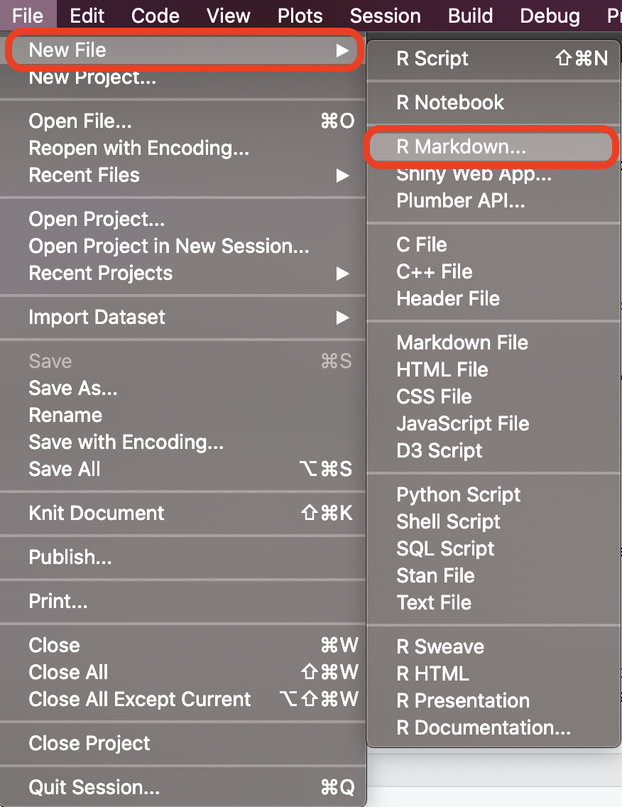
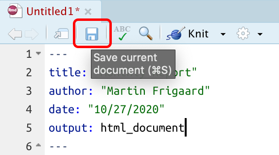

```{r , include=FALSE}
library(tidyverse)
library(ipcwswitch)
library(skimr)
# create data folder
# folders
knitr::opts_chunk$set(warning = FALSE,
                      message = FALSE,
                      tidy = FALSE,
                      size = "Huge")
```

# Objectives

This section provides some exercises to improve your understanding of R Markdown. Please see the [accompanying slides](https://mjfrigaard.github.io/rep-res-rmarkdown/Index.html) for more information.

## Create a new R Markdown file {.tabset}

We will start by creating a new R Markdown file, and set it to create an HTML document.

### New File icon

We can create a new R Markdown file using the *New File* icon

```{r new-rmarkdown, echo = FALSE, out.height="20%", out.width="20%", fig.align='center'}
knitr::include_graphics("img/new-rmarkdown.png")
```

### File tab

We can also create a new R Markdown file in RStudio using *File* \> *New File* \> *R Markdown...*

```{r new-rmarkdown-02, echo = FALSE, out.height="45%", out.width="45%", fig.align='center'}

```

### Save your .Rmd file

We will need to save our `.Rmd` file before we can knit it, so we'll save it as this `rmarkdown-solutions.Rmd`.

```{r save-rmd-file-02, echo = FALSE, out.height="65%", out.width="65%", fig.align='center'}

```

## RMarkdown: YAML {.tabset}

While R Markdown allows us to create a variety of documents formats, the output with the most features is HTML. HTML documents function essentially like a web page, and allow for interactive navigation and displays. This document was written in R Markdown, and we'll be creating a similar report to keep as a reference.

### Standard YAML Header

Our new `.Rmd` file should have the following information. *Note that indentation and case matters in YAML formatting, so we need to pay extra attention to alignments and spelling.*

``` {.yaml}
---
title: "My Report"
author: "Martin Frigaard"
date: "10/24/2020"
output: html_document
---
```

### Table of Contents (TOC)

Having an interactive table of contents makes it easier for readers to navigate your report.

We can add a table of contents (`toc: yes`) and make sure it 'floats' (i.e., remains static when we scroll through the document) with `toc_float: true`. 

These settings should be placed on an indented line below our `html_document:` output in the YAML settings:

``` {.yaml}
---
title: "My Report"
author: "Martin Frigaard"
date: "10/24/2020"
output:
  html_document:
    toc: yes
    toc_float: true
---
```

*Knit* the document again and extend the view to see the floating table of contents.

### Highlight & Themes

Highlighting and themes give us some control over the aesthetics in our reports. We can add a new theme and text highlighting to the report with the following YAML options.

``` {.yaml}
---
title: "My Report"
author: "Martin Frigaard"
date: "10/24/2020"
output:
  html_document:
    toc: yes
    toc_float: yes
    highlight: spacelab
    theme: espresso
---
```

*Knit* the document again and extend the view to see the new theme of text highlighting.
