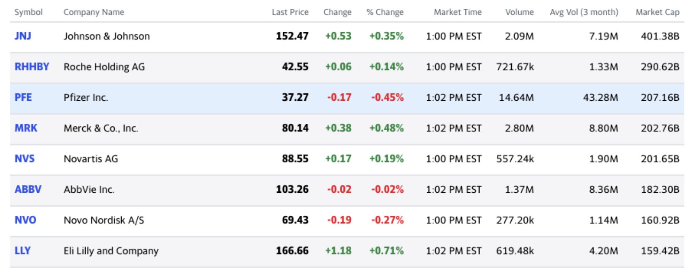

```{r , include=FALSE}
library(tidyverse)
library(skimr)
# create data folder
# folders
folders <- c("code", "data", "img", "docs", "pdfs")
purrr::map(.x = folders, .f = fs::dir_create)
knitr::opts_chunk$set(
  warning = FALSE,
  message = FALSE,
  tidy = FALSE,
  size = "Huge"
)
```

# Objectives

This section is an introduction displaying data in tables with [`reactable`](https://glin.github.io/reactable/) in your R Markdown reports. 

# Resources 

Be sure to check out the previous section on [flow control statements](https://mjfrigaard.github.io/bmrn-tutorials/bk02_subsetting-flow-control.html).

*Slides*: this is an extra lesson, so there aren't currently slides available (yet!)

*RStudio.Cloud*: this is an extra lesson, so there isn't an RStudio.Cloud project (yet!)

# Packages

We'll be covering the [`reactable`](https://glin.github.io/reactable/) package for displaying tables in R Markdown.

```{r packages, message=FALSE, warning=FALSE}
library(tidyverse)
library(gt)
library(reactable)
library(DT)
```

# Yahoo finance data

We're going to be returning to stock data for this section. Stock (or quant) data is typically presented on the web or in a dashboard, so it's great for demonstrating the capabilities of R table packages. 

```{r yahoo-table, echo=FALSE}

```


Here is the source for the dataset above: https://finance.yahoo.com/u/yahoo-finance/watchlists/biotech-and-drug-stocks

I imported these data using the [`datapasta`](https://github.com/MilesMcBain/datapasta) package on 2020-12-24.

```{r datapasta-current, class.source = "fold-hide"}
tibble::tribble(
     ~Symbol,                           ~Company.Name, ~Last.Price, ~Change, ~`%.Change`,   ~Market.Time,   ~Volume, ~`Avg.Vol.(3.month)`, ~Market.Cap,
       "JNJ",                     "Johnson & Johnson",      152.47,    0.53,    "+0.35%",  "1:00 PM EST",   "2.09M",              "7.19M",   "401.38B",
     "RHHBY",                      "Roche Holding AG",       42.55,    0.06,    "+0.14%",  "1:00 PM EST", "721.67k",              "1.33M",   "290.62B",
       "PFE",                           "Pfizer Inc.",       37.27,   -0.17,    "-0.45%",  "1:02 PM EST",  "14.64M",             "43.28M",   "207.16B",
       "MRK",                     "Merck & Co., Inc.",       80.14,    0.38,    "+0.48%",  "1:02 PM EST",   "2.80M",              "8.80M",   "202.76B",
       "NVS",                           "Novartis AG",       88.55,    0.17,    "+0.19%",  "1:00 PM EST", "557.24k",              "1.90M",   "201.65B",
      "ABBV",                           "AbbVie Inc.",      103.26,   -0.02,    "-0.02%",  "1:02 PM EST",   "1.37M",              "8.36M",   "182.30B",
       "NVO",                      "Novo Nordisk A/S",       69.43,   -0.19,    "-0.27%",  "1:00 PM EST", "277.20k",              "1.14M",   "160.92B",
       "LLY",                 "Eli Lilly and Company",      166.66,    1.18,    "+0.71%",  "1:02 PM EST", "619.48k",              "4.20M",   "159.42B",
       "BMY",          "Bristol-Myers Squibb Company",       61.15,    0.15,    "+0.25%",  "1:00 PM EST",   "3.07M",             "10.59M",   "138.18B",
      "AMGN",                            "Amgen Inc.",      222.93,   -0.01,    "-0.00%",  "1:00 PM EST", "912.39k",              "2.62M",   "129.78B",
       "AZN",                       "AstraZeneca PLC",       48.52,   -0.25,    "-0.51%",  "1:00 PM EST",   "4.91M",              "7.64M",   "126.37B",
       "SNY",                                "Sanofi",       47.45,   -0.13,    "-0.27%",  "1:00 PM EST", "477.62k",              "1.33M",   "119.44B",
       "GSK",                   "GlaxoSmithKline plc",       36.14,   -0.09,    "-0.25%",  "1:00 PM EST",   "1.29M",              "4.95M",    "91.21B",
     "GLAXF",                   "GlaxoSmithKline plc",       17.79,   -0.46,    "-2.52%", "12:07 PM EST",   "1.34k",            "253.49k",    "88.83B",
       "ZTS",                           "Zoetis Inc.",      160.72,    0.87,    "+0.54%",  "1:03 PM EST", "414.69k",              "1.75M",    "76.39B",
      "GILD",                 "Gilead Sciences, Inc.",       57.07,   -0.31,    "-0.54%",  "1:00 PM EST",   "3.26M",              "9.49M",    "71.54B",
      "VRTX",   "Vertex Pharmaceuticals Incorporated",      234.46,   -1.38,    "-0.59%",  "1:00 PM EST", "446.67k",              "2.13M",    "60.97B",
     "BAYRY",              "Bayer Aktiengesellschaft",       14.59,   -0.09,    "-0.61%", "12:59 PM EST", "366.53k",            "797.87k",    "57.33B",
       "TAK", "Takeda Pharmaceutical Company Limited",       18.11,   -0.17,    "-0.93%",  "1:00 PM EST",   "1.88M",              "1.34M",    "56.34B",
      "REGN",       "Regeneron Pharmaceuticals, Inc.",      488.93,   -3.26,    "-0.66%",  "1:00 PM EST", "286.59k",              "1.03M",    "52.17B",
      "MRNA",                         "Moderna, Inc.",      123.39,   -6.95,    "-5.33%",  "1:00 PM EST",  "12.51M",             "19.64M",    "48.83B",
      "BIIB",                           "Biogen Inc.",      248.89,   -2.31,    "-0.92%",  "1:00 PM EST", "444.89k",              "1.65M",    "38.30B",
      "SGEN",                           "Seagen Inc.",      190.61,   -0.58,    "-0.30%",  "1:00 PM EST", "246.96k",            "921.99k",    "34.12B",
      "ALXN",         "Alexion Pharmaceuticals, Inc.",      152.63,   -0.61,    "-0.40%",  "1:00 PM EST",   "1.07M",              "2.38M",    "33.38B",
      "RPRX",                    "Royalty Pharma plc",        48.9,    0.29,    "+0.60%",  "1:00 PM EST",   "1.58M",              "2.12M",    "30.57B",
      "GMAB",                            "Genmab A/S",       39.11,    0.02,    "+0.05%",  "1:00 PM EST",  "96.45k",            "504.87k",    "25.61B",
      "BGNE",                         "BeiGene, Ltd.",      263.72,   -0.14,    "-0.05%",  "1:00 PM EST",  "77.94k",            "399.97k",    "23.74B",
      "BNTX",                           "BioNTech SE",       96.96,    -3.1,    "-3.10%",  "1:00 PM EST",   "1.03M",              "3.94M",    "23.35B",
      "VTRS",                          "Viatris Inc.",       17.77,   -0.11,    "-0.62%",  "1:00 PM EST",   "1.93M",             "11.64M",    "21.36B",
      "INCY",                    "Incyte Corporation",       87.37,   -0.56,    "-0.64%",  "1:00 PM EST", "177.61k",              "1.15M",    "19.13B") -> BioTechStocksPaste
# clean names and export
BioTechStocksPaste %>% 
  janitor::clean_names() %>% 
  readr::write_csv(x = ., file = "data/2020-12-24-BioTechStocks.csv")
```


## Example summary table  {.tabset}

These data have already been formatted in a way that is great for displaying in a table, but would pose problems if we tried to visualize them in R. For example, the `percent_change`-`market_cap` columns have symbols that cause them to be read into R as characters. We would need to wrangle these data quite a bit to get them into a format we could use.

```{r biotech-and-drug-stocks, message=FALSE, warning=FALSE}
BioTechStocksRaw <- read_csv("data/2020-12-24-BioTechStocks.csv")
BioTechStocksRaw
```

### `str_remove_all()`

The first step to get these data into a format we can use is to remove the `+` symbol from the `change` variable, then convert it to a numerical value (this will result in some missing values).

```{r BioTechStocksRaw-change, message=FALSE, warning=FALSE}
BioTechStocksRaw %>%
  mutate(
    # change numeric
    change = str_remove_all(string = change, pattern = "^\\+"),
    change = as.numeric(change, na.rm = TRUE)
  )
```

Next we want to remove the `+` and `%` from the `percent_change` column, and convert this to a numerical value. 

```{r percent-change, message=FALSE, warning=FALSE}
BioTechStocksRaw %>%
  mutate(
    # change numeric
    change = str_remove_all(string = change, pattern = "^\\+"),
    change = as.numeric(change, na.rm = TRUE),
    # percent change
    percent_change = str_remove_all(string = percent_change, pattern = "^\\+"),
    percent_change = str_remove_all(string = percent_change, pattern = "\\%"),
    percent_change = as.numeric(percent_change, na.rm = TRUE)
  )
```

The `volume` and `avg_vol_3_month` columns have two different characters `k` and `M` that will take some more advanced steps, so we'll remove the `B` from `market_cap` first. 

```{r market_cap, message=FALSE, warning=FALSE}
BioTechStocksRaw %>%
  mutate(
    # change numeric
    change = str_remove_all(string = change, pattern = "^\\+"),
    change = as.numeric(change, na.rm = TRUE),
    # percent change
    percent_change = str_remove_all(string = percent_change, pattern = "^\\+"),
    percent_change = str_remove_all(string = percent_change, pattern = "\\%"),
    percent_change = as.numeric(percent_change, na.rm = TRUE),
    # market cap
    market_cap = str_remove_all(string = market_cap, pattern = "B"),
    market_cap = as.numeric(market_cap, na.rm = TRUE)
  )
```

### `case_when()`

Now, to get the correct value in the `volume` and `avg_vol_3_month` columns, we'll need to create a `key` variable for `k` and `M`, then we can use the `key`s to conditionally transform the values.

```{r keys, message=FALSE, warning=FALSE}
BioTechStocksRaw %>%
  mutate(
    # change numeric
    change = str_remove_all(string = change, pattern = "^\\+"),
    change = as.numeric(change, na.rm = TRUE),
    # percent change
    percent_change = str_remove_all(string = percent_change, pattern = "^\\+"),
    percent_change = str_remove_all(string = percent_change, pattern = "\\%"),
    percent_change = as.numeric(percent_change, na.rm = TRUE),
    # market cap
    market_cap = str_remove_all(string = market_cap, pattern = "B"),
    market_cap = as.numeric(market_cap, na.rm = TRUE),
    # volume key
    volume_key =
      case_when(
        str_detect(string = volume, pattern = "k") ~ "volume ($K)",
        str_detect(string = volume, pattern = "M") ~ "volume ($M)"
      ),
    # identify k vs M in avg_vol_3_month
    avg_vol_3mo_key =
      case_when(
        str_detect(string = avg_vol_3_month, pattern = "k") ~ "volume ($K)",
        str_detect(string = avg_vol_3_month, pattern = "M") ~ "volume ($M)"
      )
  )
```

Now we want to remove both the `M` and the `k` from `volume` and `avg_vol_3_month`.

```{r remove-km-from-volume, message=FALSE, warning=FALSE}
BioTechStocksRaw %>%
  mutate(
    # change numeric
    change = str_remove_all(string = change, pattern = "^\\+"),
    change = as.numeric(change, na.rm = TRUE),
    # percent change
    percent_change = str_remove_all(string = percent_change, pattern = "^\\+"),
    percent_change = str_remove_all(string = percent_change, pattern = "\\%"),
    percent_change = as.numeric(percent_change, na.rm = TRUE),
    # market cap
    market_cap = str_remove_all(string = market_cap, pattern = "B"),
    market_cap = as.numeric(market_cap, na.rm = TRUE),
    # volume key
    volume_key =
      case_when(
        str_detect(string = volume, pattern = "k") ~ "volume ($K)",
        str_detect(string = volume, pattern = "M") ~ "volume ($M)"
      ),
    # identify k vs M in avg_vol_3_month
    avg_vol_3mo_key =
      case_when(
        str_detect(string = avg_vol_3_month, pattern = "k") ~ "volume ($K)",
        str_detect(string = avg_vol_3_month, pattern = "M") ~ "volume ($M)"
      ),
    # remove string from volume
    volume = str_remove_all(string = volume, pattern = "M|k"),
    # volume as numeric
    volume = as.numeric(volume, na.rm = TRUE),
    # remove string from avg_vol_3_month
    avg_vol_3_month = str_remove_all(string = avg_vol_3_month, pattern = "M|k"),
    # average vol 3-month as numeric
    avg_vol_3_month = as.numeric(avg_vol_3_month, na.rm = TRUE)
  )
```

And now we can use the `key` variables to transform the values so they are all in millions. 

```{r case-when-key}
BioTechStocksRaw %>%
  mutate(
    # change numeric
    change = str_remove_all(string = change, pattern = "^\\+"),
    change = as.numeric(change, na.rm = TRUE),
    # percent change
    percent_change = str_remove_all(string = percent_change, pattern = "^\\+"),
    percent_change = str_remove_all(string = percent_change, pattern = "\\%"),
    percent_change = as.numeric(percent_change, na.rm = TRUE),
    # market cap
    market_cap = str_remove_all(string = market_cap, pattern = "B"),
    market_cap = as.numeric(market_cap, na.rm = TRUE),
    # volume key
    volume_key =
      case_when(
        str_detect(string = volume, pattern = "k") ~ "volume ($K)",
        str_detect(string = volume, pattern = "M") ~ "volume ($M)"
      ),
    # identify k vs M in avg_vol_3_month
    avg_vol_3mo_key =
      case_when(
        str_detect(string = avg_vol_3_month, pattern = "k") ~ "volume ($K)",
        str_detect(string = avg_vol_3_month, pattern = "M") ~ "volume ($M)"
      ),
    # remove string from volume
    volume = str_remove_all(string = volume, pattern = "M|k"),
    # volume as numeric
    volume = as.numeric(volume, na.rm = TRUE),
    # remove string from avg_vol_3_month
    avg_vol_3_month = str_remove_all(string = avg_vol_3_month, pattern = "M|k"),
    # average vol 3-month as numeric
    avg_vol_3_month = as.numeric(avg_vol_3_month, na.rm = TRUE),
    # format volume
    volume = case_when(
      # convert k to mil
      volume_key == "volume ($K)" ~ round(volume * 0.001, digits = 2),
      # round mil
      volume_key == "volume ($M)" ~ round(volume, digits = 2)
    ),
    # convert k to mil
    avg_vol_3_month = case_when(
      avg_vol_3mo_key == "volume ($K)" ~ round(avg_vol_3_month * 0.001, digits = 2),
      # round mil
      avg_vol_3mo_key == "volume ($M)" ~ round(avg_vol_3_month, digits = 2)
    )
  )
```

### `BioTechStocksClean`

Now we'll remove the `key` columns for volume and average 3-month volume and store the clean variables in `BioTechStocksClean`.

```{r create-BioTechStocksClean, message=FALSE, warning=FALSE}
BioTechStocksRaw %>%
  mutate(
    # change numeric
    change = str_remove_all(string = change, pattern = "^\\+"),
    change = as.numeric(change, na.rm = TRUE),
    # percent change
    percent_change = str_remove_all(string = percent_change, pattern = "^\\+"),
    percent_change = str_remove_all(string = percent_change, pattern = "\\%"),
    percent_change = as.numeric(percent_change, na.rm = TRUE),
    # market cap
    market_cap = str_remove_all(string = market_cap, pattern = "B"),
    market_cap = as.numeric(market_cap, na.rm = TRUE),
    # volume key
    volume_key =
      case_when(
        str_detect(string = volume, pattern = "k") ~ "volume ($K)",
        str_detect(string = volume, pattern = "M") ~ "volume ($M)"
      ),
    # identify k vs M in avg_vol_3_month
    avg_vol_3mo_key =
      case_when(
        str_detect(string = avg_vol_3_month, pattern = "k") ~ "volume ($K)",
        str_detect(string = avg_vol_3_month, pattern = "M") ~ "volume ($M)"
      ),
    # remove string from volume
    volume = str_remove_all(string = volume, pattern = "M|k"),
    # volume as numeric
    volume = as.numeric(volume, na.rm = TRUE),
    # remove string from avg_vol_3_month
    avg_vol_3_month = str_remove_all(string = avg_vol_3_month, pattern = "M|k"),
    # average vol 3-month as numeric
    avg_vol_3_month = as.numeric(avg_vol_3_month, na.rm = TRUE),
    # format volume
    volume = case_when(
      # convert k to mil
      volume_key == "volume ($K)" ~ round(volume * 0.001, digits = 2),
      # round mil
      volume_key == "volume ($M)" ~ round(volume, digits = 2)
    ),
    # convert k to mil
    avg_vol_3_month = case_when(
      avg_vol_3mo_key == "volume ($K)" ~ round(avg_vol_3_month * 0.001, digits = 2),
      # round mil
      avg_vol_3mo_key == "volume ($M)" ~ round(avg_vol_3_month, digits = 2)
    )
  ) %>%
  # reduce dataset to original columns
  dplyr::select(
    symbol,
    company_name,
    last_price,
    change,
    percent_change,
    market_time,
    volume,
    avg_vol_3_month,
    market_cap
  ) -> BioTechStocksClean
BioTechStocksClean
```

If we compare this to `BioTechStocksRaw` we can see we've kept all the numerical information, but removed the character symbols. See the examples we've filtered for below: 

```{r compare-BioTechStocksRaw-BioTechStocksClean}
BioTechStocksRaw %>%
  dplyr::filter(symbol %in% c("SGEN", "BAYRY", "GLAXF", "BGNE"))
BioTechStocksClean %>%
  dplyr::filter(symbol %in% c("SGEN", "BAYRY", "GLAXF", "BGNE"))
```

# `reactable` package

The `reactable` package provides a comprehensive library of data display features. 

We're going to work through a few examples of how to use this package for displaying a subset of the `BioTechStocksClean` data (created below):

```{r TopBottomBioTechChange}
BioTechStocksClean %>%
  dplyr::filter(percent_change < -0.90 | percent_change > 0.30) %>%
  dplyr::arrange(desc(percent_change)) %>% 
  dplyr::select(symbol:percent_change) -> TopBottomBioTechChange
TopBottomBioTechChange
```

## The basics {.tabset}

The simplest use of reactive is by passing a `tibble` or `data.frame` directly to it. 

```{r reactable-bare-bones}
reactable(TopBottomBioTechChange)
```

### Listing `columns`

The `columns` argument in `reactable` addresses any formatting we want to make the columns in our table. It takes the [`colDef()` function](https://glin.github.io/reactable/reference/colDef.html), which has many options for customizing and styling the table columns. 

For example, we can pass a `list()` of columns with `colDef()` to change the names of the columns.

```{r columns}
reactable(
  data = TopBottomBioTechChange,
  columns = list(
    symbol = colDef(name = "Symbol"),
    company_name = colDef(name = "Company Name"),
    last_price = colDef(name = "Last Price"),
    change = colDef(name = "Change"),
    percent_change = colDef(name = "Percent Change")
  )
)
```

### The `defaultColDef`

There is also a `defaultColDef` argument we can use to set all the columns in the `tibble` or `data.frame`. 

We use `defaultColDef` to write some custom functions for how we want the columns to be formatted. Take the `header` argument example below:

```{r header-function, eval=FALSE}
colDef(header = )
# Custom header renderer. An R function that takes the header value and column
# name as arguments, or a JS() function that takes a column info object as an
# argument.
```


## Custom `function`s {.tabset}

The function we define takes a `value`, removes the underscores and converts the column name to title case.

### Test `function`s

These should be able to stand alone as functions.

```{r header-custom-function}
header <- function(value) {
  hdr <- str_replace_all(value, "_", " ")
  str_to_title(hdr)
}
header(value = names(TopBottomBioTechChange))
```

### `colDef()` + `header`

But when we pass to `colDef()`, they get applied to the `tibble` or `data.frame`. 

```{r defaultColDef-header-function}
reactable(
  data = TopBottomBioTechChange,
  defaultColDef = colDef(
    header = function(value) {
      hdr <- str_replace_all(value, "_", " ")
      str_to_title(hdr)
    }
  )
)
```

## Argument values as `list()`s {.tabset}

We can also pass a `list` of values to `colDef()` arguments.

### `headerStyle`

See the `headerStyle` example below:

```{r headerStyle}
reactable(
  data = TopBottomBioTechChange,
  defaultColDef = colDef(
    # header formatting
    header = function(value) {
      hdr <- str_replace_all(value, "_", " ")
      str_to_title(hdr)
    },
    # headerStyle
    headerStyle = list(
      fontWeight = 500,
      fontSize = "13px",
      letterSpacing = "1px"
    ), 
    format = colFormat(digits = 2)
  )
)
```

### Override `defaultColDef`

We can also override the default column settings in `defaultColDef` by supplying an additional `colDef()` function. 

```{r override-defaultColDef}
reactable(
  data = TopBottomBioTechChange,
  defaultColDef = colDef(
    header = function(value) {
      hdr <- str_replace_all(value, "_", " ")
      str_to_title(hdr)
    },
    headerStyle = list(
      fontWeight = 500,
      fontSize = "13px",
      letterSpacing = "1px"
    ),
    format = colFormat(digits = 2)
  ),
  columns = list(
    company_name = colDef(minWidth = 240)
  )
)
```

## Add symbols {.tabset}

Let's add the symbols to `change` and `percent_change` we removed from the previous table (`+` and `-`).

### Custom `cell` function

To do this, we'll write a custom function for adding the cell formatting. 

```{r cell-symbol-function}
cell <- function(value) {
  # here we use paste0() to combine the value with +
  # for all values greater than 0
  if (value > 0.00) paste0("+", value) else value
}
cell(TopBottomBioTechChange$percent_change[1])
cell(TopBottomBioTechChange$change[6])
```

### `colDef()` + `cell`

This is working, so we'll add this to the `colDef()` function for `change` and `percent_change`.

```{r format-cells-plus-minus}
reactable(
  data = TopBottomBioTechChange,
  defaultColDef = colDef(
    header = function(value) {
      hdr <- str_replace_all(value, "_", " ")
      str_to_title(hdr)
    },
    headerStyle = list(
      fontWeight = 500,
      fontSize = "13px",
      letterSpacing = "1px"
    ),
    format = colFormat(digits = 2)
  ),
  columns = list(
    company_name = colDef(minWidth = 240),
    change = colDef(
      cell = function(value) {
        if (value >= 0) {
          paste0("+", value)
        } else {
          value
        }
      },
    ),
    percent_change = colDef(
      cell = function(value) {
        if (value >= 0) {
          paste0("+", value)
        } else {
          value
        }
      }
    )
  )
)
```

## Add `color` with `style` {.tabset}

Our table is starting to look like the [original](https://finance.yahoo.com/u/yahoo-finance/watchlists/biotech-and-drug-stocks).

```{r yahoo-stocks-table, echo=FALSE}
knitr::include_graphics(path = "img/yahoo-stocks-table.png")
```

We want to make the positive `change` and `percent_change` values green, and the negative values red. 

### Custom `style` function

First we define a function with the color values. 

```{r style-function}
style <- function(value) {
  color <- if (value > 0) {
    # green if above
    "#008B00"
    # red if below
  } else if (value < 0) {
    "#FF3030"
  } # adjust the font weight and color
  list(fontWeight = 600, color = color)
}
style(TopBottomBioTechChange$change[1])
style(TopBottomBioTechChange$percent_change[6])
```

### `colDef()` + `style` 

This is returning the two values we want to supply (`fontWeight` and `color`), so we can add it *inside* the `colDef()` function for each column. 

```{r style-formatting}
reactable(
  data = TopBottomBioTechChange,
  defaultColDef = colDef(
    header = function(value) {
      hdr <- str_replace_all(value, "_", " ")
      str_to_title(hdr)
    },
    headerStyle = list(
      fontWeight = 500,
      fontSize = "13px",
      letterSpacing = "1px"
    ),
    format = colFormat(digits = 2)
  ),
  columns = list(
    company_name = colDef(minWidth = 240),
    change = colDef(
      cell = function(value) {
        if (value >= 0) {
          paste0("+", value)
        } else {
          value
        }
      },
      style = function(value) {
        color <- if (value > 0) {
          "#008B00"
        } else if (value < 0) {
          "#FF3030"
        }
        list(fontWeight = 600, color = color)
      }
    ),
    percent_change = colDef(
      cell = function(value) {
        if (value >= 0) {
          paste0("+", value)
        } else {
          value
        }
      },
      style = function(value) {
        color <- if (value > 0) {
          "#008B00"
        } else if (value < 0) {
          "#FF3030"
        }
        list(fontWeight = 600, color = color)
      }
    )
  )
)
```


### `style` fonts and color

We need to change the `color` and `weight` of the stock symbols and last price, and we can set the font weight and color *inside* `colDef()` with the `style` argument.

```{r purple-symbols}
reactable(
  data = TopBottomBioTechChange,
  defaultColDef = colDef(
    header = function(value) {
      hdr <- str_replace_all(value, "_", " ")
      str_to_title(hdr)
    },
    headerStyle = list(
      fontWeight = 500,
      fontSize = "13px",
      letterSpacing = "1px"
    ),
    format = colFormat(digits = 2)
  ),
  columns = list(
    company_name = colDef(minWidth = 240),
    change = colDef(
      format = colFormat(digits = 2),
      cell = function(value) {
        if (value >= 0) {
          paste0("+", value)
        } else {
          value
        }
      },
      style = function(value) {
        color <- if (value > 0) {
          "#008B00"
        } else if (value < 0) {
          "#FF3030"
        }
        list(fontWeight = 600, color = color)
      }
    ),
    percent_change = colDef(
      format = colFormat(digits = 2),
      cell = function(value) {
        if (value >= 0) {
          paste0("+", value)
        } else {
          value
        }
      },
      style = function(value) {
        color <- if (value > 0) {
          "#008B00"
        } else if (value < 0) {
          "#FF3030"
        }
        list(fontWeight = 600, color = color)
      }
    ),
    symbol = colDef(
      style = list(color = "#8470FF", fontWeight = "bold")
    ),
    last_price = colDef(
      format = colFormat(digits = 2),
      style = list(color = "black", fontWeight = "bold")
    )
  )
)
```

Now that the table looks similar, we need to add some highlighting (and some other features that aren't in the original table).

## Add highlighting and formatting {.tabset}

The original table highlights each row when we roll over it with our cursor, and we can add this with the `highlight = TRUE` argument.

### `highlight` 

The `highlight` argument precedes the column definition functions.

```{r highlighting}
reactable(
  data = TopBottomBioTechChange,
  highlight = TRUE,
  defaultColDef = colDef(
    header = function(value) {
      hdr <- str_replace_all(value, "_", " ")
      str_to_title(hdr)
    },
    headerStyle = list(
      fontWeight = 500,
      fontSize = "13px",
      letterSpacing = "1px"
    ),
    format = colFormat(digits = 2)
  ),
  columns = list(
    company_name = colDef(minWidth = 240),
    change = colDef(
      format = colFormat(digits = 2),
      cell = function(value) {
        if (value >= 0) {
          paste0("+", value)
        } else {
          value
        }
      },
      style = function(value) {
        color <- if (value > 0) {
          "#008B00"
        } else if (value < 0) {
          "#FF3030"
        }
        list(fontWeight = 600, color = color)
      }
    ),
    percent_change = colDef(
      format = colFormat(digits = 2),
      cell = function(value) {
        if (value >= 0) {
          paste0("+", value)
        } else {
          value
        }
      },
      style = function(value) {
        color <- if (value > 0) {
          "#008B00"
        } else if (value < 0) {
          "#FF3030"
        }
        list(fontWeight = 600, color = color)
      }
    ),
    symbol = colDef(
      style = list(color = "#8470FF", fontWeight = "bold")
    ),
    last_price = colDef(
      format = colFormat(digits = 2),
      style = list(color = "black", fontWeight = "bold")
    )
  )
)
```

### `striped` 

The original table also has striping (every other row is a different color), and we can add the `striped` argument just like the `highlight` argument.

```{r striping}
reactable(
  data = TopBottomBioTechChange,
  highlight = TRUE,
  striped = TRUE,
  defaultColDef = colDef(
    header = function(value) {
      hdr <- str_replace_all(value, "_", " ")
      str_to_title(hdr)
    },
    headerStyle = list(
      fontWeight = 500,
      fontSize = "13px",
      letterSpacing = "1px"
    ),
    format = colFormat(digits = 2)
  ),
  columns = list(
    company_name = colDef(minWidth = 240),
    change = colDef(
      format = colFormat(digits = 2),
      cell = function(value) {
        if (value >= 0) {
          paste0("+", value)
        } else {
          value
        }
      },
      style = function(value) {
        color <- if (value > 0) {
          "#008B00"
        } else if (value < 0) {
          "#FF3030"
        }
        list(fontWeight = 600, 
             color = color)
      }
    ),
    percent_change = colDef(
      format = colFormat(digits = 2),
      cell = function(value) {
        if (value >= 0) {
          paste0("+", value)
        } else {
          value
        }
      },
      style = function(value) {
        color <- if (value > 0) {
          "#008B00"
        } else if (value < 0) {
          "#FF3030"
        }
        list(fontWeight = 600, color = color)
      }
    ),
    symbol = colDef(
      style = list(color = "#8470FF", fontWeight = "bold")
    ),
    last_price = colDef(
      format = colFormat(digits = 2),
      style = list(color = "black", fontWeight = "bold")
    )
  )
)
```

Now we have a striped, highlighted table!


## Add filtering {.tabset}

We also want to make navigating the table a little easier by adding filtering. 

### filtering

This is added with the `filterable = TRUE` argument. 

```{r filterable}
reactable(
  data = TopBottomBioTechChange,
  highlight = TRUE,
  striped = TRUE,
  filterable = TRUE,
  defaultColDef = colDef(
    header = function(value) {
      hdr <- str_replace_all(value, "_", " ")
      str_to_title(hdr)
    },
    headerStyle = list(
      fontWeight = 500,
      fontSize = "13px",
      letterSpacing = "1px"
    ),
    format = colFormat(digits = 2)
  ),
  columns = list(
    company_name = colDef(minWidth = 240),
    change = colDef(
      cell = function(value) {
        if (value >= 0) {
          paste0("+", value)
        } else {
          value
        }
      },
      style = function(value) {
        color <- if (value > 0) {
          "#008B00"
        } else if (value < 0) {
          "#FF3030"
        }
        list(fontWeight = 600, color = color)
      }
    ),
    percent_change = colDef(
      cell = function(value) {
        if (value >= 0) {
          paste0("+", value)
        } else {
          value
        }
      },
      style = function(value) {
        color <- if (value > 0) {
          "#008B00"
        } else if (value < 0) {
          "#FF3030"
        }
        list(fontWeight = 600, color = color)
      }
    ),
    symbol = colDef(
      style = list(color = "#8470FF", fontWeight = "bold")
    ),
    last_price = colDef(
      style = list(color = "black", fontWeight = "bold")
    )
  )
)
```

### selective filtering

We might not want *all* of the columns filterable, so we can define the feature by column in `colDef()` too. 

```{r selective-filter}
reactable(
  data = TopBottomBioTechChange,
  highlight = TRUE,
  striped = TRUE,
  defaultColDef = colDef(
    header = function(value) {
      hdr <- str_replace_all(value, "_", " ")
      str_to_title(hdr)
    },
    headerStyle = list(
      fontWeight = 500,
      fontSize = "13px",
      letterSpacing = "1px"
    ),
    format = colFormat(digits = 2)
  ),
  columns = list(
    company_name = colDef(minWidth = 240, 
                          filterable = TRUE),
    change = colDef(
      cell = function(value) {
        if (value >= 0) {
          paste0("+", value)
        } else {
          value
        }
      },
      style = function(value) {
        color <- if (value > 0) {
          "#008B00"
        } else if (value < 0) {
          "#FF3030"
        }
        list(fontWeight = 600, color = color)
      }
    ),
    percent_change = colDef(
      cell = function(value) {
        if (value >= 0) {
          paste0("+", value)
        } else {
          value
        }
      },
      style = function(value) {
        color <- if (value > 0) {
          "#008B00"
        } else if (value < 0) {
          "#FF3030"
        }
        list(fontWeight = 600, color = color)
      }
    ),
    symbol = colDef(
      style = list(color = "#8470FF", fontWeight = "bold"),
      filterable = TRUE
    ),
    last_price = colDef(
      style = list(color = "black", fontWeight = "bold")
    )
  )
)
```

Now this table is more interactive and easier to narrow down. 

## Add searching {.tabset}

The last feature we'll add to this table is searching. This makes the entire table `searchable`. 

### `searchable`

We can make the entire table searchable by adding `searchable = TRUE` before the column definition functions. 

```{r searchable}
reactable(
  data = TopBottomBioTechChange,
  highlight = TRUE,
  striped = TRUE,
  searchable = TRUE,
  defaultColDef = colDef(
    header = function(value) {
      hdr <- str_replace_all(value, "_", " ")
      str_to_title(hdr)
    },
    headerStyle = list(
      fontWeight = 500,
      fontSize = "13px",
      letterSpacing = "1px"
    ),
    format = colFormat(digits = 2)
  ),
  columns = list(
    company_name = colDef(minWidth = 240, 
                          filterable = TRUE),
    change = colDef(
      cell = function(value) {
        if (value >= 0) {
          paste0("+", value)
        } else {
          value
        }
      },
      style = function(value) {
        color <- if (value > 0) {
          "#008B00"
        } else if (value < 0) {
          "#FF3030"
        }
        list(fontWeight = 600, color = color)
      }
    ),
    percent_change = colDef(
      cell = function(value) {
        if (value >= 0) {
          paste0("+", value)
        } else {
          value
        }
      },
      style = function(value) {
        color <- if (value > 0) {
          "#008B00"
        } else if (value < 0) {
          "#FF3030"
        }
        list(fontWeight = 600, color = color)
      }
    ),
    symbol = colDef(
      style = list(color = "#8470FF", fontWeight = "bold"),
      filterable = TRUE
    ),
    last_price = colDef(
      style = list(color = "black", fontWeight = "bold")
    )
  )
)
```

### `minRows`

The `searchable` argument works well when combined with the `minRows` argument (especially for large tables).

```{r minRows}
reactable(
  data = TopBottomBioTechChange,
  highlight = TRUE,
  striped = TRUE,
  searchable = TRUE,
  minRows = 5,
  defaultColDef = colDef(
    header = function(value) {
      hdr <- str_replace_all(value, "_", " ")
      str_to_title(hdr)
    },
    headerStyle = list(
      fontWeight = 500,
      fontSize = "13px",
      letterSpacing = "1px"
    ),
    format = colFormat(digits = 2)
  ),
  columns = list(
    company_name = colDef(minWidth = 240, 
                          filterable = TRUE),
    change = colDef(
      cell = function(value) {
        if (value >= 0) {
          paste0("+", value)
        } else {
          value
        }
      },
      style = function(value) {
        color <- if (value > 0) {
          "#008B00"
        } else if (value < 0) {
          "#FF3030"
        }
        list(fontWeight = 600, color = color)
      }
    ),
    percent_change = colDef(
      cell = function(value) {
        if (value >= 0) {
          paste0("+", value)
        } else {
          value
        }
      },
      style = function(value) {
        color <- if (value > 0) {
          "#008B00"
        } else if (value < 0) {
          "#FF3030"
        }
        list(fontWeight = 600, color = color)
      }
    ),
    symbol = colDef(
      style = list(color = "#8470FF", fontWeight = "bold"),
      filterable = TRUE
    ),
    last_price = colDef(
      style = list(color = "black", fontWeight = "bold")
    )
  )
)
```
