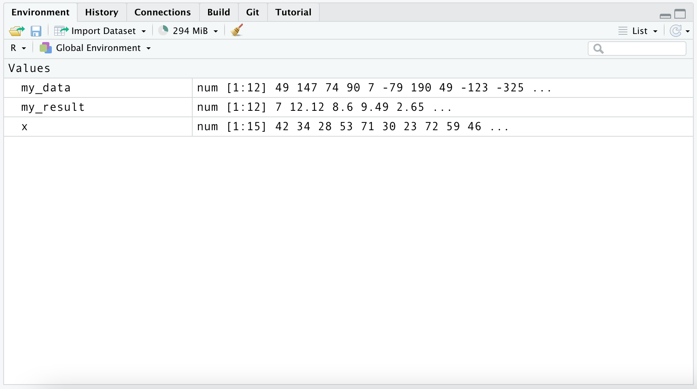
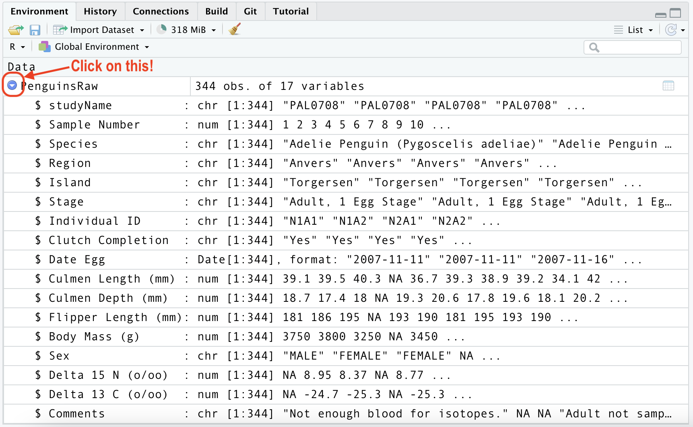

```{r setup, include=FALSE}
library(knitr)
library(memor)
library(tidyverse)
opts_chunk$set(warning = TRUE, 
                message = TRUE)
# opts_knit$set()
```

R is an object-oriented, functional programming language for statistical analysis and graphics. R is also a free and open-source software (FOSS) with a massive global community of users and developers who have helped create and maintain tools for data manipulation, graphics, statistics, and machine learning.

# Base R packages 

R `packages` are collections of commands for a particular purpose or task. R comes 'out of the box' with a ton of functions for manipulating, analyzing, and visualizing data. Two of the most commonly used standard packages are `base` and `utils`. 

You can access any function in a package using the `package::function()` syntax. If you're in RStudio, you can actually see the functions in each package by using the tab-completion feature:

```{r package-functions.png, echo=FALSE, fig.align='center', out.width='5in', out.height='3in'}
knitr::include_graphics(path = "../img/package-functions.png")
```

If you hover over the function with your mouse cursor, you'll also see the arguments and documentation for each function. 

```{r function-args.png, echo=FALSE, fig.align='center', out.width='5in', out.height='2in'}
knitr::include_graphics(path = "../img/function-args.png")
```

When you're using the `utils::install.packages()` function, the package files are installed from the [Comprehensive R Archive Network](https://cran.r-project.org/), or CRAN. These packages have passed a variety of tests and are generally considered to be more reliable. 

# User-written packages 

Most of the packages we'll be using in this course come from the `tidyverse,` which is a suite of tools pioneered by RStudio's Chief Scientist [Hadley Wickham](http://hadley.nz/). All packages in the `tidyverse` work well together because they center around a common thread of [tidy data](https://vita.had.co.nz/papers/tidy-data.pdf).

To install and load the `tidyverse`, we will use the `utils::install.packages()` function to download and installs R packages into a local folder on our computer, and the `base::library()` command loads the packages.

```{r install-tidyverse, message=FALSE, warning=FALSE, results='hide', eval=FALSE}
install.packages("tidyverse")
library(tidyverse)
```

**NOTE: Not all functions return an output. Some functions return messages (or prompts), so be sure to check the help files by using `?install.packages` in the console.**

User-written packages can be installed from code repositories like [Github.](https://github.com/). The R ecosystem has over 10,000 user-written packages available on [CRAN](https://cran.r-project.org/).

First you will need to install the `remotes` package from CRAN

```{r install-remotes, eval=FALSE, message=FALSE, warning=FALSE, results='hide'}
install.packages("remotes")
```

Second, you load the package with `library()`

```{r library, , eval=FALSE, message=FALSE, warning=FALSE, results='hide'}
library(remotes)
```

Finally, we use the `remotes::install_github()` to download and install the `tidyverse` package. 

```{r install-github, eval=FALSE, message=FALSE, warning=FALSE, results='hide'}
remotes::install_github("tidyverse/tidyverse")
library(tidyverse)
```

**Note: when installing packages from Github or other repos, you're getting the 'freshest' version, so there might be bugs or errors. If you run into an issue, look for a version of the package on CRAN**

# Functions and objects 

The R language is comprised of functions and objects. R uses functions to perform operations (like `mean()`, `sum()`, `lm()` (for linear model)) on objects (vectors, arrays, matrices, data.frames or lists).

Generally speaking, functions are similar to _verbs_, and objects are more like _nouns_. Functions typically take an object as an `input`, perform an operation on that object, and then return an `output` object. 

```{r example-function, eval=FALSE}
object <- function('input') {

    perform operation(s) on 'input'

    return output
}
# view object
object
```


# Creating objects   

R comes with a variety of functions for creating objects. We will start with `c()`, which stands for 'combine' or 'concatenate'. 

We can print this to the console by supplying the new object and hitting enter/return.

```{r create-c}
x <- c(42, 34, 28, 53, 71, 30, 23, 72, 59, 46, 64, 33, 42, 50, 68)
x
```


*A quick note on printing: notice the preceding `[1]` in the output. This is not part of the object, it's the line number for the output.*

Now that we have an object in R, what do we do with it? We will start by taking a look at some of it's technical information using `class()` and `str()`

```{r class-x}
class(x) 
```

The `class()` function tells us `x` is a `numeric` vector. The `str()` function is an abbreviation for 'structure', and it gives us a bit more information. 

```{r str-x}
str(x)
```

I recommend using `str()` and `class()` when you're programming in R. Knowing what kind of object you're dealing with will help you determine what you can do with it. 

# Store and explore 

Given the relationship between functions and objects, a common workflow is '*store and explore*, where we create (or import) some data as an object, apply a function to this object, store the output from this function in a new object, and use *another* function to view the result. 

## Store

Below we create `my_data`, a vector of 12 numbers, and print it to the console. 

```{r my_data}
# create data  
my_data <- c(49, 147, 74, 90, 7, -79, 190, 49, -123, -325, 143, 232)
my_data
```


Next, we apply the `sqrt()` function to this object, and store the output from this function in a new object called `my_result`. 

```{r sqrt, warning = TRUE, message = TRUE}
# apply a function and store in my_result
my_result <- sqrt(my_data)
```

## Warnings and messages 

R usually tells us when we've used a function and it's produced a result we might not expect (like missing values). In this case, this missing values aren't important, but it's a good idea to pay attention to any warnings or messages that are printed to the console. 

## Explore 

Now we use the `summary()` function to explore the contents of `my_result`:

```{r explore}
# explore the result
summary(my_result)
```

This process (applying functions to data objects, storing the results, and using functions to view their contents) makes up the majority of the R workflow.

# Operators

*Operators* are symbols (or collections of symbols) for performing arithmetic (`+`, `-`, `*`, `/`), comparisons (`<`, `>`, `=<`, `=>`), and assignment (`<-` and `=`). These aren't a new kind of object, though (*operators* are also functions! See below). 

```{r operators}
class(`+`)
class(`<=`)
class(`<-`)
```


# Data in R

Before we can do anything to a particular source of data (manipulate, analyze, visualize, model, etc.), we need to import in into the RStudio environment. 

Right now we have three objects in our R environment (`my_data`, `my_result`, and `x`)

```{r notes-env-pane, echo=FALSE, fig.align='center', out.width='5in', out.height='3in'}

```

If we want to remove an object from the environment, we can use `rm()`. 

```{r rm}
rm(x)
```

To remove more than one object, separate them with commas. 

```{r rm-comma}
rm(my_result, my_data)
```

Now we have an empty environment.

## Loading data from packages 

R comes 'out of the box' with a lot of data in the `datasets` package, which we can view using the command below:

```{r datasets, eval=FALSE}
library(help = "datasets")
```

To see the entire list of data--from datasets and any other R packages you've installed--use the `data()` function. 

```{r data-fun, eval=FALSE}
data()
```


## Importing data 

If we want to import a data from a local folder (like in our `Downloads` folder), we can use an import function like those from the `readr` package. 

```{r read_csv}
library(readr)
PenguinsRaw <- readr::read_csv(file = "~/Downloads/palmerpenguins.csv")
```

We can see the `read_csv()` printed a lot of messages to the console to let us know a bit about how the data were imported. We can also check the structure of our data by clicking on it in the **Environments** pane. 

```{r notes-data-view-env-pane, echo=FALSE, fig.align='center', out.width='5in', out.height='3in'}

```

## Other tricks for getting data 

Another great trick for getting data into R comes from the [`datapasta` package](https://milesmcbain.github.io/datapasta/). 

If we open the `palmerpenguins.csv` file from our downloads folder, 


