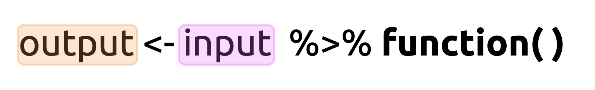

```{r setup, include=FALSE}
library(knitr)
library(memor)
library(tidyverse)
opts_chunk$set(warning = FALSE, message = FALSE)

# numvarSum
# numvarSum <- function(df, expr) {
#   expr <- enquo(expr) # turns expr into a quosure
#   summarise(df,
#           n = sum((!is.na(!!expr))), # non-missing
#           na = sum((is.na(!!expr))), # missing
#           mean = mean(!!expr, na.rm = TRUE), # unquotes mean()
#           median = median(!!expr, na.rm = TRUE), # unquotes median()
#           sd = sd(!!expr, na.rm = TRUE), # unquotes sd()
#           variance = var(!!expr, na.rm = TRUE), # unquotes var()
#           min = min(!!expr, na.rm = TRUE), # unquotes min()
#           max = max(!!expr, na.rm = TRUE), # unquotes max()
#           se = sd/sqrt(n)) # standard error
# }
```

The `ggplot2` package is one of most commonly used tools for data visualizations. For more on the grammar, see the online text titled, [ggplot2: Elegant Graphics for Data Analysis](https://ggplot2-book.org/). If you're looking for a cookbook (graphs and code to build them), see the [R Graphics Cookbook, 2nd edition](https://r-graphics.org/). 

## Why have a grammar of graphics?

[Wilhelm von Humboldt](https://en.wikipedia.org/wiki/Wilhelm_von_Humboldt) has described a language as a system for "*making infinite use of finite means.*" Grammar is the way we convert the thoughts in our heads into discrete concepts (i.e. words), and then we apply a set of rules (or syntax) to create and display comprehensible statements (for humans or computers). 

In this sense, `ggplot2` gives us an ability to communicate the complexities of any data visualization in the same way that any specialized vocabulary allows us to precisely and unambiguously define ideas.

## Import the data 

We will begin by importing the data from the wrangling section. These data come from a wikipedia table on [the deployment of COVID-19 vaccinations](https://en.wikipedia.org/wiki/Deployment_of_COVID-19_vaccines#Distribution). The code below will scrape the html table and store the results in `COVID19VaxDistByLoc`.

### Scrape wikipedia 

1. We load the `tidyverse`, `rvest`, and `xml2` packages with `library()`   
2. The url for the wikipedia page is read into R with `xml2::read_html()` and stored in `wiki_html` as a list containing `xml_document` and `xml_node`  
3. The `rvest::html_nodes()` function looks for a CSS `"table"` in `wiki_html` and stores these in `wiki_html_tables`  
4. We use the bracket subsetting (`[]`) and `base::grep()` to find tables with the word `"distribution"` in them and store these in `relevant_tables` 
5. Now we can use the `rvest::html_table()` function to 'harvest' the tables stored in the first position of `relevant_tables` and set the `fill` argument to `TRUE` (`[[1]]`), and store the output in `COVID19VaxDistByLoc`. 
6. The `COVID19VaxDistByLoc` is a rectangular `data.frame` object, but we only want the first three columns (`[ , 1:3]`), and we want to rename these `"location"`, `"n_vaccinated"`, and `"perc_of_pop"`.

```{r TopPharmComp, message=FALSE, warning=FALSE}
# packages -----------------------------------------------------------
library(tidyverse)
library(rvest)
library(xml2)

# scrape wikipedia table ---------------------------------------------
# Read html from url
wiki_html <- xml2::read_html("https://en.wikipedia.org/wiki/COVID-19_vaccine")
# extract html nodes
wiki_html_tables <- wiki_html %>% rvest::html_nodes(css = "table")
# identify relevant html table with 'distribution' in the title
relevant_tables <- wiki_html_tables[grep("distribution", wiki_html_tables)]
# convert table to data.frame
COVID19VaxDistByLoc <- rvest::html_table(relevant_tables[[1]],
                                         fill = TRUE)
# assign names to first three columns
COVID19VaxDistByLoc <- COVID19VaxDistByLoc[ , 1:3] %>%
  magrittr::set_names(x = ., value = c("location", "n_vaccinated",
                                       "perc_of_pop"))
glimpse(COVID19VaxDistByLoc)
```

### Date-stamp and export

This is a good time to export these data into the `data/raw` folder (in case the numbers change the next time we scrape the table). 

```{r write_csv-raw-data}
readr::write_csv(x = COVID19VaxDistByLoc, 
                 file = paste0("../data/raw/", 
                               base::noquote(lubridate::today()),
                 "-COVID19VaxDistByLoc.csv"))
# verify
fs::dir_tree("../data/raw/", regexp = "COVID19")
```

We can see these data have been downloaded on multiple days (starting on `2021-04-15`)

## Look at the data {.tabset}

> “A problem well-defined is a problem half solved.” ― [John Dewey](https://www.goodreads.com/quotes/7702317-a-problem-well-defined-is-a-problem-half-solved#)


Before we start any data wrangling, we need to look at the data in it's 'natural state.' Viewing the data gives us an opportunity to quantify the catastrophe we're dealing with, and let's us plan a path forward. 

There are multiple functions for looking at your data in R. I like to start with the `utils::head()` and `utils::tail()` functions see the 'top' and 'bottom' a dataset. 

`utils::head()` shows us the top six rows of `COVID19VaxDistByLoc`:

```{r head-COVID19VaxDistByLoc}
utils::head(COVID19VaxDistByLoc)
```

We can change the number of rows `head()` or `tail()` returns by supplying a number to the `n` argument. 

```{r head-n-COVID19VaxDistByLoc}
utils::head(COVID19VaxDistByLoc, n = 10)
```

### exercise 

Use the `utils::tail()` function below to view the bottom 10 rows of `COVID19VaxDistByLoc`. 

```{r tail-COVID19VaxDistByLoc-ex, eval=FALSE}
utils::tail(COVID19VaxDistByLoc, n = __)
```

### solution 

```{r tail-COVID19VaxDistByLoc-sol}
utils::tail(COVID19VaxDistByLoc, n = 10)
```

We've covered other functions for viewing your data (`dplyr::glimpse()`, `utils::str()`, and `View()`), and I recommend using any combination of them to get a good understanding of what you're dealing with. We can already see a few of the columns need to be addressed before we can start visualizing, so let's write up a plan for wrangling these variables:

1. The last row in `COVID19VaxDistByLoc` has some metadata (data about data) that needs to be extracted before we can visualize. 
2. We need to remove the alphabetic identifier for each country `location` (i.e., `World[d]` and `China[e]`).   
3. The number vaccinated variable (`n_vaccinated`) has commas (`,`) and needs to be converted to a number.    
4. The percent of population variable (`perc_of_pop`) has symbols (decimals, percent symbols (`%`), and missing values (`--`)), which is making R treat it as a character, so these will have to be removed.  

## Step 1: Remove metadata {.tabset}

We can use the `dplyr::filter` function to remove the last row with the `Sources`. We're going to combine `filter()` with the `stringr::str_detect()` function so we can identify the row with the word 'Sources'. The [`stringr` package](https://stringr.tidyverse.org/index.html) is part of the `tidyverse` and comes with some excellent functions for manipulating strings (characters). 

`stringr::str_detect()` takes a `string` argument, which will be our `location` variable in `COVID19VaxDistByLoc`, and a `pattern` argument, which we will specify as `"Source"`.

```{r str_detect}
stringr::str_detect(string = COVID19VaxDistByLoc$location, 
                    pattern = "Source")
```

As we can see, only the last row is identified as having the `"Source"` pattern. But what if we want the *opposite* logical values designated? Fortunately, `str_detect()` has a `negate` argument we can set to `TRUE`. 

```{r str_detect-negate}
stringr::str_detect(string = COVID19VaxDistByLoc$location, 
                    pattern = "Source", negate = TRUE)
```

### exercise 

Use `str_detect()` and `filter()` to remove the metadata row, and assign the output to `WikiCovid`. Change the `negate` argument to `TRUE` for these data. 

```{r WikiCovid-ex, eval=FALSE}
WikiCovid <- COVID19VaxDistByLoc %>% 
  dplyr::filter(str_detect(string = COVID19VaxDistByLoc$location, 
                    pattern = "_____", negate = ____))
glimpse(WikiCovid)
```

### solution 

See solution below. 

```{r WikiCovid-sol}
WikiCovid <- COVID19VaxDistByLoc %>% 
  dplyr::filter(str_detect(string = COVID19VaxDistByLoc$location, 
                    pattern = "Source", negate = TRUE))
glimpse(WikiCovid)
```

### exercise 

Now use `str_detect()` with `filter()` to extract the metadata row with the `"Source"` pattern, and assign the output to `WikiCovidSource`. Don't change the `negate` argument this time. 

```{r WikiCovidSource-ex, eval=FALSE}
WikiCovidSource <- COVID19VaxDistByLoc %>% 
  dplyr::filter(str_detect(string = __________________________, 
                    pattern = "_______"))
```

### solution 

See solution below. 

```{r WikiCovidSource-sol}
WikiCovidSource <- COVID19VaxDistByLoc %>% 
  dplyr::filter(str_detect(string = COVID19VaxDistByLoc$location, 
                    pattern = "Source"))
glimpse(WikiCovidSource)
```

We changed the name of the `COVID19VaxDistByLoc` dataset to `WikiCovid` so we can differentiate the changed data from the raw data. This is a good practice because you might need to revert back to the original dataset along the way (or view it for comparison).


## Step 2: Remove string characters {.tabset}

For the next step in wrangling the `location` variable, we will want to identify all the letters in brackets using  [`stringr::str_view_all()`](https://stringr.tidyverse.org/reference/str_view.html). Below is an example of how it works:

```{r remedy02}
str_view_all(string = WikiCovid$location, pattern = "\\[[^\\[\\]]+\\]", match = TRUE)
```

`str_view_all()` shows us all the `locations` with a bracket `[]` + letter/number indicator. Don't worry if you don't know what the regular expression pattern (`"\\[[^\\[\\]]+\\]"`) is doing. We will cover regular expressions in a later section (if you can't wait, check out the [Strings chapter of R for Data Science](https://r4ds.had.co.nz/strings.html)). The main takeaway here is that we need to provide a `string` (i.e. the variable name), and a pattern we wish to view. 

### exercise

Now that we've successfully identified the regular expression pattern for matching all the strings we want to remove, we can use `dplyr::mutate()` and `stringr::str_remove_all()` to remove these numbers and letters from the `location` column: 

- copy and paste the `pattern` from the `stringr::str_view_all()` function above into the `pattern` argument for `stringr::str_remove_all()` below:

```{r str_remove_all-location-ex, eval=FALSE}
WikiCovid %>%
  mutate(
    # remove bracket indicators ([])
    location = stringr::str_remove_all(string = location, 
                                       pattern = "_______________"))
```

### solution

Check your solution below:

```{r str_remove_all-location-sol}
WikiCovid %>%
  mutate(
    # remove bracket indicators ([])
    location = stringr::str_remove_all(string = location, 
                                       pattern = "\\[[^\\[\\]]+\\]"))
```

## Step 3: Removing commas {.tabset}

The next variable we want to address is the number vaccinated, or `n_vaccinated`. These numbers were formatted with commas in the Wikipedia table (which is common), so R treated them like a character variable. We will use the `readr::parse_number()` to convert `n_vaccinated` to a numerical variable.  

### exercise 

Enter the `n_vaccinated` variable into the `readr::parse_number()` function below:

```{r parse_number-ex, eval=FALSE}
WikiCovid %>%
  mutate(
    # remove bracket indicators ([])
    location = stringr::str_remove_all(string = location, 
                                       pattern = "\\[[^\\[\\]]+\\]"), 
    n_vaccinated = readr::parse_number(x = ____________))
```

### solution 

See solution below:
 
```{r parse_number-sol}
WikiCovid %>%
  mutate(
    # remove bracket indicators ([])
    location = stringr::str_remove_all(string = location, 
                                       pattern = "\\[[^\\[\\]]+\\]"), 
    n_vaccinated = readr::parse_number(n_vaccinated))
```

Now the data are beginning to look wrangled! We only have one more variable to go! 

## Step 4: Remove decimals and symbols {.tabset}

The `perc_of_pop` variable poses a few challenges, starting with the `%` symbol. We can remove this with `stringr::str_remove_all()` *or* the `readr::parse_number()` function. But we can also see the missing values are represented with a `--` symbol. We should see how many missing values there are in this dataset using `stringr::str_view_all()`.

```{r remedy03}
str_view_all(string = WikiCovid$perc_of_pop, pattern = "--", match = TRUE)
```

This is not an insignificant amount! To get an exact count, we can combine `sum()` and `str_detect()`:

```{r sum-str_detect}
sum(str_detect(WikiCovid$perc_of_pop, pattern = "--"))
```

Now we need to decide how to deal with these missing values *and* the percentage symbols. We will test both `stringr::str_remove_all()` and `readr::parse_number()` below to see which one is best:

```{r perc_of_pop-str_remove_all}
stringr::str_remove_all(string = head(WikiCovid$perc_of_pop), pattern = "%")
```

`stringr::str_remove_all` gives us no problems, and returns the original symbol for the missing `China` value (`--`). What about `readr::parse_number()`?

```{r perc_of_pop-parse_number}
readr::parse_number(x = head(WikiCovid$perc_of_pop))
```

`readr::parse_number()` tells us there was a `parsing failure`, and this value has been changed to `NA`. This is preferred because 1) it requires fewer steps, and 2) it will handle other missing values in the future. 

### exercise 

Add the code for removing the percentage symbols from `perc_of_pop` with `readr::parse_number()` to the `mutate()` function below:

```{r perc_of_pop-ex, eval=FALSE}
WikiCovid <- WikiCovid %>%
  mutate(
    # remove bracket indicators ([])
    location = stringr::str_remove_all(string = location, 
                                       pattern = "\\[[^\\[\\]]+\\]"), 
    n_vaccinated = readr::parse_number(n_vaccinated), 
    # add perc_of_pop
    perc_of_pop = readr::parse_number(_____________))
```

### solution 

See solution below:

```{r perc_of_pop-sol}
WikiCovid <- WikiCovid %>%
  mutate(
    # remove bracket indicators ([])
    location = stringr::str_remove_all(string = location, 
                                       pattern = "\\[[^\\[\\]]+\\]"), 
    n_vaccinated = readr::parse_number(n_vaccinated), 
    perc_of_pop = readr::parse_number(perc_of_pop))
```

We can see the message about the parsing failures (which we expected). Let's view our wrangled dataset below: 

```{r wrangled-WikiCovid}
WikiCovid
```

## Explore your data {.tabset} 

R has thousands of custom built packages for visualizing data. One of the packages we'll be using a lot in this course is [`skimr`](https://docs.ropensci.org/skimr/), which provides a "*A frictionless, pipeable approach to dealing with summary statistics.*" 

> *What is 'pipeable'?*

The pipe (`%>%`) from the [`magrittr` package](https://magrittr.tidyverse.org/) is what's referred to as syntactic sugar (yes, that's [really a term](https://en.wikipedia.org/wiki/Syntactic_sugar)) because it's,

"*syntax within a programming language that is designed to make things easier to read or to express*" 

### How pipes work

R is a [functional programming language](https://adv-r.hadley.nz/fp.html). In standard math notation, the common way to write a function is `f(x)` or `y = f(x)`, which is read as "*f of x*" or "*y equals f of x*". 

Pipes restructure the function syntax, so this:

```{r pipe-args.png, echo=FALSE, fig.align='center'}
knitr::include_graphics("img/pipe-args-01.png")
```

Becomes this: 

```{r pipe-args-02.png, echo=FALSE, fig.align='center'}

```

### Pipelines

As you can imagine, writing code like this can get complicated if we wanted to use multiple functions (as we typically do), Without the pipe, we have to write these as nested functions (i.e. `h(f(x))`). 

```{r pipe-args-03.png, echo=FALSE, fig.align='center'}
knitr::include_graphics("img/pipe-args-03.png")
```

With the pipe, we can rewrite this code to the following:

```{r pipe-args-04.png, echo=FALSE, fig.align='center'}
knitr::include_graphics("img/pipe-args-04.png")
```

Using the pipe makes code easier to 1) think about, 2) write, and 3) read. 

**Character variables**

If we want to view the missing values in the `location` variable, we can use the `dplyr::summarise()`, `sum()` and `is.na()` functions. 

```{r location-summary}
WikiCovid %>% 
  summarise(
          num_complete = sum((!is.na(location))), # non-missing
          num_missing = sum((is.na(location))), # missing
  )
```

We can see none of the data in `location` are missing (`num_missing` and `num_missing`). 

**Numeric variables: Location statistics**  

- the `mean` (or average) gives us the central or 'expected value' for a numeric variable    
- missing values make it difficult to calculate the mean, so include the `na.rm = TRUE` argument to remove the missing values.  

### exercise 


```{r mean-ex, eval=FALSE}
WikiCovid %>% 
  summarise(
          avg_vaccinated = mean(n_vaccinated, _____ = ____), 
          avg_perc_of_pop = mean(perc_of_pop, _____ = ____))
```

### solution 

```{r mean-sol}
WikiCovid %>% 
  summarise(
          avg_vaccinated = mean(n_vaccinated), 
          avg_perc_of_pop = mean(perc_of_pop, na.rm = TRUE))
```


**Numeric variables: Spread statistics**   

- the lowest value for each variable, or minimum (as `p0`)  
- the highest value for each variable, or maximum (as `p100`)  
*Together, these two values can give us the range, which is the difference between the maximum and minimum values*

***Do you notice anything strange?***  

Now we are ready to start visualizing!

***

`ggplot2` is part of the `tidyverse`, which is a collection of opinionated packages from RStudio that ['*you're likely to use in everyday data analyses.*'](https://www.tidyverse.org/packages/). The `ggplot2` package is an implementation of the ["Grammar of Graphics"](https://amzn.to/2MRRCAB) by Leland Wilkinson, which outlines a foundation for understanding the components of just about every graph or figure we've encountered (and some we haven't). `ggplot2` extends these concepts into a powerful grammar for developing data visualizations in R.

