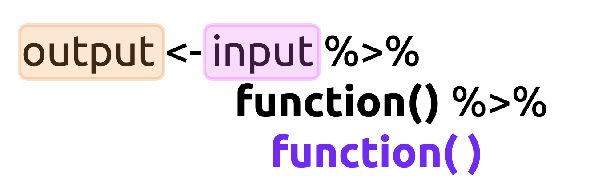

```{r setup, include=FALSE}
library(knitr)
library(memor)
library(tidyverse)
library(ggthemes)
opts_chunk$set(warning = FALSE,
               message = FALSE,
               fig.height = 5,
               fig.width = 7, 
               fig.align = 'center')
options(scipen = 999)
```

# Objectives

The objectives for this scenario are: 

- [ ] Explain why there is as Grammar of Graphics is and what problem it solves

- [ ] Understand how the pipe makes code easier to write (and read) 

- [ ] Define the terms `geom` and `aesthetic`

- [ ] Compare and contrast function calls with and without the pipe operator

- [ ] Create a visualization using `ggplot2`'s quickplot function (`qplot()`)  

- [ ] Build a graph one layer at a time using the `ggplot` template 

# What is `ggplot2`?

`ggplot2` is part of the `tidyverse`, which is a collection of opinionated packages from RStudio that ['*you're likely to use in everyday data analyses.*'](https://www.tidyverse.org/packages/)

 The `ggplot2` package is an implementation of the ["Grammar of Graphics"](https://amzn.to/2MRRCAB) by Leland Wilkinson. This text outlines a foundation for understanding the components of just about every graph or figure we've encountered (and some we haven't). `ggplot2` extends these concepts into a powerful grammar for developing data visualizations in R.
 
## ***Why have a 'grammar' of data visualization?***

[Wilhelm von Humboldt](https://en.wikipedia.org/wiki/Wilhelm_von_Humboldt) has described a language as a system for "*making infinite use of finite means.*" Grammar is the set of rules we use to generate and display comprehensible thought (to humans or computers). Within the R language, `ggplot2` provides the grammar (or set of rules) we can learn to develop a rich vocabulary for data visualizations. Knowing how to use `ggplot2`'s grammar also gives us an excellent mental model for thinking about individual graphical elements. 

## ***The lingua franca for graphical elements***

We'll extend the definition of 'grammar' above to include Steven Pinker's description of language in [The Sense of Style](https://www.amazon.com/Sense-Style-Thinking-Persons-Writing/dp/0143127799), "*[language is] our species’ solution to the problem of getting complicated thoughts from one head into another*." In this sense, the `ggplot2` package gives us an ability to communicate the *complexities* of our data in the same way that scientific jargon allows us to precisely and unambiguously define ideas. 

## ***Building graphs, bit-by-bit***

Lastly, `ggplot2` has an expansive vocabulary, so by learning a finite list of `ggplot2` functions and their syntax will allow us to build a seemingly unlimited number of visualizations. 

# The `tidyverse` and the pipe (`%>%`)

Load the `tidyverse` package by typing or copying and pasting the code below.

```{r package, eval=FALSE}
install.packages("tidyverse")
library(tidyverse)
```

A major reason for using the `tidyverse` is the pipe operator from the [`magrittr` package](https://magrittr.tidyverse.org/). 

## ***the pipe `%>%`***

The pipe (`%>%`) is what's referred to as syntactic sugar (yes, that's [really a term](https://en.wikipedia.org/wiki/Syntactic_sugar)) because it's,

"*syntax within a programming language that is designed to make things easier to read or to express*" 

## ***Using the pipe `%>%`***

Writing R code using the pipe operator makes it easier to combine function calls, and it's easier for to read. For example, consider a single function call: 

```{r pipe-args-01.png, echo=FALSE, fig.align='center', out.width='4in', out.height='1in'}
knitr::include_graphics("img/pipe-args-01.png")
```

The pipe allows us to write this as, "take the *input* and apply this  *function()*" 

```{r pipe-args-02.png, echo=FALSE, fig.align='center', out.width='5in', out.height='1in'}
knitr::include_graphics("img/pipe-args-02.png")
```

Writing code this way might not seem like it's a big improvement in clarity, but consider a more complicated series of function calls: 


```{r pipe-args-03.png, echo=FALSE, fig.align='center', out.width='5.7in', out.height='1in'}
knitr::include_graphics("img/pipe-args-03.png")
```
If we want to apply a two functions, we have to write them so the output from the first function is an input for the second function--which means they have to written inside-out! 

If we use the pipe operator, the code looks like this: 

```{r pipe-args-04.png, echo=FALSE, fig.align='center', out.width='4.2in', out.height='1.5in'}

```

Now we can take the **`input`**, apply the first **`function()`**, then pass the output from the first function to the second **`function()`** and store this in the **`output`**. 

# ggplot2: `geoms` and `aes`thetics

A *geom* (or geometric object) is the 'thing' we see on a graph or plot (this includes dots or points, lines, bars, etc.).

*geoms* are combined with aesthetic mappings, which are properties of the 'thing' on the plot or graph (this includes things like color, size, position, and shape).

So every graph or plot has a geom, and that geom will also have some visual properties called aesthetics.

## ***Starting with quick plots***

We will start using `ggplot2` with the `qplot()` function. `qplot()` is short for 'quick plot', and it takes the following arguments: 

```r
ggplot2::qplot(data = Data, # assume dataset 'Data'
               x = variable_x, # single column on the x
               y = variable_y, # single column on the y
               geom = "shape") # the 'thing' on the graph
```

Assume the same dataset `Data`, and two variables `variable_x` and `variable_y`. If we wanted to use the pipe with the `ggplot2::qplot()` function, it would look like the code below:

```r
Data %>% ggplot2::qplot(data = ., x = variable_x, y = variable_y, geom = "shape")
```

## ***Using the dot (`.`)***

[`magrittr` package](https://magrittr.tidyverse.org/) has some additional tricks that are worth knowing. For example, in the code above, you may have noticed the `data = .` argument.

```r
Data %>% 
  ggplot2::qplot(data = ., 
                 x = variable_x, 
                 y = variable_y,
                 geom = "shape")
```

The period (`.`) here is a product of the pipe syntax. We use the `.` argument because of where the `data =` argument sits inside the `qplot()` function. See the `args()` by using `args(qplot)`

```{r args, eval=FALSE}
args(qplot)
```
```r
function(x, y, ..., data, 
        # all other optional arguments
        facets = NULL, 
        margins = FALSE, 
        geom = "auto", 
        xlim = c(NA, NA), 
        ylim = c(NA, NA), 
        log = "", 
        main = NULL, 
        xlab = NULL, 
        ylab = NULL, 
        asp = NA, 
        stat = NULL, 
        position = NULL) 
```

We can see the `data` argument comes *after* the `x`, `y`, and any other variable arguments `...`. That means we need to tell the pipe we want the `Data` to be in the named `data = ` argument, so we use `data = .`

So by using the pipe, we can rewrite this function,

```r
function(y, named_argument = x)
```

to this:

```r
x %>% function(y, named_argument = .)
```
 
By placing the `data = .` on the right-hand side of the pipe operator (`%>%`) in the `named_argument` position, we're telling R to read this statement as, "*the object to the left of the `%>%` belongs in the `data` argument.*" 

See the figure below:

```{r pipe-data-args.png, echo=FALSE, fig.align='center', out.width='6in', out.height='3in'}

```

We can demonstrate this in the code section below: 

- First we create a `diamonds` dataset from the `ggplot2` package, 
- Then we 'pipe' the data to `qplot()`  

```{r diamonds-qplot, fig.height=3.5, fig.width=5}
# data 
diamonds <- ggplot2::diamonds
# graph
diamonds %>% 
  ggplot2::qplot(data = ., 
                 x = carat, y = price, 
                 geom = "point")
```


# Lets get some data!

We will be using `ggplot2` to explore data from the Economist's Medium post titled, ["Mistakes, we've drawn a few"](https://medium.economist.com/mistakes-weve-drawn-a-few-8cdd8a42d368). These data are available for download as part of the [#TidyTuesday](https://github.com/rfordatascience/tidytuesday) project on Github. 

The code section below will import the data into RStudio.

```{r import-data, message=FALSE, warning=FALSE, results='hide'}
# Balance 
Balance <- readr::read_csv("https://bit.ly/3hRzrKS")
# Brexit 
Brexit <- readr::read_csv("https://bit.ly/3s2wqMx")
# Corbyn 
Corbyn <- readr::read_csv("https://bit.ly/35mgYRB")
# Pensions 
Pensions <- readr::read_csv("https://bit.ly/2MNAvEp")
```

The code below displays each dataset using three different functions: `dplyr::glimpse()`, `utils::head()`, and `utils::str()` (*we learned about these functions in the previous lessons and exercises*)
 
```{r glimpse-Brexit}
Balance %>% dplyr::glimpse()
```

```{r head-Brexit}
Brexit %>% utils::head()
```

```{r Corbyn}
Corbyn %>% tail()
```


```{r Pensions-str}
Pensions %>% utils::str()
```

We've provided some additional information on each datasets below:

+ `Balance` is a dataset with countries, the country budget balance/current-account balance, the year, and the value in billions of euros. 

+ `Brexit` is a dataset of Brexit poll opinions (with dates).

+ `Corbyn` is a dataset of average Facebook likes and political leaders/groups.

+ `Pensions` is a dataset of countries, percent of the country's population 65 years old or over, and the percent of government spending on pensions as a percent of GDP.

## ***Variable types***

Before we look at how variables relate to each other, we should get an idea of how each variable looks independently, or it's [distribution.](https://en.wikipedia.org/wiki/List_of_probability_distributions). 

How we visualize a variable's distribution depends on whether it's **continuous**, **categorical**, or **binary**.

**Continuous** variables mean they can be any value including `0`--and are typically thought of as raw measurements (i.e., human body weight, speed, time in seconds, etc.). Continuous variables also can have decimal values that make sense.

**Categorical** variables count discrete items or events, such as Facebook 'like's or the number of page views. Categorical variables are different from continuous variables because they have a fixed set of possible values (i.e., you can't have 1/2 a Facebook 'like'). 

A particular case of a categorical variable is a **binary** variable, which only has two possible values (`0` or `1`, `alive` or `dead`, `yes` or `no`, etc.).

# Visualize a single variable: histograms

We will view the distribution of the `avg_facebook_likes` from the `Corbyn` dataset using `ggplot2::qplot()`. 

```{r Corbyn-avg_facebook_likes, message=FALSE, warning=FALSE}
Corbyn %>% 
    ggplot2::qplot(x = avg_facebook_likes, data = .) 
```

*What is this graph telling us?* 

Well, we can print the entire `Corbyn` dataset to the console to view it (it's not very big). 

We can see the data printed to the screen has the `avg_facebook_likes` variable sorted descending, with the highest number on top (`5210`), and the lowest number on the bottom (`56`). 

When we give the `qplot()` function a single numerical variable, it assumes we want a [histogram](https://ggplot2.tidyverse.org/reference/geom_histogram.html). 

The histogram displays the `avg_facebook_likes` variable by splitting up the `x` axis into `bins`, then plotting the count for each number of observations in each bin on the `y` axis.

```{r corbyn-histogram.png, echo=FALSE, fig.align='center', out.width='7in', out.height='5in'}

```

# Visualize a single variable: box-plots

Histograms are a great way to visualize the distribution of a single variable, but there are other `geom`s, too. For example, a box-plot gives us a graph with quite a few summary statistics.

The code section below will create a box-plot of the `pop_65_percent` from the `Pensions` dataset.


```{r Pensions-boxplot}
Pensions %>% 
  # the variable 
  ggplot2::qplot(x = pop_65_percent, 
                 y = " ",
                 # the dot
                 data = .,
                 geom = "boxplot")
```

The box-plot gives us an idea of `pop_65_percent`'s distribution using the white box to show where the median (middle value), 1st and 3rd quartiles, higher/lower values, and outliers (see image below). 

```{r pensions-boxplot.png, echo=FALSE, fig.align='center', out.width='5in', out.height='3.5in'}

```

# Visualizing a numerical and categorical variable

Box-plots are also great for visualizing continuous variables across the levels of a categorical variable. For example, we have the `Balance` dataset with `value`s of European Union countries' budget surplus. We can add the categorical variable to the `y` axis to view one box-plot per `country` level.

```{r Balance-boxplot-country-value}
# the data
Balance %>% 
  ggplot2::qplot(x = value, y = country, 
                 data = ., geom = "boxplot") 
```

Other options for individual variables include the [`geom = "density"`](https://ggplot2.tidyverse.org/reference/geom_density.html) and [`geom = "violin"`](https://ggplot2.tidyverse.org/reference/geom_violin.html).

# Visualizing two continuous variables

What if we want to graph the relationship between two variables? We'll graph two variables from the `Brexit` dataset. 

Use RStudio to view this dataset with `dplyr::glimpse()` or `utils::str()`.

```{r date-Brexit}
glimpse(Brexit)
```


When we view the contents of `Brexit`, we can see the `date` column is a character variable (`<chr>`), and the other two variables--`percent_responding_right` and `percent_responding_wrong`--are numeric (`<dbl>`). 

## ***Creating date variables***

If we want to plot the relationship between `date` and the `percent_responding_right`, we'll first need to change the format of `date` from character to `Date`, which we can do using the [`lubridate` package](https://lubridate.tidyverse.org/) (also from the `tidyverse`). 

We use the `lubridate::mdy()` function to format the `date` variable as a `Date`.

```{r dmy}
Brexit <- Brexit %>% mutate(date = lubridate::dmy(date))
```

Read more about `dmy()` [here.](https://lubridate.tidyverse.org/reference/ymd.html)

Use the `base::is.double()`, `base::class()`, or `base::typeof()` function to figure out if you’ve formatted the new date variable correctly.

```{r check-date-as-date}
base::is.double(Brexit$date)
base::class(Brexit$date)
base::typeof(Brexit$date)
```

After we're sure we've formatted the `date` variable correctly, we want to 'pipe' the formatted data to the `ggplot2::qplot()` function with the new `date` variable on the `x` and the `percent_responding_right` variable on the `y`.

```{r lubridate-date}
Brexit %>% 
  qplot(x = date, 
        y = percent_responding_right, data = .)
```

The `ggplot2::qplot()` function is smart enough to automatically choose a `geom` depending on what type of variable we assign to the `x` and `y` axes. In this case, the `percent_responding_right` variable is a `<dbl>` (numeric), and we've reformatted the `date` variable into a double before we passed it to the `y` axis.

The `ggplot2::qplot()` function knows to plot the dates on the `y` axes (notice it displays only the `year`) and represent the data with `geom = "points"`.


# Wrangling and visualization pipelines 

Sometimes we might want to pass the data directly from a wrangling step to a data visualization without assigning changes to the data frame. We will demonstrate how this works using the same `Brexit` dataset. 

If you read the [Medium article](https://medium.economist.com/mistakes-weve-drawn-a-few-8cdd8a42d368), you'll find The Economist first plotted these data as a line graph, with two lines (see 'Original' image below). The 'Better' way to improve the graph would be to include points and smooth the line in the graph (see below):


```{r original-brexit.png, echo=FALSE, fig.align='center', out.width='7in', out.height='4in'}

```

In order to re-create these graphs, we'll need to restructure the `Brexit` data with the `tidyr::pivot_longer()` function from the [`tidyr` package](https://tidyr.tidyverse.org/reference/pivot_longer.html).


We should end up with a dataset that has three variables: `date`, `poll`, and `percent`.  

```{r pivot_longer}
Brexit %>% pivot_longer(cols = -date, 
                        names_to = "poll", 
                        values_to = "percent")
```

## ***Restructure and plot***

After we're sure the data are structured correctly, we won't assign it to the `Brexit` data frame. Instead, we'll pass it straight through to the `ggplot2::qplot()` function. The `date` variable will go on the `x`, and the `percent` variable will go on the `y`. Click on the Run icon below to see the graph.

First, we will create the 'Original' graph by using `group = poll` and `geom = "line'`, because this allows us to build a separate colored line for each `poll`. 

```{r pivot_longer-qplot, fig.height=5, fig.width=7}
Brexit %>% 
  pivot_longer(cols = -date, 
               names_to = "poll", 
               values_to = "percent") %>% 
  ggplot2::qplot(x = date, 
                 y = percent,
                 group = poll,
                 data = .,
                 geom = "line",
                 color = poll)
```

As we can see from the graph above, using `group` and the `color` aesthetic extends the `qplot()`'s capabilities by making it clear there are two categories for `polls` represented in the graph.

## ***Build plots layer-by-layer with `ggplot()`***

Now that we've learned how to plot using geoms and aesthetics, we can add layers to the graph. In the previous step, we re-created the 'Original' plot using `geom = "line"`. The `ggplot2::qplot()` function was written to "produce plots quickly", but more complex graphs should be built using the `ggplot2::ggplot()` function.

The `ggplot2::ggplot()` function initializes a graph, then we can 'map' variables to the positions (`x` or `y`), aesthetics (`color = `), or groupings (`group = `). 

We'll start by assigning the restructuring changes to the `Brexit` dataset. The `tidyr::pivot_longer()` function takes a 'wide' dataset and makes it 'long', or [tidy](https://vita.had.co.nz/papers/tidy-data.pdf). 

We will store the restructured data in `TidyBrexit`. 

```{r tidy-brexit}
TidyBrexit <- Brexit %>% pivot_longer(-date, 
                                  names_to = "poll", 
                                  values_to = "percent")
head(TidyBrexit)
```

# Using the `ggplot()` function

The `ggplot()` follows a pretty standard template, similar to the `qplot()` function. See below: 

```r
<DATA> %>% 
  ggplot(mapping = aes(x = <MAPPINGS>, y = <MAPPINGS>))
```

We begin with a dataset, pass it over to to the `ggplot()` function, then map the `x` and `y` variables. 

```{r TidyBrexit-ggplot}
ggp_brexit <- TidyBrexit %>% ggplot(mapping = aes(x = date, y = percent))
ggp_brexit
```

There aren't any points on the graph because we haven't added any geoms or aesthetics. 

We'll add the smoothed line in the step below with `ggplot2::geom_smooth()` like the template below.

```r
<DATA> %>% 
  ggplot(mapping = aes(x = <MAPPINGS>, y = <MAPPINGS>)) + 
    <GEOM_FUNCTION>(mapping = aes(<MAPPINGS>))
```

**Note**: the `+` operator is used with `ggplot2` functions, not the pipe `%>%` operator.  

```{r geom_smooth, message=FALSE, warning=FALSE}
ggp_brexit + ggplot2::geom_smooth()
```

*Why are we only seeing a single line?* We need to look at our template again:

```r
<DATA> %>% 
  ggplot(mapping = aes(x = <MAPPINGS>, y = <MAPPINGS>)) + 
    <GEOM_FUNCTION>(mapping = aes(<MAPPINGS>))
```

We can see from the template above that we can set the aesthetic mappings (`aes(<MAPPINGS>)`) globally *and* inside the geom layer we want to display. 

In this case, we want the lines from `geom_smooth()` colored by the two kinds of polls. We can set this with `color = poll`.

```{r color-poll, message=FALSE, warning=FALSE, fig.height=5, fig.width=7}
ggp_brexit + 
  ggplot2::geom_smooth(aes(color = poll))
```

The default `ggplot2::geom_smooth()` function includes the gray confidence interval around the smoothed line. We can remove this with `se = FALSE`. We'll also add the `show.legend = FALSE` argument to remove the `poll` categories from the left-hand side of the graph.

```{r ggp_brexit_smooth, message=FALSE, warning=FALSE}
ggp_brexit_smooth <- ggp_brexit + 
  geom_smooth(aes(color = poll), se = FALSE, show.legend = FALSE)
ggp_brexit_smooth
```

In the next step, we'll add the points to the graph. We've also updated the template below for adding aesthetics.

```r
<DATA> %>% 
  ggplot(mapping = aes(x = <MAPPINGS>, y = <MAPPINGS>)) + 
    <GEOM_FUNCTION>(mapping = aes(<MAPPINGS>), 
                    optional_arguments = "values")
```

In the last step we added a `geom_smooth()` removed the standard errors (`se = FALSE`) and legend (`show.legend = FALSE`). We stored these changes in the `ggp_brexit_smooth`. 

Refer to the template below for a refresher.

```
<DATA> %>% 
  ggplot(mapping = aes(x = <MAPPINGS>, y = <MAPPINGS>)) + 
    <GEOM_FUNCTION>(mapping = aes(<MAPPINGS>), 
                    optional_arguments = "values")
```

We're going to continue building our plot by adding the `ggplot2::geom_point()` function. We need to specify the `aes()` argument (`color = poll`), and we'll also include the `show.legend = FALSE` argument again to remove the legend for the two `poll` categories.

```{r geom_point, message=FALSE, warning=FALSE}
ggp_brexit_smooth + geom_point(aes(color = poll), show.legend = FALSE)
```

This is starting to look more like the graph in the medium article, but we still need to make a few minor adjustments. 

`ggplot2` allows us to build graphs layer-by-layer using the geoms and aesthetics to customize each plot so that they are necessarily expressive. Each time we need to add something to a graph, we can either add a new `geom`, or look for ways to adjust a geoms with new aesthetic options. 

For example, from the 'Original' graph in the medium article, the points are slightly transparent. The `alpha` is the transparency argument, and it's available inside nearly every `geom`. 

```{r original-brexit-02, echo=FALSE, fig.align='center', out.width='7in', out.height='4in'}

```

We can add the `alpha` argument inside the `ggplot2::geom_point()` function, and specify either a decimal, fraction, or numeric value. In this case, we want the value set to `1/3`.

```{r geom_point-alpha, message=FALSE, warning=FALSE}
ggp_brexit_smooth + 
  geom_point(aes(color = poll), show.legend = FALSE, alpha = 1/3)
```

 Now the points are slightly transparent, which helps with over-plotting. Review the template below for adding layers. 
 
```r
<DATA> %>% 
  ggplot(mapping = aes(x = <MAPPINGS>, y = <MAPPINGS>)) + 
    <GEOM_FUNCTION>(mapping = aes(<MAPPINGS>), args = "options")
```

As you can see, the grammar of graphics makes it easy to think about what we'd like to see on a plot, decide what kind of graph element it is (`geom`, `aesthetic`, etc.), and then add it as a layer with the `+` operator. Hopefully, you can see how easy it is to customize a graph by adding new layers and aesthetics!

# Mapping aesthetics globally

**Note**: so far, we have added the `aes()` arguments *locally* in each new `geom` layer we've built. This section will map these variables *globally* in the `ggplot()` function. See the code below:

```{r ggp_brexit_global}
ggp_brexit_global <- TidyBrexit %>% 
  ggplot(mapping = aes(x = date, y = percent, color = poll)) + 
              geom_smooth(se = FALSE, show.legend = FALSE) + 
                geom_point(alpha = 1/3, show.legend = FALSE)
ggp_brexit_global
```

By adding `color = poll` in the `ggplot()` function, the aesthetic carries down through each `geom`. All we have to do is add the arguments for each `geom`. 

## ***Adding colors manually***

We want to change the graph's colors from the default settings to fire-brick red and cornflower blue. We can do this by adding the `ggplot2::scale_color_manual()` function and specifying the values(`c("cornflowerblue", "firebrick3")`).

```{r scale_color_manual}
ggp_brexit_global_colors <- ggp_brexit_global +  
  scale_color_manual(values = c("cornflowerblue", "firebrick3"))
ggp_brexit_global_colors
```

For a full list of colors, check the pdf [here](http://www.stat.columbia.edu/~tzheng/files/Rcolor.pdf).


## ***Adding text to a graph***

In the [Medium article](https://medium.economist.com/mistakes-weve-drawn-a-few-8cdd8a42d368), the fixed 'Better' graph labels each smoothed line with `'Wrong'` vs `'Right'`. 

We're going to add text labels to our graph using the `ggplot2::geom_text()` function. The `ggp_brexit_global_colors` object has the latest changes to the plot.

## ***Using the `geom_text()` function***

`ggplot2::geom_text()` works on a Cartesian coordinate system and requires the `x`, `y`, and `label` arguments. We want to place the `Wrong` label at the intersection of percent `46`, just above the red line near the year `2018`.

Recall that the dates are formatted as `YYYY-MM-DD`, so we have to pick an `x` value that we can specify as a date with `as.Date()`. See the example below:

```r
ggp_brexit_global_colors + 
  geom_text(label = "Wrong", color = "firebrick3", 
            x = as.Date("2018-01-01"), y = 46)
```

Now we want to add the `Right` label to the graph, but make this cornflower blue, at position `x` = `as.Date("2018-01-01")` and `y` = `42.5`. Click the section below to add the text to the graph:

```{r ggp_brexit_global_colors_text}
ggp_brexit_global_colors_text <- ggp_brexit_global_colors + 
  geom_text(label = "Wrong", color = "firebrick3", 
            x = as.Date("2018-01-01"), y = 46) + 
  geom_text(label = "Right", color = "cornflowerblue", 
            x = as.Date("2018-01-01"), y = 42.5)
ggp_brexit_global_colors_text
```

These labels match up with the Medium article graph below: 

```{r original-brexit-03, echo=FALSE, fig.align='center', out.width='7in', out.height='4in'}

```

In the next step, we will move the `y` axis over to the right-hand side of the graph.

### Adjusting axes on a graph

Our graph is coming along, but we should shift the `y` axes to the opposite side of the graph (like the image above). 

## ***Moving the `y` axis***

`ggplot2` has a rich grammar for building graphs, which means it has a function for doing nearly anything we can think of, including moving axes. To shift the `y` axis from it's original position, we can use the `ggplot2::scale_y_continuous()` function and specify `"right"` in the `position =` argument.

```{r ggp_brexit_global_colors_text_scale_y}
ggp_brexit_global_colors_text_scale_y <- ggp_brexit_global_colors_text + 
  ggplot2::scale_y_continuous(position = "right")
ggp_brexit_global_colors_text_scale_y
```

Now we have the lines, the points, the plot labels, and the axes in the correct spot. Next up, we need to make sure our chart is titled and labeled correctly!

# Adding labels 

Titles and labels are important because they give readers the context of the information they see in a graph. Without some additional information about the data, the audience is just staring at lines, points, colors, etc.

`ggplot2` has a few options for labeling graphs, but we recommend using the standard `ggplot2::labs()` function. It's easy to remember, and it has most of the necessary arguments you'll need for almost all the graphs you'll build. 

## ***Using the `ggplot2::labs()` function***

Below is a set of arguments that match the title and labels from the 'Better' graph from the Medium article. 

As you can see, the Economist article chose to remove the `x` and `y` axes labels, but we think it's clearer to leave them in. Run the code below to create the `labs_eco` layer.

```{r labs_eco}
labs_eco <- ggplot2::labs(title = "Bremorse", 
  subtitle = "'In hindsight, do you think Britain was right or wrong to vote to leave the EU?'", 
                caption = "Source: NatCen Social Research", 
                x = " ", 
                y = "Percent (%)")
```

We store the labels in the `labs_eco` object, which we can add to the `gg_p13_y` object and reassign this to the `gg_p14_labs` object. 

Run the code below to assign the labels layer to the plot object. 

```{r ggp_brexit_labs}
ggp_brexit_labs <- ggp_brexit_global_colors_text_scale_y + labs_eco
ggp_brexit_labs
```

Labels are also important for keeping track of your work. If you're exploring a dataset using graphs (a process called [Exploratory Data Analysis](https://en.wikipedia.org/wiki/Exploratory_data_analysis), or EDA), the labels can help you remember what transformations or changes you made to the data under hood.   

# Using themes

Our graph is nearly complete! We have all the geoms, aesthetics, titles, and labels. The last thing we will add is a theme, but we will do this by going outside the `tidyverse` to the [`ggthemes`](https://yutannihilation.github.io/allYourFigureAreBelongToUs/ggthemes/) package. 

## ***`ggthemes`*** 

The [`ggthemes` package](https://yutannihilation.github.io/allYourFigureAreBelongToUs/ggthemes/) has pre-packaged design, color, and font choices for most popular media outlets (FiveThirtyEight, Wall Street Journal, etc.). We'll use the `ggthemes::theme_economist_white()` function to change our plot's colors and design.

Install this package by clicking on the code section below:

```{r install-ggthemes, eval=FALSE}
install.packages("ggthemes")
library(ggthemes)
```

This function takes a `gray_bg = ` argument, which we will set to `FALSE`. We'll also change the `base_size` for the font to `12`, and the default font family to `"Verdana"`.

```{r theme_economist_white}
ggp_brexit_labs + 
  ggthemes::theme_economist_white(gray_bg = FALSE, 
                                 base_size = 12, 
                                 base_family = "Verdana")
```

This looks pretty close, right? Compare to the image below:

```{r original-brexit-05, echo=FALSE, fig.align='center', out.width='7in', out.height='4in'}

```
