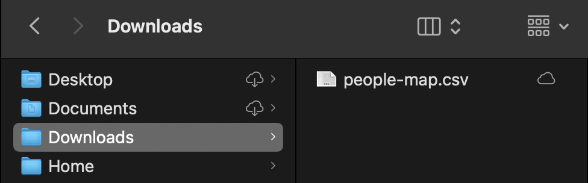
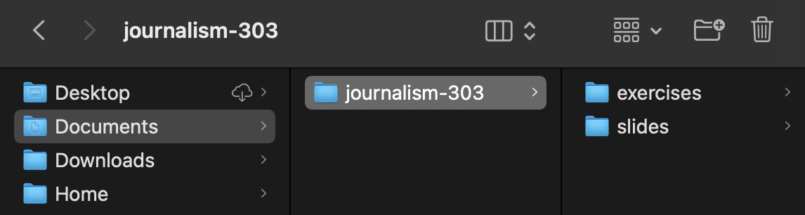
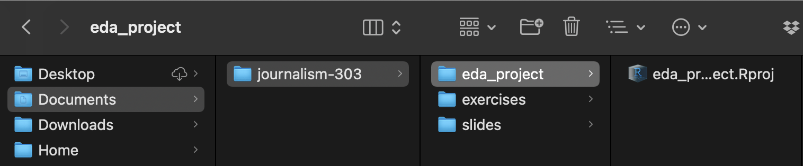
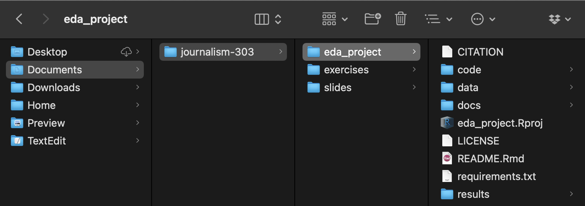

```{r setup, include=FALSE}
library(tidyverse)
library(knitr)
library(rmdformats)
library(devtools)
library(hrbrthemes)
library(pinp)
library(skimr)
# figs folder
fs::dir_create('img')
## Global options
knitr::opts_chunk$set(
  cache = FALSE, # cache data
  echo = TRUE, # show/hide all code
  # results = "hide", # hide results
  tidy = FALSE, # cleaner code printing
  comment = "#> ", # better console printing
  eval = TRUE, # turn this to FALSE stop code chunks from running
  message = TRUE, # show messages
  warning = FALSE, # show warnings
  size = "small", # size of the text
  fig.path = "img/", # location of figure files
  fig.height = 3, # height of figures
  fig.width = 5 # width of figures
) 
# knit options
knitr::opts_knit$set(
  width = 20,
  progress = FALSE
)
# base options
base::options(
  tibble.print_max = 60,
  tibble.width = 60,
  max.print = 999999,
  scipen = 100000000
)
```


# Introduction 

This document outlines the requirements for your first project, which is an exploratory data analysis (EDA) of a dataset (or multiple datasets). 

# Project setup

For this assignment, you've been given a dataset (or datasets) and the EDA template. You should set up your project using the [`goodenuffR` package](https://github.com/mjfrigaard/goodenuffR) package. You can review the slides for getting started with this package [here](https://mjfrigaard.github.io/csuc-data-journalism/slides/wk-08.1-intro-to-goodenuffR.html#1):

For example, if you've downloaded the `people-map.csv` data into your `Downloads` folder: 

```{r downloads.png, echo=FALSE, out.width='50%', fig.align='left'}

```

We're going to create a new project folder using `goodenuffR`. Assume I have a folder for the course in `Documents/` named `journalism-303/`: 

```{r course-folder, echo=FALSE, out.width='50%', fig.align='left'}

```

A folder tree for this type of organization is below: 

```{bash eval=FALSE}
Documents/
  |-- journalism-303/
    |-- exercises/
    |-- slides/
```

To create a project folder, I complete the following steps:

1. Use the `getwd()` function to print my current working directory 

```{r getwd, eval=FALSE}
getwd()
# > "/Users/mjfrigaard"
```

2. I want the new project folder to be named `eda-project/` and to be located under the `Documents/journalism-303/` folder, like so: 

```{bash eval=FALSE}
Documents/
  |-- journalism-303/
    |-- exercises/
    |-- slides/
    |-- eda-project/ <- new project folder!
```

So in the `goodenuffR::goodenuff_project()` function, I enter the **name for the new folder as the `project_name` argument**, and the path to **where I want this folder in the `folder_path` argument.**

```{r goodenuff_project-eda-project, eval=FALSE}
goodenuffR::goodenuff_project(project_name = "eda-project", 
    folder_path = "/Users/mjfrigaard/Documents/journalism-303/")
```

When I execute these commands, a new RStudio session will open and I should see the following folder structure:

```{bash, eval=FALSE}
Documents/
|--journalism-303/
  |-- eda_project/
          |-- eda_project.Rproj
  |-- exercises/
  |-- slides/
```

```{r proj-folder, echo=FALSE, out.width='70%', fig.align='left'}

```

To create the project files, use the `goodenuffR::goodenuff_files()` function. We can enter this into the console (you should see the following output): 

```{r goodenuff_files, eval=FALSE}
goodenuffR::goodenuff_files()
# trying URL 'https://creativecommons.org/publicdomain/zero/1.0/legalcode.txt'     
# downloaded 7048 bytes
# 
# trying URL 'https://raw.githubusercontent.com/rstudio/rmarkdown/main/inst/rmar
# kdown/templates/github_document/skeleton/skeleton.Rmd'
# Content type 'text/plain; charset=utf-8' length 691 bytes
# ==================================================
# downloaded 691 bytes
```

This will create the following folders and files: 

```{r proj-files, echo=FALSE, out.width='80%', fig.align='left'}

```

And the folder tree below:

```{bash, eval=FALSE}
Documents/
    journalism-303/
        |-- eda_project/
        |   |-- CITATION
        |   |-- LICENSE
        |   |-- README.Rmd
        |   |-- code/
        |   |   |-- 01-import.R
        |   |   |-- 02-tidy.R
        |   |   |-- 03-wrangle.R
        |   |   |-- 04-visualize.R
        |   |   |-- 05-model.R
        |   |   |-- 06-communicate.R
        |   |   |-- runall.R
        |   |-- data/
        |   |   |-- README.md
        |   |   |-- raw
        |   |-- docs/
        |   |   |-- changelog.txt
        |   |   |-- manuscript.Rmd
        |   |   |-- notebook.Rmd
        |   |-- eda_project.Rproj
        |   |-- requirements.txt
        |   |-- results/
        |       |-- figures
        |       |-- manuscript
        |       |-- tables
        |-- exercises/
        |-- slides/
```

# Outline

After you've set up your project and imported your data into RStudio, you need to answer the following questions:

1. What are the general characteristics of the dataset?   
  a. *How many rows are in the dataset(s)?*    
  b. *How many variables are in the dataset(s)?*    
2. What are the variable names?    
  a. *Are the names meaningful?*   
  b. *Is a data dictionary available (or other info on the dataset)?*    
  c. *What if the format or type of each variable (i.e. character, numeric, categorical, logical)?*      
3. Information about the variables:  
  a. *For categorical/qualitative variables, what values occurs most frequently?*   
  b. *Are any of the data missing? If so, how much?*  
4. Summary statistics: 
  a. *Calculate the mean, median, standard deviation, minimum, and maximum for each numerical variable.*    
  b. *Calculate the counts for each level or unique values for each character variable.*  
  

# Dataset characteristics 

We'll use the `palmerpenguins` data for this example.

```{r penguins_raw}
# assign to PenguinsRaw
PenguinsRaw <- palmerpenguins::penguins_raw
```

## Dimensions

The functions below give you an idea of the dataset shape.  

```{r rows}
nrow(PenguinsRaw) # number of rows
ncol(PenguinsRaw) # number of columns
dim(PenguinsRaw) # dimensions
```

For information on the data format, use `str()` or `glimpse()`

```{r glimpse}
glimpse(PenguinsRaw)
```

# Column names 

We want to standardize the column names so they are easier to program with. 

```{r clean_names, message=FALSE, warning=FALSE}
library(janitor)
Penguins <- PenguinsRaw %>% janitor::clean_names()
glimpse(Penguins)
```

Some of these names are a little long, but we can manually change them with `rename()`. 

```{r rename}
Penguins <- Penguins %>% 
  rename(
    study = study_name,
    sample = sample_number,
    ind_id = individual_id, 
    clutch_cmp = clutch_completion, 
    cul_lngth = culmen_length_mm,
    cul_dpth = culmen_depth_mm, 
    flip_lngth = flipper_length_mm, 
    body_mass = body_mass_g, 
    delta15 = delta_15_n_o_oo, 
    delta13 = delta_13_c_o_oo
  )
glimpse(Penguins)
```


# Summary statistics 

To calculate summary statistics, I recommend using the `skimr::skim()` function. 

```{r skim, eval=FALSE}
Penguins %>% 
  skim()
```

```{r skim_without_charts, echo=FALSE}
Penguins %>% 
  skim_without_charts()
```

## `skim()` output

The `factor` variable is qualitative, so the levels are counted and summarized in the `n_unique` and `top_counts`. The `numeric` variables give us a lot more information, which includes the `n_missing`, `complete_rate`, `mean`, standard deviation (`sd`), minimum (`p0`), 25th percentile (`p25`), median (`p50`), 75th percentile (`p75`), and max (`p100`). 

# Exploratory visualizations 

To complete this project, you'll need to create **at least one visualization and explain it's contents.** We've covered how to create visualizations using [ggplot2](https://ggplot2.tidyverse.org/), so feel free to use the code in the exercises or the slides. 

## Single variable graphs

To view the distribution (or 'shape') of a variable, you can use histograms (`geom_histogram()`), density plots (`geom_density()`), frequency polygons (`geom_freqpoly()`), or box-plots `geom_boxplot()`.

```{r geom_histogram, message=FALSE, warning=FALSE}
# label
labs_hist <- labs(title = "Histogram of Penguins$flip_lngth", 
                  x = "Flipper Length")
Penguins %>% 
  ggplot(aes(x = flip_lngth)) + 
    geom_histogram() + 
      labs_hist
```

```{r geom_density, message=FALSE, warning=FALSE}
# label
labs_dens <- labs(title = "Density plot of Penguins$flip_lngth", 
                  x = "Flipper Length")
Penguins %>% 
  ggplot(aes(x = flip_lngth)) + 
    geom_density() + 
      labs_dens
```

```{r geom_freqpoly, message=FALSE, warning=FALSE}
# label
labs_freq <- labs(title = "Frequency polygon of Penguins$flip_lngth", 
                  x = "Flipper Length")
Penguins %>% 
  ggplot(aes(x = flip_lngth)) + 
    geom_freqpoly() + 
      labs_freq
```

```{r geom_boxplot, message=FALSE, warning=FALSE}
# label
labs_box <- labs(title = "Box-plot of Penguins$flip_lngth", 
                  x = "Flipper Length")
Penguins %>% 
  ggplot(aes(x = flip_lngth, 
             y = "")) + 
  geom_boxplot() + 
  labs_box
```

# Relationships between variables

For exploring relationships between variables, we can use box-plots and ridgeline plots (from the `ggridges` package).


```{r geom_boxplot-2, message=FALSE, warning=FALSE}
labs_box2 <- labs(
     title = "Flipper length by island",
     subtitle = "source: https://allisonhorst.github.io/palmerpenguins/",
     fill = "Island",
     x = "Flipper length",
     y = "Island")
Penguins %>%  
  ggplot() + 
  geom_boxplot(aes(x = flip_lngth, 
                      y = island, 
                      fill = island),
                      alpha = 1/5) + 
  labs_box2
```


```{r lab_ridges, message=FALSE, warning=FALSE}
library(ggridges)
lab_ridges <- labs(
     title = "Flipper length by island",
     subtitle = "source: https://allisonhorst.github.io/palmerpenguins/",
     fill = "Island",
     x = "Flipper length",
     y = "Island")
Penguins %>%  
  ggplot() + 
  geom_density_ridges(aes(x = flip_lngth, 
                          y = island, 
                          fill = island), 
                      alpha = 1/5) + 
  lab_ridges
```

# Data dictionary 

To complete this project, you need to turn in your `.html` report and a data dictionary for the dataset which documents each variable and their contents. For examples, see the example for the `palmerpenguins::penguins` data:

```{r dictionary, eval=FALSE}
??palmerpenguins::penguins
```

## Example data dictionary

> Size measurements for adult foraging penguins near Palmer Station, Antarctica
Description
> Includes measurements for penguin species, island in Palmer Archipelago, size (flipper length, body mass, bill dimensions), and sex. This is a subset of penguins_raw.

> **Usage**: `penguins`

> **Format**: A tibble with 344 rows and 8 variables:

> `species`: a factor denoting penguin species (Adélie, Chinstrap and Gentoo)

> `island`: a factor denoting island in Palmer Archipelago, Antarctica (Biscoe, Dream or Torgersen)

> `bill_length_mm`: a number denoting bill length (millimeters)

> `bill_depth_mm`: a number denoting bill depth (millimeters)

> `flipper_length_mm`: an integer denoting flipper length (millimeters)

> `body_mass_g`: an integer denoting body mass (grams)

> `sex`: a factor denoting penguin sex (female, male)

> `year`: an integer denoting the study year (2007, 2008, or 2009)

> **Source**
> Adélie penguins: Palmer Station Antarctica LTER and K. Gorman. 2020. Structural size measurements and isotopic signatures of foraging among adult male and female Adélie penguins (Pygoscelis adeliae) nesting along the Palmer Archipelago near Palmer Station, 2007-2009 ver 5. Environmental Data Initiative https://doi.org/10.6073/pasta/98b16d7d563f265cb52372c8ca99e60f

> Gentoo penguins: Palmer Station Antarctica LTER and K. Gorman. 2020. Structural size measurements and isotopic signatures of foraging among adult male and female Gentoo penguin (Pygoscelis papua) nesting along the Palmer Archipelago near Palmer Station, 2007-2009 ver 5. Environmental Data Initiative https://doi.org/10.6073/pasta/7fca67fb28d56ee2ffa3d9370ebda689

> Chinstrap penguins: Palmer Station Antarctica LTER and K. Gorman. 2020. Structural size measurements and isotopic signatures of foraging among adult male and female Chinstrap penguin (Pygoscelis antarcticus) nesting along the Palmer Archipelago near Palmer Station, 2007-2009 ver 6. Environmental Data Initiative https://doi.org/10.6073/pasta/c14dfcfada8ea13a17536e73eb6fbe9e

> Originally published in: Gorman KB, Williams TD, Fraser WR (2014) Ecological Sexual Dimorphism and Environmental Variability within a Community of Antarctic Penguins (Genus Pygoscelis). PLoS ONE 9(3): e90081. doi:10.1371/journal.pone.0090081

