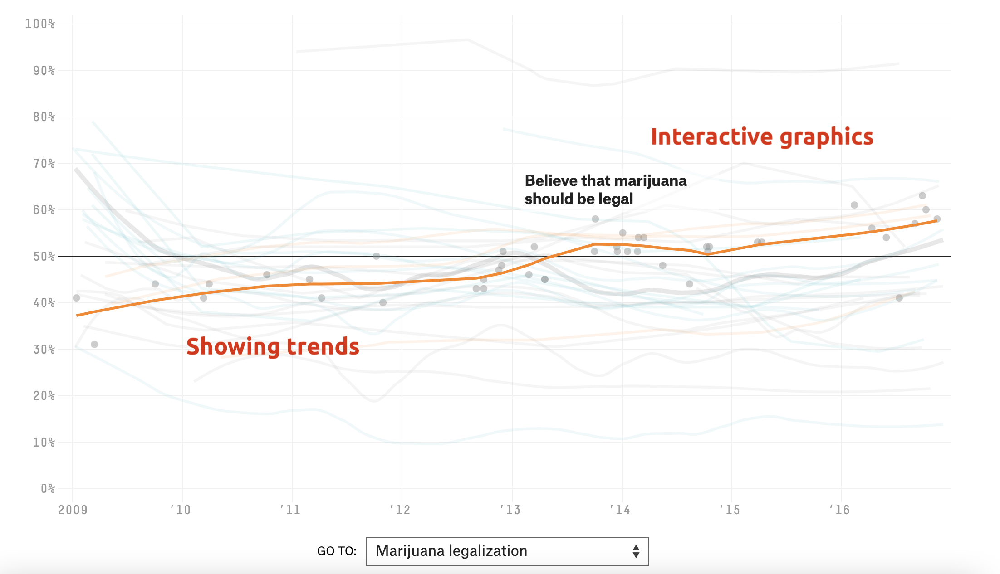
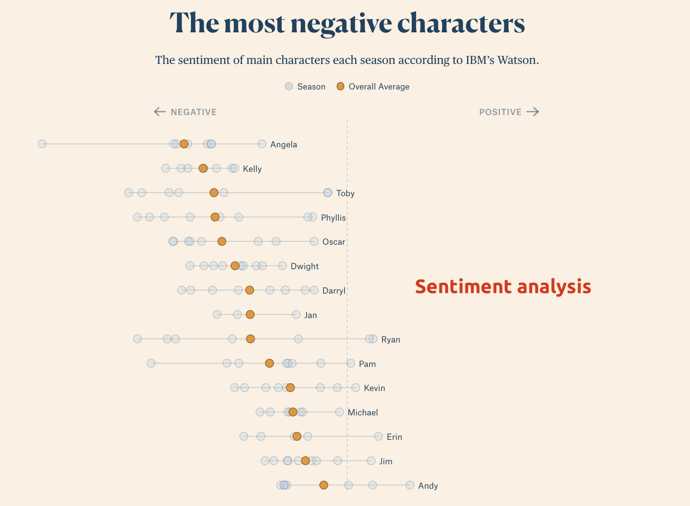
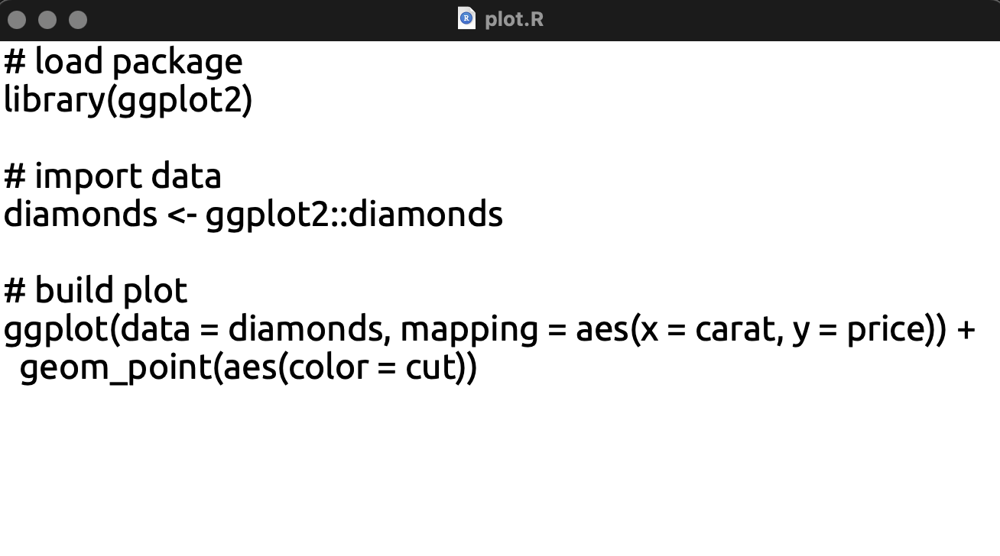
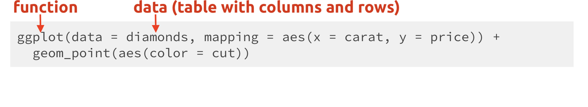
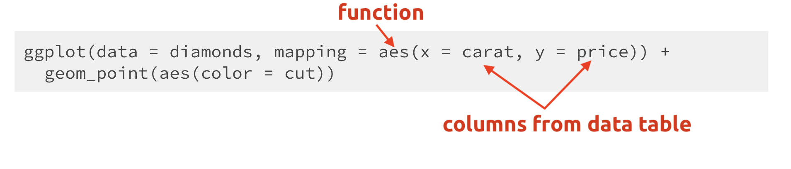
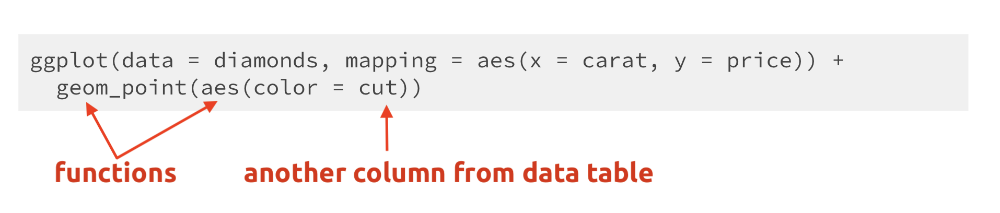
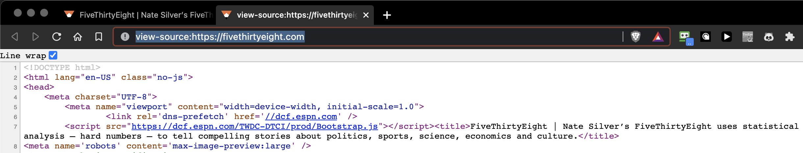

```{r setup, include=FALSE}
library(tidyverse)
library(gapminder)
library(here)
library(xaringan)
options(htmltools.dir.version = FALSE,
        tibble.max_extra_cols = 6,
        tibble.width = 60)
knitr::opts_chunk$set(echo = TRUE,
                      warning = FALSE,
                      message = FALSE,
                      tidy = FALSE,
                      fig.align = 'center',
                      dpi = 320)
library(xaringanthemer)
# xaringanthemer::style_duo(primary_color = "#F0FFFF", secondary_color = "#CD0000")
# xaringanthemer::style_duo_accent(primary_color = "#8B1A1A", secondary_color = "#BABABA")
# xaringan::inf_mr() # for instant knitting and reviewing
```


class: center, middle, inverse

# Data Journalism Web Technologies

---
class: left, top

## Overview 

.pull-left[

### 1.) What is data journalism? 

#### 1.1) Definitions 

#### 1.2) Examples 

### 2.) Code files for data journalism

#### 2.1) R Code 

]

.pull-right[

#### 2.2) HTML 

#### 2.3) CSS 

### 3) Data file formats

#### 3.1) .CSV

#### 3.2 .XML

#### 3.3) .JSON

]

---
class: left, top

## What is data journalism?

### 1.1) [Wikipedia](https://en.wikipedia.org/wiki/Data_journalism): 

> "*a journalistic process based on analyzing and filtering large data sets for the purpose of creating or elevating a news story*"

### 1.2) [fivethirtyeight](https://twitter.com/FiveThirtyEight): 

> "*Data-driven news and analysis*"

### 1.3) [the upshot (NYT)](https://twitter.com/UpshotNYT): 

> "*Analytical journalism in words and graphics *" 

---
class: left, top

## What is data journalism? (Example 1)

<br />

### FiveThirtyEight's *[How America’s Thinking Changed Under Obama: Public opinion on 32 big issues over the past eight years](https://projects.fivethirtyeight.com/obama-polling-trends/)*

---
class: left, top

## What is data journalism? (Example 1)

FiveThirtyEight's *[How America’s Thinking Changed Under Obama: Public opinion on 32 big issues over the past eight years](https://projects.fivethirtyeight.com/obama-polling-trends/)*

```{r 00-538-example-01.png, echo=FALSE, out.height='80%', out.width='80%'}

```

---
class: left, top

## What is data journalism? (Example 1)

FiveThirtyEight's *[How America’s Thinking Changed Under Obama: Public opinion on 32 big issues over the past eight years](https://projects.fivethirtyeight.com/obama-polling-trends/)*

```{r 00-538-example-02.png, echo=FALSE, out.height='80%', out.width='80%'}
knitr::include_graphics("../img/00-538-example-02.png")
```

---
class: left, top

## What is data journalism? (Example 2)

<br />

### Washington Post's *[Why outbreaks like coronavirus spread exponentially, and how to "flatten the curve"](https://www.washingtonpost.com/graphics/2020/world/corona-simulator/)*

---
class: left, top

## What is data journalism? (Example 2)

> Washington Post's *[Why outbreaks like coronavirus spread exponentially, and how to "flatten the curve"](https://www.washingtonpost.com/graphics/2020/world/corona-simulator/)*


```{r 00-wapo-covid-sparkline.png, echo=FALSE, out.height='65%', out.width='65%'}
knitr::include_graphics("../img/00-wapo-covid-sparkline.png")
```

---
class: left, top

## What is data journalism? (Example 2)

> Washington Post's *[Why outbreaks like coronavirus spread exponentially, and how to "flatten the curve"](https://www.washingtonpost.com/graphics/2020/world/corona-simulator/)*

```{r 00-wapo-covid.gif, echo=FALSE, out.height='80%', out.width='80%'}
knitr::include_graphics("../img/00-wapo-covid.gif")
```


---
class: left, top

## What is data journalism? (Example 3)

<br />

### The Pudding's *[‘The Office’ Dialogue in Five Charts: A breakdown of how every character contributed to the show.](https://pudding.cool/2017/08/the-office/)*

---
class: left, top

## What is data journalism? (Example 3)

> The Pudding's *[‘The Office’ Dialogue in Five Charts: A breakdown of how every character contributed to the show.](https://pudding.cool/2017/08/the-office/)*

```{r 00-pudding-office-01.png, echo=FALSE, out.height='75%', out.width='75%'}

```

---
class: left, top

## What is data journalism? (Example 3)

> The Pudding's *[‘The Office’ Dialogue in Five Charts: A breakdown of how every character contributed to the show.](https://pudding.cool/2017/08/the-office/)*

```{r 00-pudding-office-02.png, echo=FALSE, out.height='70%', out.width='70%'}
knitr::include_graphics("../img/00-pudding-office-02.png")
```

---
class: center, middle, inverse

# Code for Data Journalists

---
class: left, top

## `Code` file formats and extensions

### We can determine the language of code by it's `file` extension 

### - `file.R` = R code file (or script)  
### - `file.html` = HTML code file (or webpage)  
### - `file.css` = CSS code file (or stylesheet)

---
class: left, top

## `Code` file formats and extensions


### Text editors (like Notepad or TextEdit) can be used to view code files

### Below is the `plot.R` code file in TextEdit

<br />
<br />

```{r 00-textedit.png, echo=FALSE}

```


---
class: left, top

# `R Code`

##* Why do we need to write code?* 

--

### 1) R is an actual ***language***, which means it gives us the ability to express our ideas with precision. 

--

<br />

### 2) R code is text, so we can use copy + paste and Google

---
class: left, top

## `R Code`: grammar & syntax

<br />

--

### - A code's *syntax* defines the rules for it's grammar and punctuation 

<br />

--

### - The characters and words have specific meanings (just like in English)

---
class: left, top

## `R Code`: grammar & syntax

<br />

--

### -  Characters and words have to be written in a particular order for R code work

--

<br />

### -  In the R, there are two primary components to the grammar (or sytnax): *functions* and *objects*

---
class: left, top

# `R Code`: R functions & objects

--

.pull-left[

<br />

### `functions` are like *verbs* 

<br />

### `objects` are like *nouns*

]

--

.pull-right[

<br />

### `verb(noun)` 

*is like...* 

<br />

### `function(object)`

]


---
class: left, top

## `R Code`: A quick example  

### Here is some example R code for building a graph:

<br />

```{r 00-r-code-example-01.png, echo=FALSE, out.height='100%', out.width='100%'}

```

<br /> 

> The functions (`ggplot()`) *'do things'* to the objects (`diamonds`)


---
class: left, top

## `R Code`: A quick example  

### Here is some example R code for building a graph:

<br />

```{r 00-r-code-example-02.png, echo=FALSE, out.height='100%', out.width='100%'}

```

<br /> 

> *We're telling R we want to use the `diamonds` data, and we want the `carat` column on the `x` axis, and the `price` column on the `y`.* 


---
class: left, top

## `R Code`: A quick example  

### Here is some example R code for building a graph:

<br />

```{r 00-r-code-example-03.png, echo=FALSE, out.height='100%', out.width='100%'}

```

<br /> 

> *We want the graph to have 'points' (or dots), so we use the `geom_point()` function, and we want the points colored by the `cut` column.* 


---
class: left, top

## `R Code`: A quick example 

.small[

```{r plot, out.height='55%', out.width='55%'}
ggplot(data = diamonds, mapping = aes(x = carat, y = price)) + 
  geom_point(aes(color = cut))
```

]

---
class: center, middle, inverse

# Code for Data Journalists

## `HTML` 

---
class: left, top

## `HTML`

### HTML stands for 'HyperText Markup Language' and is a computer language used to create web pages

--

### HTML code can be run by opening the file containing the code with any web browser (Chrome, Safari, Firefox, etc.)

--

### HTML5 is the current standard 

---
class: left, top

## `HTML`

### Head over to the [fivethirtyeight landing page](https://fivethirtyeight.com/)

```{r 00-538-html-ref-00.png, echo=FALSE, out.height='55%', out.width='55%'}
knitr::include_graphics("../img/00-538-html-ref-00.png")
```


---
class: left, top

## `HTML`

### Right click on the page and click 'view source'

```{r 00-538-html-ref-01.png, echo=FALSE, out.height='100%', out.width='100%'}

```

---
class: left, top

## `HTML`: structure

### HTML consists of `elements` and `tags`

--

### Elements have a start tag, followed by the element content, followed by an end tag

--

```html
<element>content</element>
```

```{r 00-538-html-ref-02.png, echo=FALSE, out.height='100%', out.width='100%'}
knitr::include_graphics("../img/00-538-html-ref-02.png")
```

---
class: left, top

## `HTML`: `elements` and `tags`

#### Start tag: 

```html
<title>
```
#### Content: 

```html
<title>FiveThirtyEight | Nate Silver’s FiveThirtyEight uses statisti...
```

#### End tag: 

```html
<title>FiveThirtyEight | Nate Silver’s FiveThirtyEight uses...</title>
```

---
class: left, top

## `HTML`: attributes

### Attributes appear in the start tag and are of the form `attribute="attribute value"`

<br />

--

### The code below shows the start tag for an `img` element, with an attribute called `src` with a value `"image.png"`

<br />

--

```html

```

---
class: left, top

## `HTML`: tags to know 

.small[

```html
<!-- html comments (not read or displayed by browser) -->
<!DOCTYPE html> <!-- document type declaration -->
<html lang="en-US"> <!-- describes the web page -->
  <head> <!-- header of the HTML document -->
    <title></title> <!-- title of the HTML document -->
  </head> 
  <body> <!-- visible page content -->
    <h1> <!-- level 1 header (others include h2-h6) -->
    <!-- href is url, followed by displayed text -->
      <a 
      href="https://www.website.com">A link to website
      </a>
      <!-- src the path to an image file -->
        
    <h1/>
  </body>
</html>
```

]

*Most code is added in the `<body>` element*


---
class: center, middle, inverse

# Code for Data Journalists

## `CSS` 

---
class: left, top

## `CSS`

--

<br />

### `CSS` stands for 'Cascading Style Sheets' 

--

<br />

### `CSS` is used for describing the layout, colors, and fonts of a HTML document 


---
class: left, top

## `CSS`: structure

### `CSS` syntax

.pull-left[

<br />

```css
<style>
    h1 {
        color: blue;
    }
</style>
```


]

--

.pull-right[

+ `<style>` start tag
  + a **selector** (`h1`) 
    + an open bracket (`{`) 
        + **property name** (`color`)
        + colon (`:`)  
        + **property value** (`blue`)  
        + semi-colon (`;`) 
    + a closed bracket (`}`)
+ `</style>` end tag

]


---
class: left, top

## `CSS`: use 

### `CSS` is most useful when included in an external CSS file (i.e., `my_style_sheet.css`)

<br />

--

### We can then reference the `my_style_sheet.css` style sheet using the `<link>` tag

<br />

--

```html
<link href="my_style_sheet.css" rel="stylesheet" 
      type="text/css">
```


---
class: center, middle, inverse

# Data file formats

---
class: left, top

## `Data` file types

### Data comes in a variety of formats, but this course will focus on 'plain text formats'

--

### Text editors can read and write plain text files  

--

### Plain text files are portable across different computer operating systems

---
class: left, top

## `CSV`: 'comma-separated values' files

### The first line is a "header" and contains column (or variable) names in each of the fields (using letters, digits, and underscores)

--

### Each following line represents a new row (or observation)

--

### Any field *may be* quoted, but fields with embedded commas or double-quote characters *must be* quoted

---
class: left, top

## `CSV`: 'comma-separated values' files

### How .csv files look in text editors:

```
name, age, street, city, state, zip
Sally, 24, 6 Taylor Ave., Commack, NY, 11725 
Fred, 38, 450 Grant Ave., Fort Dodge, IA, 50501 
Deb, 48, 661 Spring Drive, Phillipsburg, NJ, 08865
```

--

### How .csv files look in a spreadsheet:

```{r csv, echo=FALSE, warning=FALSE, message=FALSE}
knitr::kable(
readr::read_csv("name, age, street, city, state, zip
                Sally, 24, 6 Taylor Ave., Commack, NY, 11725 
                Fred, 38, 450 Grant Ave., Fort Dodge, IA, 50501 
                Deb, 48, 661 Spring Drive, Phillipsburg, NJ, 08865"))
```


---
class: left, top

## `XML`: Extensible Markup Language

### `XML` consists of of XML elements with a start tag and an end tag (with plain text content or other XML elements in-between)

--

### The start tag may include attributes of the form `attribute="value"` (case-sensitive)

--

### All attribute values must be enclosed within double-quotes

---
class: left, top

## `XML`: structure

### Below is a small XML document

.pull-left[

```xml
<?xml version="2.0"?>
<heights>
<filename>heights.txt</filename>
<case date="24-JAN-2019"
      height="78.9"/>
</heights>
```
]

.pull-right[
- **`root element`** = `<heights>`  
- **`start tag`** = `<filename>`  
- **`content`** = `heights.txt`  
- **`end tag`** = `</filename>`    
- **`element name`** = `case`  
- **`attribute name`** = `date`  
- **`attribute value`** = `"24-JAN-2019"`   
- **`attribute name`** = `height`   
- **`attribute value`** = `"78.9"` 
]

--

#### The root element is the `heights` element with `filename` and `case` elements nested within the `heights`


---
class: left, top

## `JSON`: JavaScript Object Notation

### `JSON` is a lightweight data storage format similar in structure to `XML` but different syntax/format

--

### Common format for data from application programming interfaces (APls)


---
class: left, top

## `JSON`: structure

### Data are stored as:

#### - Numbers (double)
#### - Strings (double quoted)
#### - Boolean ( true or false)
#### - Array (ordered, comma separated enclosed in square brackets`[]`)
#### - Object (unorderd, comma-separated collection of key:value pairs in curley brackets `{}`)

---
class: left, top

```{r , include=FALSE, eval=FALSE}
library(jsonlite)
x <- readr::read_csv("name, age, street, city, state, zip
                Sally, 24, 6 Taylor Ave., Commack, NY, 11725 
                Fred, 38, 450 Grant Ave., Fort Dodge, IA, 50501 
                Deb, 48, 661 Spring Drive, Phillipsburg, NJ, 08865")
jsonlite::toJSON(x = x, pretty = TRUE)
```


## `JSON`: structure

.pull-left[

### Recall the .csv format:

```{r 00-csv.png, echo=FALSE, out.height='150%', out.width='150%'}
knitr::include_graphics(path = "../img/00-csv.png")
```

]

.pull-right[

### Same data as JSON:

```{r 00-json.png, echo=FALSE, out.height='70%', out.width='70%'}
knitr::include_graphics(path = "../img/00-json.png")
```

]


---
class: left, top, inverse

# Recap

### Data journalists use programming languages as a tool to process, store, and display data

### Code is the preferred technology because it's a language and allows us to be precise and expressive

### Plain text data file formats are simple, lowest-common-denominator storage formats

### Data in a plain text formats are usually arranged in rows, with several values on each row 

