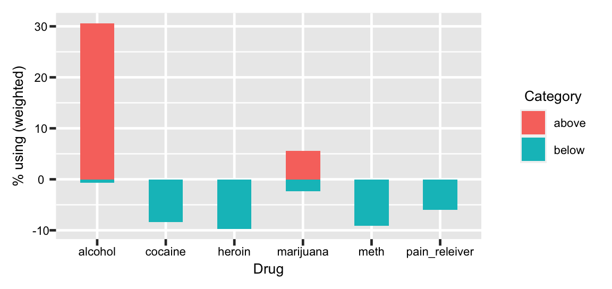
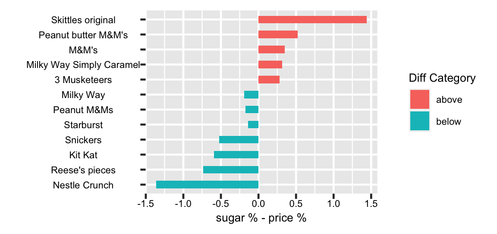
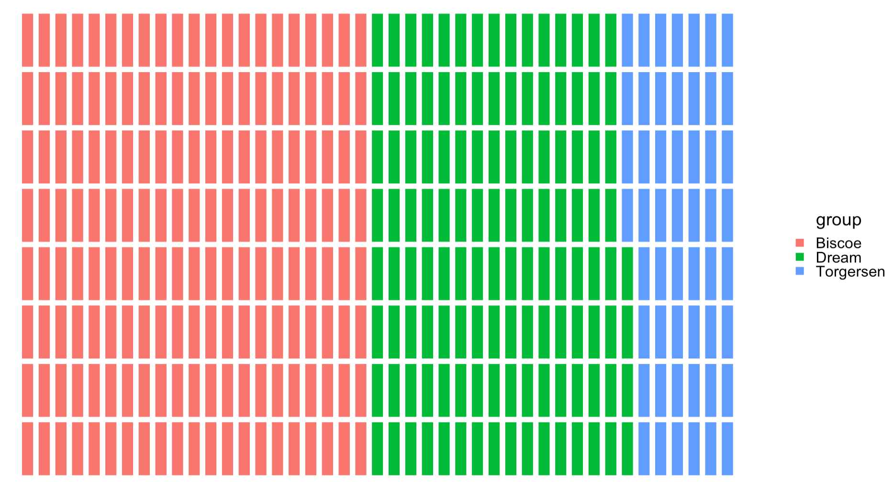
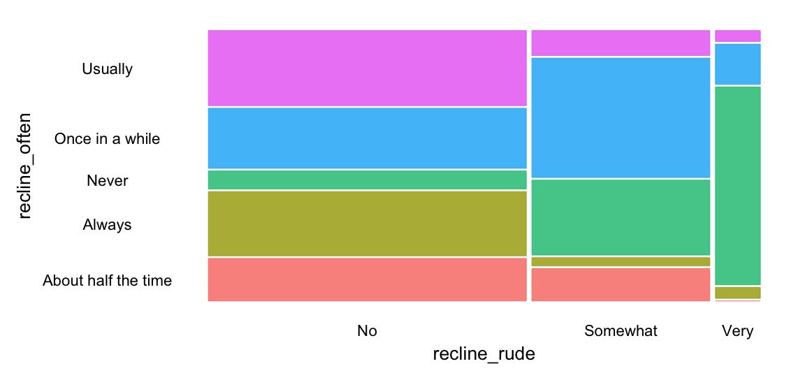
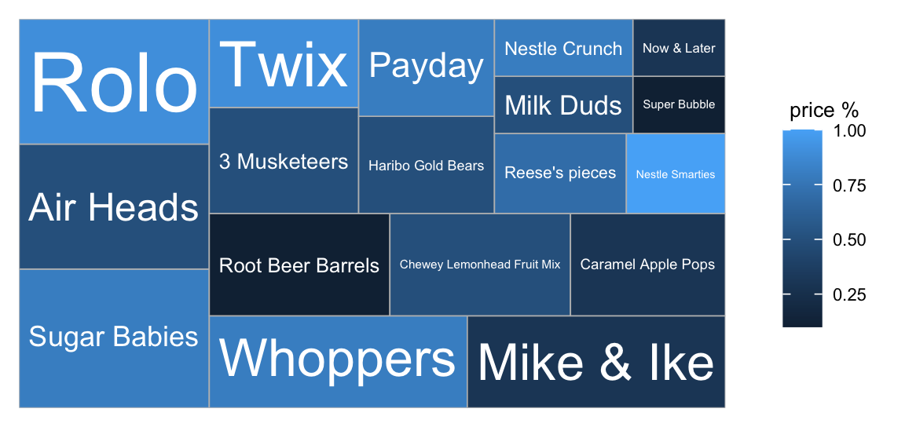
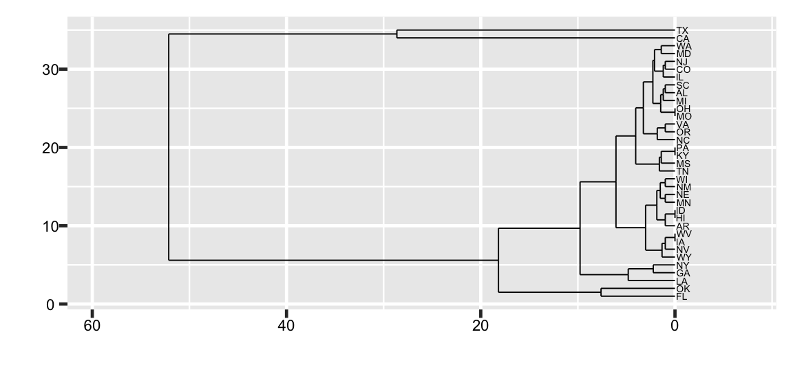
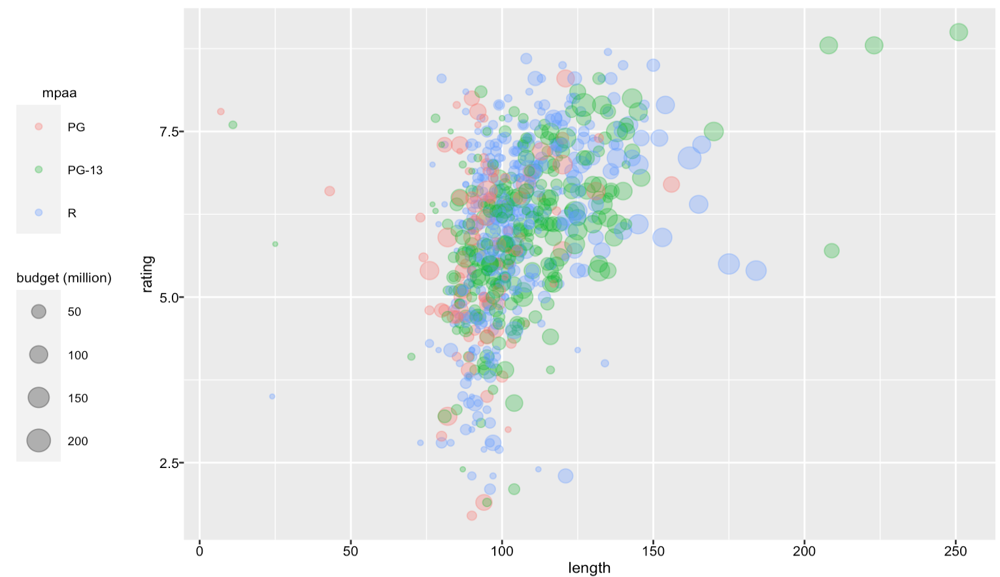

```{r setup, include=FALSE}
library(tidyverse)
library(reprex)
library(xaringan)
library(pagedown)
library(Lahman)
library(xaringanthemer)
library(vcdExtra)
library(ggrepel)
library(ggbeeswarm)
library(ggwaffle)
library(ggmosaic)
library(treemapify)
library(ggdendro)
knitr::opts_chunk$set(warning = FALSE, 
                      message = FALSE, 
                      fig.align = "center", 
                      dpi = 320, 
                      fig.height = 1.7,
                      fig.width = 3.6,
                      fig.path = "../img/")
options(width = 60, max.print = 60)
source("../code/vcsExtra-datasets-fun.R")
source("../code/create-movie-data.R")
movies_data <- create_movie_data()
movies_data <- filter(movies_data, !is.na(budget)) %>% 
  mutate(mpaa = factor(mpaa, 
                       levels = c("PG", "PG-13", "R")))
# set theme 
ggplot2::theme_set(theme(
  axis.text = element_text(size = 5),
  axis.text.x = element_text(size = 5),
  axis.text.y = element_text(size = 5),
  plot.title = element_text(size = 7),
  axis.title = element_text(size = 6),
  legend.text = element_text(size = 5),
  legend.title = element_text(size = 6),
  legend.position = "right", 
  legend.key.size = unit(0.4, 'cm')
  ))
# xaringan::inf_mr()
```

class: inverse, center, top
background-image: url(../img/ggplot2.png)
background-position: 50% 70%
background-size: 35%

# Graph best practices

---
class: left, top
background-image: url(../img/ggplot2.png)
background-position: 95% 8%
background-size: 10%

# Outline

## Types of graphs

.pull-left[

### Distributions & Counts

### Proportions

### Part-to-Whole 

]

.pull-right[

### X vs. Y 

### Uncertainty

### Spatial Data

]

---
class: left, top
background-image: url(../img/ggplot2.png)
background-position: 95% 8%
background-size: 10%

# Datasets 

## `palmerpenguins`

## `fivethirtyeight` 

## `ggplot2movies`

Load these datasets below:

```{r package-datasets, message=FALSE, warning=FALSE}
library(palmerpenguins)
library(fivethirtyeight)
library(ggplot2movies)
```

---
class: left, top
background-image: url(https://allisonhorst.github.io/palmerpenguins/reference/figures/logo.png)
background-position: 95% 8%
background-size: 10%

## `palmerpenguins` 

#### [Package website](https://allisonhorst.github.io/palmerpenguins/)

```{r penguins}
(palmerpenguins::penguins -> penguins)
```

---
class: left, top
background-image: url(../img/ggplot2.png)
background-position: 95% 8%
background-size: 10%

## `fivethirtyeight` 

[Package website](https://fivethirtyeight-r.netlify.app/)

*All datasets are listed below with descriptions*

```{r fivethirtyeight, echo=FALSE}
datasets("fivethirtyeight")
```

---
class: left, top
background-image: url(../img/ggplot2.png)
background-position: 95% 8%
background-size: 10%

## `ggplot2movies` 

[Package website](https://github.com/hadley/ggplot2movies)

```{r movies_data, echo=FALSE}
movies_data
```

*We're using `movies_data` (derived version of the `ggplot2movies::movies`)*

---
class: left, top
background-image: url(../img/ggplot2.png)
background-position: 95% 8%
background-size: 10%

## Distributions & Counts

Visualize distributions with `geom_histogram()`

```{r geom_histogram, message=FALSE, warning=FALSE}
penguins %>% ggplot(aes(x = flipper_length_mm)) + 
  geom_histogram()
```


---
class: left, top
background-image: url(../img/ggplot2.png)
background-position: 95% 8%
background-size: 10%

## Distributions & Counts

Visualize distributions with  `geom_freqpoly()`

```{r geom_freqpoly}
penguins %>% ggplot(aes(x = flipper_length_mm)) + 
  geom_freqpoly()
```

---
class: left, top
background-image: url(../img/ggplot2.png)
background-position: 95% 8%
background-size: 10%

## Distributions & Counts

Visualize distributions with `geom_density()`

```{r geom_density}
penguins %>% ggplot(aes(x = flipper_length_mm)) + 
  geom_density()
```

---
class: left, top
background-image: url(../img/ggplot2.png)
background-position: 95% 8%
background-size: 10%

## Distributions & Counts

Visualize counts with [`geom_bar()`](https://ggplot2.tidyverse.org/reference/geom_bar.html)

```{r geom_bar}
movies_data %>% ggplot(aes(x = mpaa)) + 
  geom_bar(aes(fill = mpaa))
```

---
class: left, top
background-image: url(../img/ggplot2.png)
background-position: 95% 8%
background-size: 10%

## Comparing Distributions & Counts

Use [`geom_col()`](https://ggplot2.tidyverse.org/reference/geom_bar.html) for comparing two variables 

```{r geom_col}
movies_data %>% ggplot(aes(x = mpaa, y = rating)) + 
  geom_col(aes(fill = mpaa))
```


---
class: left, top
background-image: url(../img/ggplot2.png)
background-position: 95% 8%
background-size: 10%

## Comparing Distributions & Counts

Use pie-charts for proportions with [`ggpubr::ggpie`](https://rpkgs.datanovia.com/ggpubr/reference/ggpie.html)

```{r ggpie}
movies_data %>% group_by(mpaa) %>% summarize(avg = mean(rating)) %>% 
  ggpubr::ggpie(x = "avg", label = "mpaa", fill = "mpaa", 
        color = "white") + theme(legend.position = "none")
```

```{r pie-chart-ggplot2, echo=FALSE}
# https://r-charts.com/part-whole/pie-chart-ggplot2/
# ggp_pie
```

---
class: left, top
background-image: url(../img/ggplot2.png)
background-position: 95% 8%
background-size: 10%

## Comparing Distributions & Counts

Comparing distributions with [`ridgeline plots`](https://wilkelab.org/ggridges/) 

```{r geom_density_ridges}
penguins %>% filter(!is.na(sex)) %>% 
  ggplot(aes(x = bill_length_mm, y = sex, fill = sex)) +
  ggridges::geom_density_ridges(alpha = 2/3)
```

---
class: left, top
background-image: url(../img/ggplot2.png)
background-position: 95% 8%
background-size: 10%

## Comparing Distributions & Counts

Compare distributions with  [`bee-swarm`](https://github.com/eclarke/ggbeeswarm) plots

```{r geom_beeswarm}
penguins %>% ggplot(aes(x = island, y = body_mass_g, 
                        color = island)) + 
  ggbeeswarm::geom_beeswarm(size = 0.4, alpha = 1/2)
```

---
class: left, top
background-image: url(../img/ggplot2.png)
background-position: 95% 8%
background-size: 10%

## Comparing Distributions & Counts

Compare distributions box-plots using  [`geom_boxplot()`](https://ggplot2.tidyverse.org/reference/geom_boxplot.html)

```{r geom_boxplot}
movies_data %>% ggplot(aes(x = mpaa, y = length, fill = mpaa)) + 
  geom_boxplot(outlier.size = 0.4) + 
  theme(legend.position = "none")
```

---
class: left, top
background-image: url(../img/ggplot2.png)
background-position: 95% 8%
background-size: 10%

## Comparing Distributions & Counts

Compare distributions with [`geom_violin()`](https://ggplot2.tidyverse.org/reference/geom_violin.html)

```{r geom_violin}
movies_data %>% 
  ggplot(aes(x = mpaa, y = length, fill = mpaa)) + 
  geom_violin(alpha = 1/3)
```

---
class: left, top
background-image: url(../img/ggplot2.png)
background-position: 95% 8%
background-size: 10%

## Comparing Distributions & Counts

Create dumbbell-plots to compare the difference between two values.

```{r dumbbell_plot_police_deaths, echo=FALSE}
dumbbell_plot_police_deaths <- fivethirtyeight::police_deaths %>%
    group_by(state, year) %>% 
    summarize(deaths = n()) %>% 
    ungroup() %>% 
    filter(year == 1997 | year == 2007) %>% 
    arrange(desc(deaths)) 

death_states <- c("TX", "NY", "CA", "FL", "LA", "IN",
            "IL", "AZ", "NC", "MS", "SC", "AR")

dumbbell_plot_police_deaths <- dumbbell_plot_police_deaths %>% 
    count(state, sort = TRUE) %>% 
    filter(n == 2) %>% 
    inner_join(x = ., y = dumbbell_plot_police_deaths, by = "state") %>% 
    arrange(desc(state)) %>% 
    filter(state %in% death_states) %>% 
    mutate(paired = rep(1:(n()/2), each = 2),
            year = factor(year)) %>% 
    select(`Police Deaths` = deaths, 
           State = state,
           Year = year, 
           paired)
```

```{r dumbbell-plot}
dumbbell_plot_police_deaths %>% 
  ggplot(aes(x = `Police Deaths`, y = State, group = paired)) +
  geom_line(size = 0.1) + geom_point(aes(color = Year), size = 0.2)
```


---
class: left, top
background-image: url(../img/ggplot2.png)
background-position: 95% 8%
background-size: 10%

## Part-to-Whole Relationships

Create (stacked) bar charts with `geom_bar()`

```{r stacked-bar-chart}
penguins %>% filter(!is.na(sex)) %>% 
  ggplot(aes(x = flipper_length_mm, fill = sex)) + 
  geom_bar()
```

```{r stacked-bar-chart-ggplot2, echo=FALSE}
# STACKED BAR CHARTS  
# + https://r-charts.com/part-whole/stacked-bar-chart-ggplot2/
```

---
class: left, top
background-image: url(../img/ggplot2.png)
background-position: 95% 8%
background-size: 10%

## Part-to-Whole Relationships

Create (horizontal) diverging bar-charts using `geom_bar()`

```{r drug_use_tidy, echo=FALSE}
use <- drug_use %>%
  select(age, n, ends_with("_use")) %>%
  pivot_longer(-c(age, n), names_to = "drug", values_to = "use") %>%
  mutate(drug = str_sub(drug, start = 1, end = -5))
freq <- drug_use %>%
  select(age, n, ends_with("_freq")) %>%
  pivot_longer(-c(age, n), names_to = "drug", values_to = "freq") %>%
  mutate(drug = str_sub(drug, start = 1, end = -6))
diverging_bar_drug_use <- left_join(x = use, y = freq, by = c("age", "n", "drug")) %>%
  arrange(age) %>%
  select(age, n, drug, percent_using = use,
        median_use = freq) %>%
    filter(!is.na(median_use) &
             drug %in% c("alcohol", "cocaine", "marijuana",
                         "pain_releiver", "meth", "heroin")) %>%
  mutate(
    age = as.character(age),
    perc_using_wt = round((percent_using - mean(percent_using)) / sd(percent_using), 2),
    perc_using_cat = if_else(perc_using_wt < 0, "below", "above"),
    perc_using_cat = factor(perc_using_cat, levels = c("above", "below"))) %>%
  select(`% using (weighted)` = perc_using_wt,
         `Category` = perc_using_cat,
         Drug = drug)
```

```{r horizontal-diverging-bar-chart, eval=FALSE}
diverging_bar_drug_use %>%
  ggplot(aes(x = Drug, y = `% using (weighted)`, label = Drug)) +
  geom_bar(aes(fill = `Category`),
           stat = "identity", width = .5)
```

```{r horizontal-diverging-bar-chart-1, echo=FALSE, out.height='85%', out.width='85%'}

```


---
class: left, top
background-image: url(../img/ggplot2.png)
background-position: 95% 8%
background-size: 10%

## Part-to-Whole Relationships

Create (vertical) diverging bar-charts using `geom_bar()`

```{r diverging_bar_candy_rankings, echo=FALSE}
# DIVERGING BAR CHARTS  
# + https://www.tutorialspoint.com/ggplot2/ggplot2_diverging_charts.htm
candy_names <- c("Kit Kat", "Snickers", "Reese's pieces", "Milky Way", "Peanut butter M&M's", "Peanut M&Ms", "3 Musketeers", "Starburst", "M&M's", "Nestle Crunch", "Milky Way Simply Caramel", "Skittles original")

diverging_bar_candy <- candy_rankings %>%
  tidyr::pivot_longer(
    cols = -c(competitorname, sugarpercent, pricepercent, winpercent),
     names_to = "characteristics", values_to = "present") %>%
  mutate(present = as.logical(present)) %>% arrange(competitorname) %>%
  filter(present == TRUE) %>% distinct() %>%
  select(-present) %>%
  mutate(sugar_price_diff = sugarpercent - pricepercent,
         sugar_price_cat = if_else(sugar_price_diff < 0, "below", "above"),
         sugar_price_cat = factor(sugar_price_cat, levels = c("above", "below"))) %>%
  arrange(desc(winpercent)) %>%
  filter(competitorname %in% candy_names) %>%
  select(name = competitorname,
         `sugar % - price %` = sugar_price_diff,
         Characteristics = characteristics,
         `Diff Category` = sugar_price_cat)
```

```{r vertical-diverging-bar-chart, eval=FALSE}
diverging_bar_candy %>% ggplot(aes(x = `sugar % - price %`, 
 y =  reorder(name, `sugar % - price %`), label = Characteristics)) +
  geom_bar(aes(fill = `Diff Category`), stat = "identity", 
           width = .5) + labs(y = " ")
```

```{r vertical-diverging-bar-chart-1, echo=FALSE, out.height='85%', out.width='85%'}

```

---
class: left, top
background-image: url(../img/ggplot2.png)
background-position: 95% 8%
background-size: 10%

## Part-to-Whole Relationships

Use heatmaps to compare numeric variables across two categorical variables.

```{r heatmap_births_2000_2014, echo=FALSE}
heatmap_births_2000_2014 <- fivethirtyeight::US_births_2000_2014 %>% 
    mutate(year = factor(year), 
           weekday = as.character(day_of_week),
           weekday = factor(weekday)) 
```

```{r geom_raster}
heatmap_births_2000_2014 %>% 
  ggplot(aes(weekday, year, fill = births)) + geom_raster() + 
  scale_fill_distiller(palette = "RdPu")
```


---
class: left, top
background-image: url(../img/ggplot2.png)
background-position: 95% 8%
background-size: 10%

## Part-to-Whole Relationships

Create waffle charts with `ggwaffle`

```{r penguins_waffle, echo=FALSE}
penguins_waffle <- mutate(penguins, island = as.character(island))
penguins_waffle_data <- ggwaffle::waffle_iron(penguins_waffle, 
                                     aes_d(group = island))
```

```{r theme_waffle, eval=FALSE}
penguins_waffle_data %>% ggplot(aes(x, y, fill = group)) + 
  ggwaffle::geom_waffle() + 
  theme_waffle() + labs(x = " ", y = " ")
```

```{r geom_waffle.png, echo=FALSE, out.height='75%', out.width='75%'}

```


---
class: left, top
background-image: url(../img/ggplot2.png)
background-position: 95% 8%
background-size: 10%

## Part-to-Whole Relationships

Create mosaic plots with [`ggmosaic::geom_mosaic()`](https://haleyjeppson.github.io/ggmosaic/)

```{r flying_mosaic, echo=FALSE}
flying_mosaic <- fivethirtyeight::flying %>% 
    select(recline_frequency, recline_rude) %>% 
    filter(!is.na(recline_frequency) & !is.na(recline_rude)) %>% 
    mutate(
        # character 
        recline_rude = as.character(recline_rude),
        # factor
        recline_rude = factor(recline_rude), 
        # character
        recline_often = as.character(recline_frequency), 
        # factor
        recline_often = factor(recline_often))
```

```{r theme_mosaic, eval=FALSE}
flying_mosaic %>% ggplot() + 
    geom_mosaic(aes(x = product(recline_rude), 
    fill = recline_often), show.legend = FALSE) + theme_mosaic()
```

```{r geom_mosaic, echo=FALSE}
flying_mosaic %>% ggplot() + 
    geom_mosaic(aes(x = product(recline_rude), 
    fill = recline_often), show.legend = FALSE) + 
    theme(rect = element_blank(), 
          axis.ticks = element_blank())
```

```{r geom_mosaic-1-png, echo=FALSE, out.height='80%', out.width='80%'}
# 
```

---
class: left, top
background-image: url(../img/ggplot2.png)
background-position: 95% 8%
background-size: 10%

## Part-to-Whole Relationships

Build tree-maps with [`treemapify::geom_treemap()`](https://cran.r-project.org/web/packages/treemapify/vignettes/introduction-to-treemapify.html)

```{r treemap_candy, echo=FALSE}
treemap_candy <- candy_rankings %>%
  tidyr::pivot_longer(
    cols = -c(competitorname, sugarpercent, pricepercent, winpercent),
     names_to = "characteristics", values_to = "present") %>%
  mutate(present = as.logical(present)) %>% arrange(competitorname) %>%
  filter(present == TRUE) %>% 
  select(-present, -characteristics) %>% 
  group_by(competitorname) %>% 
  slice_max(winpercent, n = 1) %>% 
  ungroup() %>% 
  distinct() %>% 
  transmute(name = competitorname, 
            win_percent = winpercent, 
            `sugar %` = round(sugarpercent, 1),
            `price %` = round(pricepercent, 1)) %>% 
    slice_sample(n = 20, replace = FALSE)
```

```{r geom_treemap, eval=FALSE}
treemap_candy %>% 
  ggplot(aes(area = `sugar %`, fill = `price %`, label = name)) +
  geom_treemap() + geom_treemap_text(min.size = 3, colour = "white", 
  place = "centre", grow = TRUE)
```

```{r geom_treemap-1-png, echo=FALSE, out.height='85%', out.width='85%'}

```


---
class: left, top
background-image: url(../img/ggplot2.png)
background-position: 95% 8%
background-size: 10%

## Part-to-Whole Relationships

Build dendrograms with [`ggdendro`](https://cran.r-project.org/web/packages/ggdendro/vignettes/ggdendro.html)

```{r hclust_police, echo=FALSE}
deaths_year <- fivethirtyeight::police_deaths %>%
    filter(year == 2015) %>% 
    group_by(state, year) %>% 
    summarize(deaths = n()) %>% 
    ungroup()
killings_year <- fivethirtyeight::police_killings %>% 
    group_by(state, year) %>% 
    summarize(killings = n()) %>% 
    ungroup()
police_death_killing_year <- inner_join(deaths_year, killings_year, 
           by = c("state", "year")) 
hclust_police <- police_death_killing_year %>%
    column_to_rownames(var = 'state') %>% 
    select(deaths, killings) 

police_hcmodel <- hclust(dist(hclust_police), method = "average")
dhc_police <- as.dendrogram(police_hcmodel)
rect_police_data <- ggdendro::dendro_data(dhc_police, type = "rectangle")
```

```{r ggdendro, eval=FALSE}
ggplot(ggdendro::segment(rect_police_data)) + 
geom_segment(aes(x = x, y = y, xend = xend, yend = yend), size = 0.2) + 
geom_text(data = ggdendro::label(rect_police_data), aes(x = x, y = y, 
          label = label, hjust = -0.1), size = 1.1) + coord_flip() +
          scale_y_reverse(expand = c(0.2, 0)) + 
          labs(x = " ", y = " ")
```

```{r ggdendro-1-png, echo=FALSE, out.height='80%', out.width='80%'}

```


---
class: left, top
background-image: url(../img/ggplot2.png)
background-position: 95% 8%
background-size: 10%

## X vs. Y Relationships

Build scatter-plots with [`geom_point()`](https://ggplot2.tidyverse.org/reference/geom_point.html) (adjust points with `size`)

```{r scatter_movie_data, echo=FALSE}
scatter_movie_data <- movies_data %>% 
    mutate(budget_mil = budget / 1000000,
           budget_mil = paste0(budget_mil, " mil"),
           budget_mil = factor(budget_mil)) %>% 
    select(title, year, rating, length, 
           budget, budget_mil, mpaa, genres)
```

```{r scatter-plot}
scatter_movie_data %>% 
    ggplot(aes(x = length, y = rating)) + 
    geom_point(size = 0.3)
```

---
class: left, top
background-image: url(../img/ggplot2.png)
background-position: 95% 8%
background-size: 10%

## X vs. Y Relationships

Add color with `geom_point(aes(color = ))` and reduce over-plotting with `alpha = `

```{r scatter-plot-color}
scatter_movie_data %>% 
    ggplot(aes(x = length, y = rating)) + 
    geom_point(aes(color = mpaa), size = 0.3, alpha = 1/3)
```

---
class: left, top
background-image: url(../img/ggplot2.png)
background-position: 95% 8%
background-size: 10%

## X vs. Y Relationships

Create bubble-charts by setting size to a numerical variable. 

```{r bubble_movie_data, echo=FALSE}
bubble_movie_data <- movies_data %>% 
    mutate(`budget (million)` = budget / 1000000,
           budget_mil_fct = paste0(`budget (million)`, " mil"),
           budget_mil_fct = factor(budget_mil_fct)) %>% 
    select(title, year, rating, length, `budget (million)`, 
           budget, budget_mil_fct, mpaa, genres)
```

```{r bubble-chart, eval=FALSE}
bubble_movie_data %>% ggplot(aes(x = length, y = rating)) + 
  geom_point(aes(color = mpaa, size = `budget (million)`), 
               alpha = 1/3) + theme(legend.position = "left")
```

```{r bubble-chart-1-png, echo=FALSE, out.height='80%', out.width='80%'}

```


---
class: left, top
background-image: url(../img/ggplot2.png)
background-position: 95% 8%
background-size: 10%

## Uncertainty

---
class: left, top
background-image: url(../img/ggplot2.png)
background-position: 95% 8%
background-size: 10%

## Spatial Data


```{r tidy_candy_rankings, eval=FALSE, include=FALSE}
tidy_candy_rankings <- candy_rankings %>%
  tidyr::pivot_longer(
    cols = -c(competitorname, sugarpercent, pricepercent, winpercent), 
     names_to = "characteristics", values_to = "present") %>%
  mutate(present = as.logical(present)) %>% arrange(competitorname) %>% 
  filter(present == TRUE) %>% distinct() %>% 
  select(-present)
```
